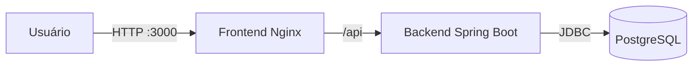

# Escala 24

[](https://github.com/LeftSon13/escala-24/actions/workflows/backend-ci.yml)

Sistema web para gerenciamento e geração de escalas mensais de plantão para equipes de bombeiros.

O Escala 24 centraliza o cadastro da equipe, indisponibilidades, feriados e escalas, aplicando regras operacionais para auxiliar a distribuição segura dos plantões.

## Objetivo

O projeto foi desenvolvido como uma aplicação completa para uma única corporação ou equipe de bombeiros, permitindo que administradores organizem a operação e que bombeiros consultem suas escalas e registrem indisponibilidades.

Esta é a primeira versão do sistema e também um projeto de aprendizado prático sobre desenvolvimento de software, arquitetura web, segurança, testes automatizados, banco de dados, integração contínua e Docker.

## Funcionalidades

### Autenticação e segurança

- autenticação baseada em sessão;
- perfis de administrador e bombeiro;
- proteção contra CSRF;
- renovação do identificador da sessão após o login;
- troca obrigatória da senha temporária;
- encerramento seguro da sessão.

### Administração

- criação segura do primeiro administrador;
- cadastro e consulta de bombeiros;
- desativação de bombeiros;
- cadastro, consulta, edição e exclusão de feriados;
- análise de solicitações de indisponibilidade.

### Operação

- solicitação de indisponibilidade pelo bombeiro;
- geração de rascunho da escala mensal;
- consulta da escala por mês e ano;
- publicação da escala;
- remanejamento de plantões;
- validação de descanso obrigatório;
- validação de indisponibilidades e bombeiros ativos.

### Interface web

- painel diferenciado por perfil;
- dashboard operacional;
- gerenciamento de bombeiros;
- gerenciamento de indisponibilidades;
- gerenciamento de feriados;
- visualização e geração de escalas mensais.

## Arquitetura

O Escala 24 utiliza uma arquitetura web dividida em três serviços executados pelo Docker Compose:



- **Frontend:** interface construída com HTML, CSS e JavaScript, servida pelo Nginx.
- **Nginx:** entrega os arquivos da interface e encaminha requisições `/api` para o backend.
- **Backend:** API REST construída com Java e Spring Boot, responsável pelas regras de negócio, autenticação e persistência.
- **PostgreSQL:** banco de dados relacional que armazena usuários, bombeiros, indisponibilidades, feriados e escalas.
- **Flyway:** aplica e controla as alterações na estrutura do banco de dados.

Os serviços possuem verificações de saúde e são iniciados na ordem correta: banco de dados, backend e frontend.

## Tecnologias

### Backend

- Java 21;
- Spring Boot 4;
- Spring Web MVC;
- Spring Data JPA;
- Spring Security;
- Bean Validation;
- Flyway;
- PostgreSQL;
- Maven.

### Frontend

- HTML5;
- CSS3;
- JavaScript;
- Nginx.

### Qualidade e infraestrutura

- JUnit 5;
- MockMvc;
- AssertJ;
- Testcontainers;
- JaCoCo;
- GitHub Actions;
- Docker;
- Docker Compose.

## Requisitos

Para executar a aplicação completa, é necessário instalar:

- Git;
- Docker Desktop com Docker Compose.

O Java e o PostgreSQL não precisam ser instalados separadamente quando a aplicação é executada com Docker.

## Instalação

### 1. Clonar o repositório

```bash
git clone https://github.com/LeftSon13/escala-24.git
cd escala-24
```

### 2. Criar o arquivo de ambiente

No PowerShell:

```powershell
Copy-Item ".env.example" ".env"
```

No Linux ou macOS:

```bash
cp .env.example .env
```

O arquivo `.env` contém configurações locais e não deve ser enviado ao Git.

### 3. Configurar as variáveis

Abra o arquivo `.env` e substitua os valores de exemplo:

```dotenv
POSTGRES_DB=escala24
POSTGRES_USER=escala24_user
POSTGRES_PASSWORD=defina_uma_senha_segura
POSTGRES_PORT=5432

ESCALA24_INITIAL_ADMIN_ENABLED=true
ESCALA24_INITIAL_ADMIN_NAME=Administrador Inicial
ESCALA24_INITIAL_ADMIN_EMAIL=admin@escala24.local
ESCALA24_INITIAL_ADMIN_PASSWORD=defina_uma_senha_temporaria_segura
```

Utilize senhas diferentes para o banco de dados e para o administrador inicial. Não registre senhas reais no `.env.example`, no código ou no Git.

### 4. Iniciar a aplicação

```bash
docker compose up -d --build
```

Confira o estado dos serviços:

```bash
docker compose ps
```

Os serviços `postgres`, `backend` e `frontend` devem estar em execução. O PostgreSQL e o backend também devem apresentar estado saudável.

### 5. Acessar o sistema

Abra no navegador:

```text
http://localhost:3000
```

Entre utilizando o e-mail e a senha temporária configurados para o administrador inicial.

## Primeiro acesso

O administrador inicial precisa alterar a senha temporária no primeiro acesso.

Depois que a conta estiver funcionando:

1. altere a senha pelo sistema;
2. abra o arquivo `.env`;
3. defina `ESCALA24_INITIAL_ADMIN_ENABLED=false`;
4. apague o valor de `ESCALA24_INITIAL_ADMIN_PASSWORD`;
5. recrie o backend.

```bash
docker compose up -d --force-recreate backend
```

A desativação do bootstrap impede novas tentativas de criação do administrador e evita manter a senha temporária no ambiente.

## Comandos úteis

Exibir o estado dos serviços:

```bash
docker compose ps
```

Acompanhar os logs:

```bash
docker compose logs -f
```

Acompanhar somente o backend:

```bash
docker compose logs -f backend
```

Parar a aplicação preservando os dados:

```bash
docker compose down
```

Reconstruir e iniciar novamente:

```bash
docker compose up -d --build
```

## Exclusão dos dados locais

O comando abaixo remove os contêineres e também o volume do PostgreSQL:

```bash
docker compose down --volumes
```

> Atenção: essa operação apaga os dados locais da aplicação e deve ser usada somente quando um banco de dados vazio for realmente desejado.

## Testes automatizados

Os testes de integração utilizam Testcontainers para iniciar um PostgreSQL 17 temporário. Por isso, o Docker precisa estar em execução.

No Windows:

```powershell
.\mvnw.cmd --batch-mode --no-transfer-progress verify
```

No Linux ou macOS:

```bash
bash ./mvnw --batch-mode --no-transfer-progress verify
```

O comando `verify`:

1. compila o projeto;
2. executa os testes unitários e de integração;
3. aplica as migrações do Flyway no banco temporário;
4. gera o relatório de cobertura;
5. verifica os limites mínimos configurados.

O relatório HTML do JaCoCo é gerado em:

```text
target/site/jacoco/index.html
```

Os limites atuais de qualidade são:

- cobertura de linhas: no mínimo 90%;
- cobertura de branches: no mínimo 85%.

## Integração contínua

O workflow `Backend CI` é executado pelo GitHub Actions:

- em Pull Requests direcionados à `main`;
- depois de alterações incorporadas à `main`;
- manualmente, quando necessário.

A pipeline configura o Java 21, executa `mvn verify`, inicia o PostgreSQL temporário por meio do Testcontainers e publica o relatório do JaCoCo como artefato.

## Estrutura do projeto

```text
escala-24/
├── .github/workflows/       # Pipeline de integração contínua
├── frontend/                # Interface web e configuração do Nginx
├── src/main/java/           # Código principal do backend
├── src/main/resources/      # Configurações e migrações do Flyway
├── src/test/java/           # Testes unitários e de integração
├── .env.example             # Exemplo de configuração local
├── docker-compose.yml       # Orquestração dos serviços
├── Dockerfile               # Imagem do backend
├── pom.xml                  # Dependências e build Maven
└── README.md                # Documentação do projeto
```

O backend está organizado nas seguintes camadas:

- `controller`: endpoints HTTP e respostas da API;
- `service`: regras de negócio;
- `repository`: acesso ao banco de dados;
- `entity`: entidades persistidas;
- `dto`: dados de entrada e saída da API;
- `security`: autenticação e respostas de segurança;
- `config`: configurações da aplicação;
- `exception`: erros específicos do domínio.

## Segurança em produção

A configuração fornecida pelo Docker Compose é voltada ao desenvolvimento local e a ambientes de demonstração.

Antes de disponibilizar a aplicação pela internet, é necessário:

- utilizar HTTPS;
- definir `SERVER_SERVLET_SESSION_COOKIE_SECURE=true`;
- armazenar segredos fora do repositório;
- impedir o acesso público direto ao PostgreSQL;
- configurar cópias de segurança do banco;
- definir políticas de atualização e recuperação;
- configurar monitoramento e registros operacionais.

## Escopo da versão 1.0

A versão 1.0 foi planejada para uso piloto por uma única corporação ou equipe de bombeiros.

Recursos como múltiplas organizações, cobrança, planos comerciais, recuperação de senha por e-mail e infraestrutura gerenciada ficam reservados para versões futuras.

## Autor

Desenvolvido por [João Vinicius](https://github.com/LeftSon13) como projeto de aprendizado e construção de uma aplicação web completa.