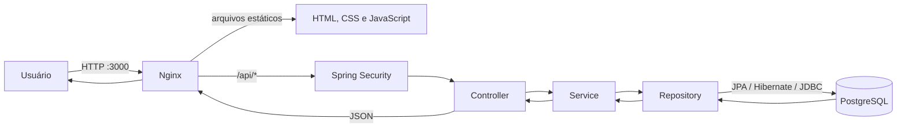
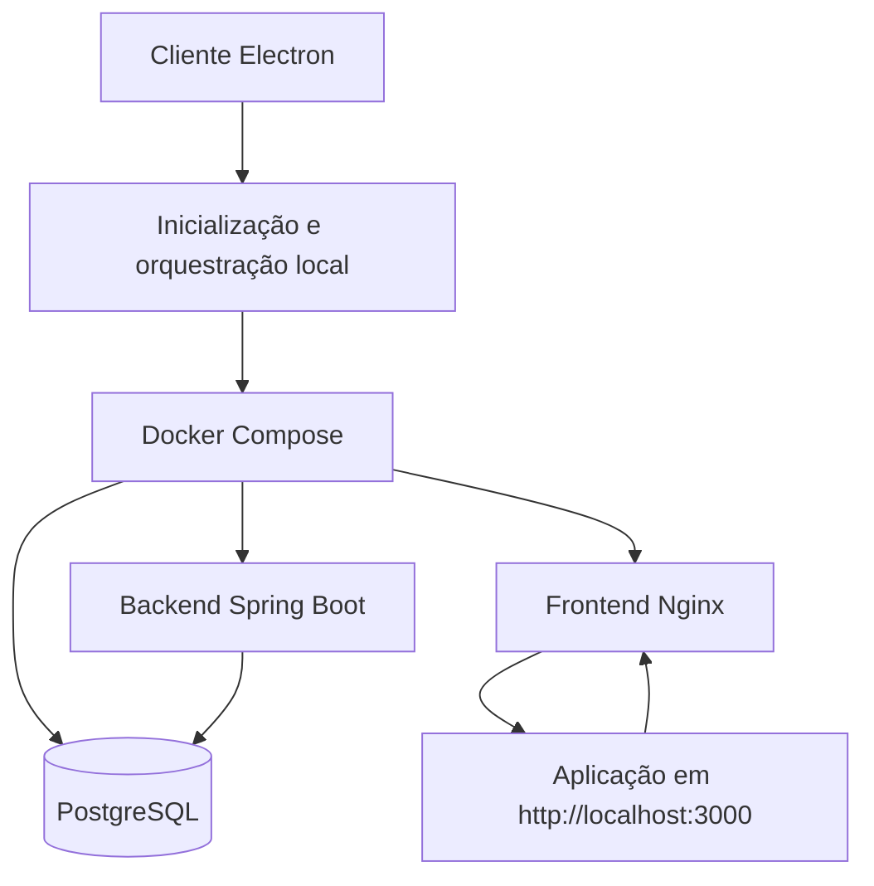
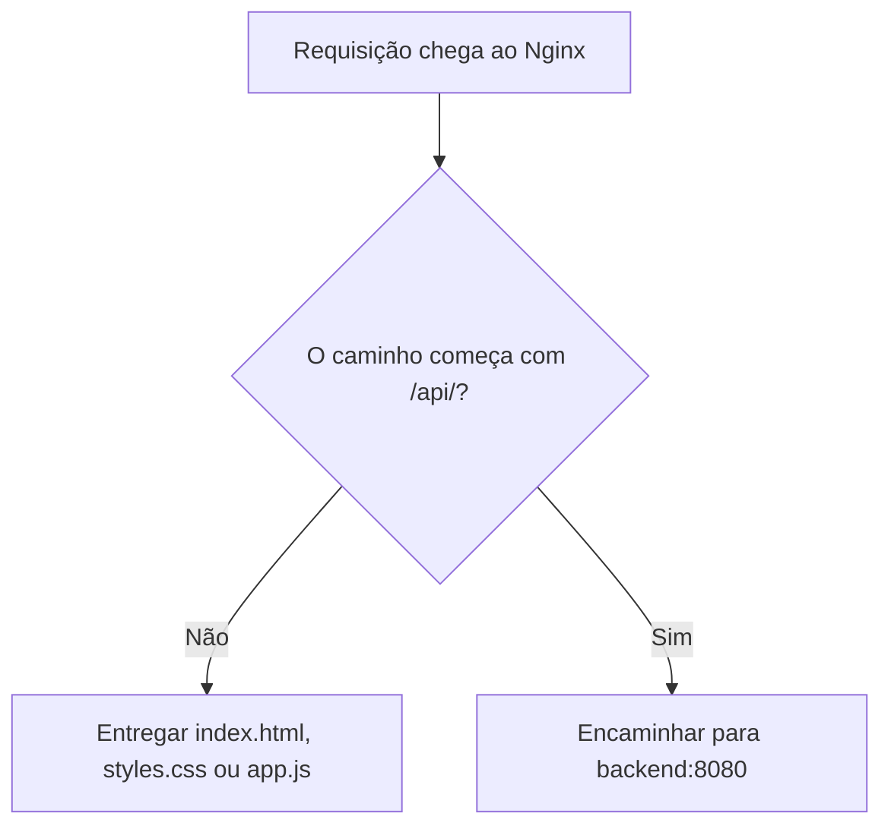
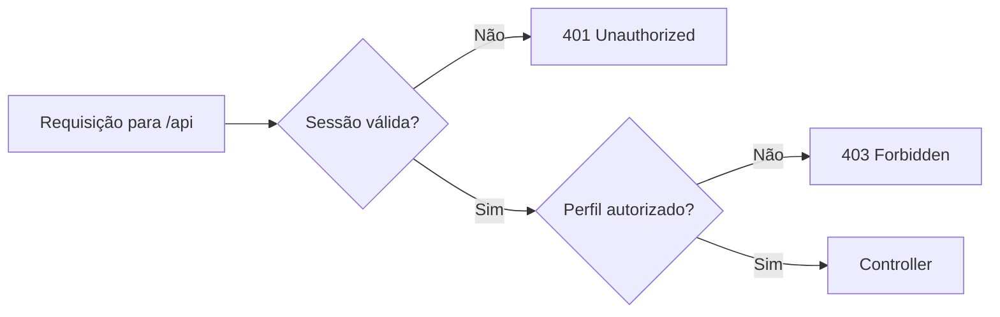
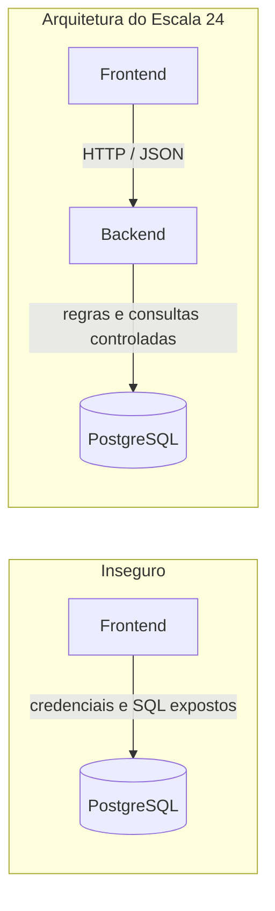
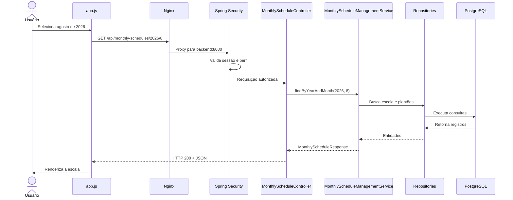
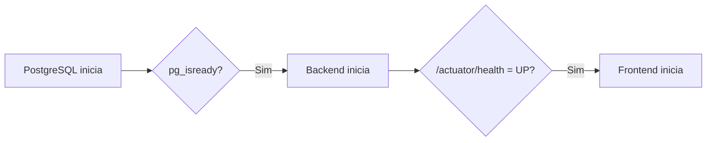

# Arquitetura do Escala 24

## Objetivo deste capítulo

Este capítulo explica como as partes do Escala 24 se conectam desde uma ação
no navegador até a leitura ou gravação de dados no PostgreSQL. Também apresenta
como o cliente desktop prepara a execução local dessa mesma aplicação.

Ao final, você deverá conseguir:

- identificar a responsabilidade de cada camada;
- acompanhar o caminho de uma requisição;
- entender por que o frontend não acessa o banco diretamente;
- distinguir entidade, DTO, repository, service e controller;
- explicar por que essa arquitetura facilita manutenção, testes e segurança.

## Visão geral

O caminho principal da aplicação é:



Apesar de o desenho parecer uma fila, cada parte possui uma responsabilidade
própria. Isso evita que uma única classe cuide de interface, segurança, regras
de negócio e banco de dados ao mesmo tempo.

O diagrama representa a arquitetura lógica da aplicação web. A distribuição
desktop acrescenta uma forma de inicialização e encapsulamento, mas não altera
as responsabilidades de frontend, backend ou banco de dados.



Nesse cenário, o Electron não substitui o frontend nem o backend. Ele prepara
o ambiente local e abre a interface web; o Nginx continua servindo o frontend,
o Spring Boot continua executando a API e o PostgreSQL continua armazenando os
dados.

### Analogia: uma corporação organizada

Imagine a aplicação como uma corporação:

| Parte técnica | Analogia | Responsabilidade |
| --- | --- | --- |
| Nginx | Recepção | Recebe a pessoa e a encaminha ao local correto |
| Spring Security | Controle de acesso | Confere identidade, sessão e permissão |
| Controller | Atendente | Entende o pedido HTTP e devolve uma resposta |
| Service | Responsável pela operação | Aplica as regras antes de autorizar a ação |
| Repository | Arquivista | Localiza e guarda registros |
| PostgreSQL | Arquivo central | Mantém os dados de forma persistente |

A analogia ajuda a lembrar as funções, mas não substitui a explicação técnica.
Por exemplo, o Nginx não é uma pessoa e o service não é apenas um gerente: são
componentes de software com contratos bem definidos.

## 1. Frontend

O frontend é a parte com a qual o usuário interage no navegador.

No Escala 24:

- o **HTML** define a estrutura e o conteúdo das telas;
- o **CSS** define aparência, organização, layout e responsividade;
- o **JavaScript** controla interações, chama a API e atualiza a tela com os
  dados recebidos.

> Uma correção importante: responsividade é principalmente uma responsabilidade
> do CSS. O JavaScript pode auxiliar comportamentos da interface, mas seu papel
> central neste projeto é dar vida à página e conectá-la ao backend.

Na distribuição desktop, o Electron apresenta essa mesma interface web em uma
janela nativa. Ele funciona como uma camada de apresentação e inicialização,
não como uma substituição do frontend. A implementação dessa integração está
em [`desktop/main.js`](../../desktop/main.js) e o fluxo orientado da primeira
execução está em [`docs/desktop-client.md`](../../docs/desktop-client.md).

### Como a porta 3000 participa

No Docker Compose, o frontend funciona assim:

```text
Navegador: localhost:3000
             |
             | mapeamento de porta
             v
Contêiner frontend: porta 80
```

A porta `3000` é a porta exposta no computador. Dentro do contêiner, o Nginx
escuta na porta `80`. Portanto, a porta 3000 não é uma função do HTML, CSS ou
JavaScript; ela é uma configuração da infraestrutura local.

## 2. Nginx

O Nginx possui duas responsabilidades no projeto:

1. entregar os arquivos do frontend;
2. encaminhar requisições iniciadas por `/api/` para o backend.



Esse segundo comportamento é chamado de **proxy reverso**. Para o navegador,
frontend e API parecem estar na mesma origem: `http://localhost:3000`.

Neste projeto existe apenas uma instância do backend. Por isso, o Nginx não está
fazendo balanceamento de carga agora. Ele poderia assumir essa função no futuro
se houvesse várias instâncias configuradas.

A configuração real pode ser consultada em
[`frontend/nginx.conf`](../../frontend/nginx.conf).

## 3. Backend com Spring Boot

O Spring Boot não é o “lugar onde o backend fica guardado”. Ele é o framework
usado para configurar e executar o backend Java, incluindo servidor HTTP,
injeção de dependências, segurança, validações e acesso a dados.

### Spring Security

Antes de uma requisição protegida chegar ao controller, o Spring Security
verifica:

- se existe uma sessão autenticada;
- qual é o perfil do usuário;
- se esse perfil pode acessar o endpoint;
- se requisições que alteram dados possuem um token CSRF válido.



Uma forma simples de lembrar:

- **401**: “Ainda não sei quem você é.”
- **403**: “Sei quem você é, mas esta ação não é permitida para seu perfil.”

### Regras de negócio

As regras de negócio representam políticas do domínio, e não apenas cálculos.
No Escala 24, alguns exemplos são:

- um bombeiro inativo não pode assumir um plantão;
- uma indisponibilidade aprovada precisa ser respeitada;
- o descanso obrigatório entre plantões precisa ser validado;
- uma escala incompleta não pode ser publicada;
- uma escala publicada não pode ser alterada como se ainda fosse rascunho.

Essas regras ficam principalmente nos services porque precisam continuar
válidas independentemente de a ação ter sido iniciada pela interface atual,
por outra interface ou por um teste automatizado.

## 4. PostgreSQL

O PostgreSQL é o banco de dados relacional usado para armazenar informações de
forma persistente, como:

- usuários e bombeiros;
- indisponibilidades;
- feriados;
- escalas mensais;
- atribuições de plantão.

### Por que o frontend não acessa o banco?



Se o navegador acessasse o banco diretamente, seria necessário expor
credenciais e permitir que o cliente montasse operações sobre os dados. Isso
contornaria autenticação, autorização, validações e regras de negócio.

Na analogia da corporação, o usuário não entra sozinho no arquivo central. Ele
faz uma solicitação, a operação é validada e somente o arquivista autorizado
consulta ou altera os registros.

## 5. Caminho de uma requisição real

Considere a consulta da escala de agosto de 2026:

```http
GET /api/monthly-schedules/2026/8
```

O fluxo é:



Passo a passo:

1. O JavaScript cria a requisição HTTP.
2. O Nginx identifica o prefixo `/api/` e encaminha a chamada.
3. O Spring Security valida a sessão e o perfil.
4. O controller recebe `year` e `month` da URL.
5. O service interpreta esses valores, aplica o fluxo da aplicação e coordena
   as consultas.
6. Os repositories acessam o banco por meio do Spring Data JPA.
7. O service converte os dados para um DTO de resposta.
8. O controller devolve JSON, e o JavaScript atualiza a tela.

O controller real desse exemplo está em
[`MonthlyScheduleController.java`](../../src/main/java/br/com/escala24/controller/MonthlyScheduleController.java).

## 6. Responsabilidade das camadas

### Controller

O controller representa a fronteira HTTP da aplicação. Ele:

- define o endpoint e o método HTTP;
- recebe parâmetros, corpo e identidade autenticada;
- solicita uma operação ao service;
- define o código de resposta;
- devolve um DTO.

Ele deve ser enxuto. Se o controller decidir regras complexas, essas regras
ficam presas ao protocolo HTTP e mais difíceis de reutilizar e testar.

### Service

O service coordena o caso de uso e protege as regras do domínio.

Por exemplo, antes de publicar uma escala, o service verifica se ela ainda pode
ser publicada e se todos os dias do mês possuem plantão. Somente depois altera
o estado e solicita a gravação.

Analogia: o controller anota “publique esta escala”; o service verifica se todos
os requisitos operacionais foram cumpridos antes de autorizar.

### Repository

O repository define as operações de persistência. No projeto, interfaces que
estendem `JpaRepository` recebem implementações geradas pelo Spring Data JPA.

```text
Service
  -> método do Repository
     -> Spring Data JPA
        -> Hibernate
           -> JDBC
              -> PostgreSQL
```

O repository não deve decidir regras como descanso obrigatório ou permissão de
publicação. Sua especialidade é consultar e persistir dados.

### Entity

Uma entity representa um conceito persistido e é mapeada para uma tabela do
banco. Ela pode conter identificadores, relacionamentos e estado interno.

### DTO

Um DTO define quais dados entram ou saem de uma operação da API. Ele evita
expor diretamente toda a estrutura interna de uma entity.

Exemplo real simplificado:

```text
Entity User, usada internamente
--------------------------------
id
name
email
password              <- não deve sair na resposta
role
active
mustChangePassword

AuthenticatedUserResponse, enviado ao frontend
-----------------------------------------------
name
email
role
mustChangePassword
```

```json
{
  "name": "João Vinicius",
  "email": "admin@escala24.com",
  "role": "ADMIN",
  "mustChangePassword": false
}
```

O DTO funciona como um formulário controlado: somente os campos necessários
são entregues, mesmo que o registro interno possua mais informações.

## 7. Fluxos de leitura e escrita

Uma leitura percorre as camadas e retorna os dados:

```text
Frontend
  -> Controller
     -> Service
        -> Repository
           -> PostgreSQL
        <- Entity
     <- DTO
  <- JSON
```

Uma escrita percorre as mesmas camadas, mas inclui validação antes da gravação:

```text
Frontend envia JSON + token CSRF
  -> Spring Security autoriza
     -> Controller valida o formato do DTO
        -> Service aplica regras de negócio
           -> Repository persiste a alteração
  <- resposta HTTP
```

## 8. Inicialização e health checks

O Docker Compose usa verificações de saúde para iniciar os serviços na ordem
correta:



O health check não comprova que todas as funcionalidades estão corretas. Ele
responde a uma pergunta mais simples: “este serviço está pronto para receber
tráfego?”

### Execução pelo cliente desktop

Quando a instalação desktop ainda não foi configurada, o Electron apresenta a
tela de configuração inicial. O formulário está em
[`desktop/setup.html`](../../desktop/setup.html) e seu comportamento em
[`desktop/setup.js`](../../desktop/setup.js). Depois de validar os dados, o
cliente prepara uma pasta privada de implantação, copia o Compose, cria o
arquivo `.env` e executa `docker compose up -d`.

O Compose usado pela distribuição desktop define os mesmos três serviços:
PostgreSQL, backend e frontend. Ele expõe o frontend na porta `3000`, aguarda o
PostgreSQL ficar saudável antes do backend e aguarda o health check do backend
antes de iniciar o frontend. A configuração está em
[`desktop/deployment/docker-compose.yml`](../../desktop/deployment/docker-compose.yml).

Analogia: antes de abrir a recepção, confirma-se que o arquivo central está
acessível e que a equipe responsável pela operação já iniciou o expediente.

## 9. Por que essa arquitetura foi escolhida?

### Separação de responsabilidades

Cada camada possui uma função principal. Quando uma regra muda, é mais fácil
localizar onde a alteração deve acontecer.

### Manutenção

Uma correção no CSS não precisa alterar o acesso ao banco. Uma nova consulta
normalmente não exige reescrever a segurança inteira.

### Testabilidade

É possível testar uma regra no service e também testar o fluxo completo com
requisições HTTP e um PostgreSQL temporário.

### Segurança

O banco não fica exposto ao navegador, endpoints são protegidos por perfil,
sessões são controladas e operações mutáveis exigem proteção CSRF.

### Evolução

A separação permite trocar ou ampliar partes do sistema com menor impacto. Isso
não significa que toda arquitetura em camadas seja automaticamente rápida ou
escalável; significa que as responsabilidades e dependências estão mais claras.

A adição do cliente desktop amplia a forma de distribuição sem criar uma nova
camada de negócio. O Electron coordena a execução local; as regras continuam no
backend, a interface continua no frontend e os dados continuam no PostgreSQL.

## Mapa mental

```text
Nginx       = recebe e encaminha
Security    = identifica e autoriza
Controller  = traduz HTTP
Service     = decide e coordena
Repository  = consulta e persiste
Entity      = representa o dado interno
DTO         = transporta apenas o necessário
PostgreSQL  = armazena de forma durável
```

Uma frase para memorizar o fluxo:

> A recepção encaminha, a segurança autoriza, o atendente entende, o responsável
> decide, o arquivista consulta e o arquivo preserva.

## Resumo

O Escala 24 usa uma arquitetura web em camadas. O Nginx entrega o frontend e
encaminha a API; o Spring Security protege o acesso; controllers traduzem HTTP;
services coordenam casos de uso e regras; repositories persistem entities no
PostgreSQL; DTOs controlam os dados trocados com o frontend. Essa divisão torna
o comportamento do sistema mais compreensível, testável, seguro e evolutivo.
