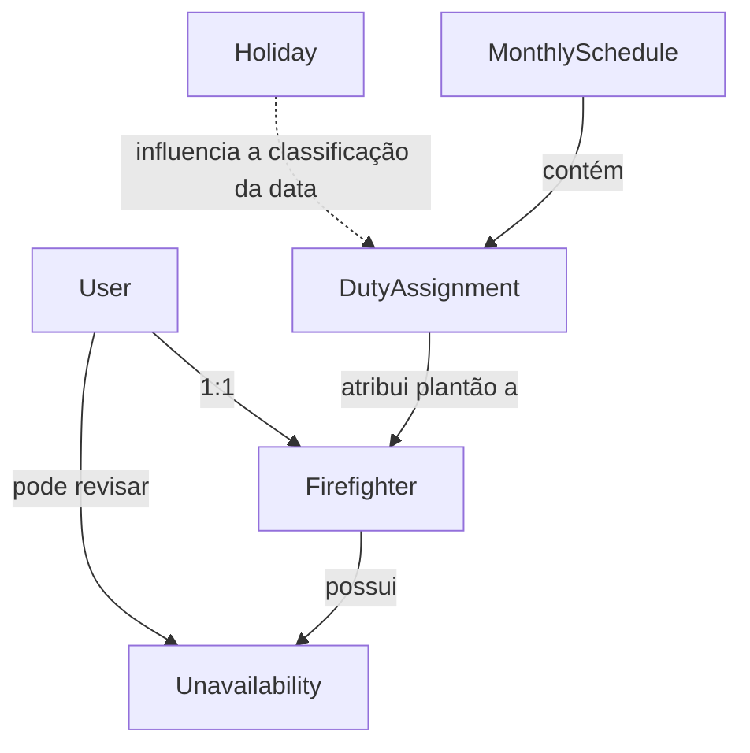
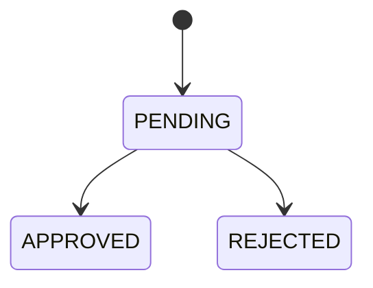
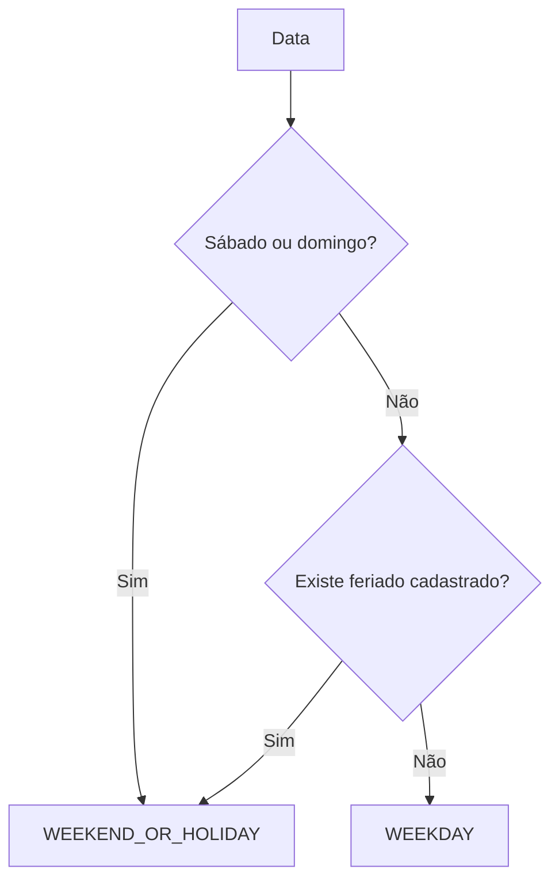
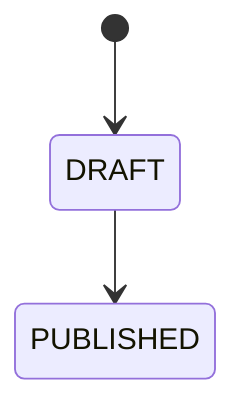
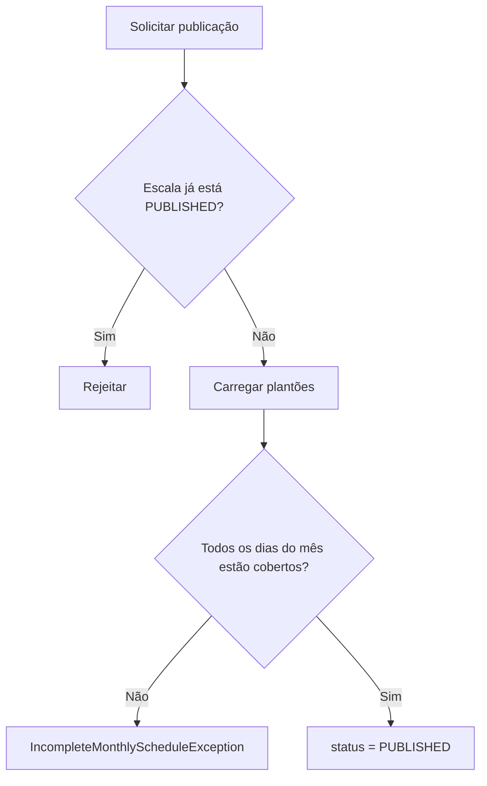
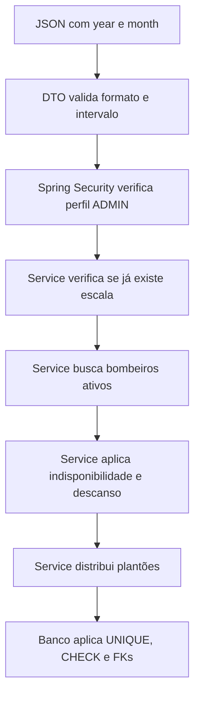

# Domínio e regras do Escala 24

## Objetivo deste capítulo

Este capítulo explica como uma necessidade do mundo real foi transformada em conceitos de software no Escala 24 e como as principais regras do sistema protegem a criação, revisão e publicação das escalas.

> **Pergunta central:** como as regras do mundo real de uma escala de bombeiros são representadas e protegidas pelo software?

Ao final, você deverá conseguir:

- identificar os principais conceitos do domínio;
- diferenciar `User` de `Firefighter`;
- entender como indisponibilidades, escalas mensais e plantões se relacionam;
- reconhecer os estados principais do sistema;
- distinguir regra de negócio, validação de entrada, regra de segurança, restrição do banco e decisão de interface;
- explicar por que a mesma regra importante pode ser protegida em mais de uma camada;
- localizar no código onde as principais regras são aplicadas.

## Do problema real para o modelo de software

O problema original do Escala 24 não é simplesmente “guardar nomes de bombeiros em uma tabela”. A aplicação precisa representar informações e decisões do mundo real: quem participa da equipe, quem pode acessar o sistema, quando um bombeiro não está disponível, quais dias são feriados, qual plantão pertence a cada data e quando uma escala pode ser considerada pronta.

No software, esses conceitos são representados principalmente pelas classes do pacote [`entity`](../../src/main/java/br/com/escala24/entity/).



A ligação tracejada entre `Holiday` e `DutyAssignment` é conceitual. Não existe uma chave estrangeira direta entre essas entidades. O feriado é consultado quando o sistema classifica uma data como dia útil ou como fim de semana/feriado.

## 1. User e Firefighter não representam a mesma coisa

A classe [`User.java`](../../src/main/java/br/com/escala24/entity/User.java) representa uma conta de acesso ao sistema. Ela possui dados como nome, e-mail, senha, perfil, situação ativa e indicação de troca obrigatória de senha.

Os perfis possíveis são definidos em [`Role.java`](../../src/main/java/br/com/escala24/entity/Role.java):

```text
ADMIN
FIREFIGHTER
```

Já [`Firefighter.java`](../../src/main/java/br/com/escala24/entity/Firefighter.java) representa o bombeiro como participante operacional das escalas. Ele possui uma relação um-para-um com `User` e acrescenta dados específicos da função:

```text
User
├── name
├── email
├── password
├── role
├── active
└── mustChangePassword
       │
       │ 1 : 1
       ▼
Firefighter
├── registration
└── phone
```

Essa separação permite representar uma diferença importante do domínio: toda conta possui informações de acesso, mas nem todo usuário precisa ser um bombeiro escalável. O administrador, por exemplo, precisa de uma conta para operar o sistema, enquanto os plantões são atribuídos a registros de `Firefighter`.

A evolução dessa decisão também aparece nas migrations. A primeira versão do banco possuía uma tabela `employees`. A migration [`V2__separate_users_and_firefighters.sql`](../../src/main/resources/db/migration/V2__separate_users_and_firefighters.sql) renomeou essa tabela para `users`, criou `firefighters` e substituiu o antigo campo booleano `administrator` pelo enum de perfil `ADMIN` ou `FIREFIGHTER`.

### Analogia

Pense em `User` como o crachá de acesso ao sistema e em `Firefighter` como o cadastro funcional do bombeiro.

A analogia possui um limite: `User` não é apenas um crachá. Ele também guarda informações de autenticação e estado da conta. Da mesma forma, `Firefighter` não representa toda a vida profissional da pessoa; contém apenas os dados necessários ao Escala 24.

## 2. Bombeiro ativo e bombeiro escalável

O campo `active` pertence a `User`. Quando um bombeiro é desativado, o [`FirefighterManagementService`](../../src/main/java/br/com/escala24/service/FirefighterManagementService.java) altera esse campo para `false`.

Na geração da escala, o [`MonthlyScheduleGenerationService`](../../src/main/java/br/com/escala24/service/MonthlyScheduleGenerationService.java) carrega somente bombeiros cujo usuário está ativo.

Portanto, uma regra fundamental da versão 1.0.0 é:

> Bombeiros inativos não podem ser selecionados para novos plantões.

O remanejamento aplica a mesma proteção. O [`DutyReassignmentService`](../../src/main/java/br/com/escala24/service/DutyReassignmentService.java) rejeita explicitamente um substituto cujo usuário esteja inativo.

Essa duplicidade de verificação não é necessariamente repetição indevida. Geração e remanejamento são casos de uso diferentes e ambos precisam preservar a mesma condição do domínio.

## 3. Indisponibilidade

A entidade [`Unavailability.java`](../../src/main/java/br/com/escala24/entity/Unavailability.java) representa um período em que um bombeiro informa que não poderá trabalhar.

Ela registra:

- bombeiro;
- tipo;
- data inicial;
- data final;
- justificativa opcional;
- estado da solicitação;
- momento da solicitação;
- usuário que realizou a revisão;
- momento da revisão.

Os tipos disponíveis em [`UnavailabilityType.java`](../../src/main/java/br/com/escala24/entity/UnavailabilityType.java) são:

```text
VACATION
MEDICAL_LEAVE
PERSONAL_COMMITMENT
OTHER
```

Os estados definidos em [`UnavailabilityStatus.java`](../../src/main/java/br/com/escala24/entity/UnavailabilityStatus.java) são:

```text
PENDING
APPROVED
REJECTED
```

Uma nova solicitação começa como `PENDING`.



O [`UnavailabilityManagementService`](../../src/main/java/br/com/escala24/service/UnavailabilityManagementService.java) impede que uma solicitação já revisada seja analisada novamente. Assim, na versão atual, não existe transição de `APPROVED` para `REJECTED`, nem o caminho inverso.

### Regras confirmadas para indisponibilidades

Uma solicitação só pode ser criada para um bombeiro ativo.

A data final não pode ser anterior à data inicial. Essa condição é verificada no service e também existe como `CHECK` na migration [`V6__create_unavailabilities.sql`](../../src/main/resources/db/migration/V6__create_unavailabilities.sql).

Somente um usuário ativo com perfil `ADMIN` pode ser aceito pelo service como revisor.

Uma solicitação já revisada não pode ser revisada novamente.

Uma indisponibilidade não pode ser aprovada se já existir um plantão do mesmo bombeiro dentro daquele período. Nesse caso, o sistema lança `DutyReassignmentRequiredException`: primeiro é necessário resolver o conflito de escala.

Quando a decisão é registrada, o sistema salva também quem revisou e quando a revisão ocorreu.

Os testes em [`UnavailabilityManagementServiceIntegrationTest.java`](../../src/test/java/br/com/escala24/service/UnavailabilityManagementServiceIntegrationTest.java) verificam esses comportamentos, incluindo aprovação, rejeição, bloqueio de segunda revisão, período inválido e necessidade de remanejamento antes da aprovação.

## 4. Holiday e a classificação dos dias

[`Holiday.java`](../../src/main/java/br/com/escala24/entity/Holiday.java) representa um feriado por meio de uma data e um nome. Uma mesma data não pode possuir dois feriados cadastrados.

O [`DayTypeClassifier`](../../src/main/java/br/com/escala24/service/DayTypeClassifier.java) recebe uma data e devolve um dos valores de [`DayType.java`](../../src/main/java/br/com/escala24/entity/DayType.java):

```text
WEEKDAY
WEEKEND_OR_HOLIDAY
```

A classificação real é:



Portanto, no modelo atual, sábado, domingo e feriado pertencem à mesma categoria de distribuição: `WEEKEND_OR_HOLIDAY`.

Essa classificação é utilizada durante a geração da escala para auxiliar o balanceamento dos plantões especiais.

## 5. MonthlySchedule: a escala de um mês

[`MonthlySchedule.java`](../../src/main/java/br/com/escala24/entity/MonthlySchedule.java) representa a escala de um mês e ano específicos.

Ela possui dois estados definidos em [`ScheduleStatus.java`](../../src/main/java/br/com/escala24/entity/ScheduleStatus.java):

```text
DRAFT
PUBLISHED
```

Uma escala nasce como `DRAFT`.



A versão 1.0.0 não implementa retorno de uma escala `PUBLISHED` para `DRAFT`.

A combinação de ano e mês é única. A proteção existe na entidade e também no banco, por meio de `UNIQUE (schedule_year, schedule_month)` na migration [`V5__create_monthly_schedules_and_duty_assignments.sql`](../../src/main/resources/db/migration/V5__create_monthly_schedules_and_duty_assignments.sql).

O [`MonthlyScheduleGenerationService`](../../src/main/java/br/com/escala24/service/MonthlyScheduleGenerationService.java) também verifica a existência da escala antes de começar a geração e lança `MonthlyScheduleAlreadyExistsException` quando encontra duplicidade.

Essa é uma boa demonstração de defesa em profundidade: o service entrega um erro de domínio compreensível, enquanto o banco mantém a integridade mesmo se outra parte do código tentar persistir uma duplicidade.

## 6. DutyAssignment: o plantão de 24 horas

[`DutyAssignment.java`](../../src/main/java/br/com/escala24/entity/DutyAssignment.java) representa a atribuição de um bombeiro a uma data dentro de uma escala mensal.

Cada registro liga:

```text
MonthlySchedule
      │
      ▼
DutyAssignment ──────► Firefighter
      │
      ├── dutyDate
      └── dayType
```

O início do plantão é calculado para as 08:00 da data atribuída e o término para as 08:00 do dia seguinte.

```text
19/08 08:00 -------------------- 20/08 08:00
                 24 horas
```

No banco, a combinação `monthly_schedule_id + duty_date` é única. Portanto, uma mesma escala não pode ter dois `DutyAssignment` diferentes para a mesma data.

## 7. Descanso obrigatório

Uma das regras mais importantes da escala é impedir plantões em datas adjacentes para o mesmo bombeiro.

Durante a geração, o sistema considera o bombeiro indisponível para uma data quando ele já possui plantão:

```text
dia anterior
OU
no próprio dia
OU
dia seguinte
```

O objetivo é impedir uma sequência como:

```text
10/08 08:00 -> 11/08 08:00  plantão A
11/08 08:00 -> 12/08 08:00  plantão B
```

Nesse exemplo não haveria intervalo de descanso entre os dois plantões.

A regra também atravessa a fronteira dos meses. Para gerar um mês, o `MonthlyScheduleGenerationService` carrega atribuições desde o dia anterior ao início até o dia posterior ao fim do mês. O teste [`MonthlyScheduleGenerationServiceIntegrationTest.java`](../../src/test/java/br/com/escala24/service/MonthlyScheduleGenerationServiceIntegrationTest.java) confirma que um plantão no último dia do mês anterior ou no primeiro dia do mês seguinte influencia a elegibilidade.

O `DutyReassignmentService` repete a mesma proteção quando um administrador tenta substituir manualmente o bombeiro de um plantão.

## 8. Como o sistema escolhe um bombeiro elegível

Durante a geração, o sistema começa apenas com bombeiros ativos e, para cada data do mês, elimina candidatos que:

- possuem indisponibilidade `APPROVED` cobrindo aquela data;
- já possuem plantão no dia anterior;
- já possuem plantão naquela própria data;
- já possuem plantão no dia seguinte.

Se não restar nenhum candidato, a geração lança `NoEligibleFirefighterException`.

Depois de filtrar os candidatos, o sistema usa contadores para favorecer uma distribuição equilibrada. Para dias `WEEKEND_OR_HOLIDAY`, o histórico anual de plantões especiais possui prioridade. O número de plantões do mês também participa do desempate. Em dias úteis, o balanceamento mensal recebe prioridade.

O detalhamento do algoritmo pertence ao capítulo específico de geração de escalas. Aqui é suficiente guardar duas ideias:

1. elegibilidade responde “quem pode trabalhar nesta data?”;
2. balanceamento responde “entre os elegíveis, quem deve ser escolhido?”.

Os testes de integração confirmam geração completa, exclusão de bombeiros inativos, respeito a indisponibilidades aprovadas, descanso obrigatório, classificação de feriados e diferença máxima de um plantão no balanceamento mensal do cenário testado.

## 9. Publicação da escala

O [`MonthlyScheduleManagementService`](../../src/main/java/br/com/escala24/service/MonthlyScheduleManagementService.java) protege a transição de `DRAFT` para `PUBLISHED`.

Antes de publicar, ele calcula todas as datas esperadas daquele mês e compara com as datas que possuem `DutyAssignment`.



Uma escala incompleta permanece `DRAFT`.

O teste [`MonthlyScheduleManagementServiceIntegrationTest.java`](../../src/test/java/br/com/escala24/service/MonthlyScheduleManagementServiceIntegrationTest.java) confirma tanto a publicação bem-sucedida de uma escala completa quanto a rejeição de uma escala incompleta e de uma escala já publicada.

## 10. Remanejamento

O remanejamento altera o bombeiro responsável por um `DutyAssignment` já existente.

Antes da substituição, o [`DutyReassignmentService`](../../src/main/java/br/com/escala24/service/DutyReassignmentService.java) valida:

1. se a escala existe;
2. se a escala ainda está em `DRAFT`;
3. se o plantão pertence ao mês informado e existe;
4. se o bombeiro substituto existe;
5. se o substituto está ativo;
6. se não possui indisponibilidade aprovada naquela data;
7. se o novo plantão não viola o descanso obrigatório.

Só depois dessas verificações o bombeiro do plantão é alterado.

Isso mostra uma propriedade importante do domínio:

> Publicar a escala muda o que pode ser feito com ela.

Enquanto está em rascunho, o administrador ainda pode corrigir atribuições. Depois da publicação, o sistema rejeita esse tipo de modificação.

## 11. O que é uma invariante?

Uma **invariante** é uma condição que precisa continuar verdadeira para que o estado do sistema seja considerado válido.

No Escala 24, podemos identificar como invariantes importantes da versão 1.0.0:

- não existir mais de uma escala para o mesmo mês e ano;
- não existir mais de um plantão para a mesma data dentro da mesma escala;
- a data final de uma indisponibilidade não ser anterior à data inicial;
- uma indisponibilidade revisada registrar revisor e momento da revisão;
- um bombeiro inativo não ser usado em geração ou remanejamento;
- indisponibilidades aprovadas impedirem a escalação naquele período;
- o descanso obrigatório ser preservado;
- uma escala somente ser publicada quando todos os dias do mês estiverem cobertos;
- uma escala publicada não aceitar remanejamento pela operação atual.

Nem todas essas condições são protegidas no mesmo lugar. Algumas aparecem no service, outras no banco e algumas em ambos.

## 12. Cinco categorias que não devem ser confundidas

Uma das partes mais importantes deste capítulo é perceber que nem toda verificação no sistema é uma regra de negócio.

| Categoria | Pergunta principal | Exemplo no Escala 24 |
| --- | --- | --- |
| Regra de negócio | O que precisa ser verdadeiro no domínio? | Bombeiro com indisponibilidade aprovada não pode receber plantão naquele período |
| Validação de entrada | Os dados recebidos possuem formato e valores básicos aceitáveis? | Mês deve estar entre 1 e 12 |
| Regra de segurança | Quem pode executar a operação? | Somente `ADMIN` pode gerar, publicar ou remanejar escalas |
| Restrição do banco | Que estados inválidos o banco deve recusar? | Ano/mês da escala deve ser único |
| Decisão de interface | O que a tela mostra ou habilita para facilitar o uso? | Ex.: ocultar ou desabilitar uma ação sem substituir a autorização do backend |

### Validação de entrada

O DTO [`MonthlyScheduleGenerationRequest.java`](../../src/main/java/br/com/escala24/dto/MonthlyScheduleGenerationRequest.java) usa **Bean Validation**, mecanismo do ecossistema Java para declarar regras básicas de validação dos dados recebidos, para exigir ano positivo e mês entre 1 e 12.

O DTO [`UnavailabilityRequest.java`](../../src/main/java/br/com/escala24/dto/UnavailabilityRequest.java) exige tipo, data inicial e data final, além de limitar a justificativa a 500 caracteres.

Essas validações protegem o contrato de entrada. Elas não respondem, por exemplo, se um bombeiro pode ser escalado naquela data.

### Regra de segurança

O [`SecurityConfig.java`](../../src/main/java/br/com/escala24/config/SecurityConfig.java) define quem pode chamar os endpoints.

No caso das escalas:

- `GET /api/monthly-schedules/**` pode ser usado por `ADMIN` e `FIREFIGHTER`;
- as demais operações em `/api/monthly-schedules/**` exigem `ADMIN`.

Portanto, consultar uma escala e alterar uma escala são permissões diferentes.

### Restrição do banco

A migration das escalas impede mês fora de `1..12`, estado diferente de `DRAFT`/`PUBLISHED` e duplicidade de ano/mês.

A migration das indisponibilidades impede período invertido e também exige coerência entre estado e dados de revisão.

Essas restrições são a última linha de defesa da persistência, mas não substituem mensagens de domínio claras no backend.

### Decisão de interface

A interface pode ocultar uma ação que o usuário não deveria executar, melhorando a experiência. Porém isso não é proteção suficiente.

Uma pessoa pode tentar chamar a API diretamente sem usar a tela. Por isso a autorização precisa continuar existindo no backend.

```text
Interface: orienta o uso
Security: controla quem entra
Service: protege as regras do caso de uso
Banco: preserva a integridade persistida
```

## 13. Um exemplo completo de cooperação entre camadas

Considere a tentativa de gerar uma escala para um mês.



Cada camada responde a uma pergunta diferente:

```text
DTO: os dados básicos são aceitáveis?
Security: este usuário pode fazer isso?
Service: esta operação respeita as regras do domínio?
Banco: o estado persistido continua íntegro?
```

Essa cooperação é mais segura do que colocar todas as verificações em um único lugar.

## 14. Por que as regras estão distribuídas em várias camadas?

O Escala 24 não concentra todas as proteções em um único ponto. Essa decisão ajuda cada parte do sistema a cuidar do tipo de responsabilidade que conhece melhor.

Se uma regra existisse **somente no frontend**, a experiência visual poderia parecer correta, mas alguém ainda poderia chamar a API diretamente. Se todas as regras fossem colocadas **somente no banco**, a integridade dos dados seria protegida, porém seria mais difícil expressar decisões do domínio e devolver erros claros antes da tentativa de persistência. Se tudo fosse concentrado **no controller**, o código HTTP ficaria misturado com regras de negócio, dificultando manutenção e testes.

A implementação atual distribui essas responsabilidades:

| Camada | Responsabilidade principal neste contexto | Consequência |
| --- | --- | --- |
| DTO / validação | Rejeitar dados básicos inválidos na entrada | O caso de uso não precisa começar com dados evidentemente incorretos |
| Spring Security | Controlar quem pode executar a operação | A API continua protegida mesmo sem o frontend |
| Service | Aplicar decisões do domínio | Regras como descanso, elegibilidade e publicação ficam próximas do caso de uso |
| Banco | Preservar integridade persistida | Duplicidades e estados estruturalmente inválidos continuam bloqueados |

Isso não significa que toda regra precise obrigatoriamente existir em todas as camadas. A proteção deve ser colocada onde faz sentido para aquela responsabilidade. Algumas condições importantes aparecem em mais de um ponto porque cada camada oferece uma garantia diferente.

### Alternativas e limites

Uma alternativa seria criar um componente de domínio ainda mais isolado para concentrar determinadas invariantes e reduzir repetição entre geração e remanejamento. A versão 1.0.0, porém, mantém essas verificações nos services responsáveis pelos casos de uso. Este capítulo descreve essa implementação atual; não afirma que seja a única arquitetura possível.

Também é importante não interpretar “defesa em profundidade” como licença para duplicar qualquer validação indiscriminadamente. Repetição sem propósito aumenta o custo de manutenção. O valor está em combinar proteções que resolvem problemas diferentes: autorização, decisão de negócio e integridade persistida.

## 15. Onde encontrar as regras principais

| Assunto | Arquivos principais |
| --- | --- |
| Usuários e bombeiros | [`User.java`](../../src/main/java/br/com/escala24/entity/User.java), [`Firefighter.java`](../../src/main/java/br/com/escala24/entity/Firefighter.java) |
| Cadastro e desativação | [`FirefighterRegistrationService.java`](../../src/main/java/br/com/escala24/service/FirefighterRegistrationService.java), [`FirefighterManagementService.java`](../../src/main/java/br/com/escala24/service/FirefighterManagementService.java) |
| Indisponibilidades | [`Unavailability.java`](../../src/main/java/br/com/escala24/entity/Unavailability.java), [`UnavailabilityManagementService.java`](../../src/main/java/br/com/escala24/service/UnavailabilityManagementService.java) |
| Feriados | [`Holiday.java`](../../src/main/java/br/com/escala24/entity/Holiday.java), [`HolidayManagementService.java`](../../src/main/java/br/com/escala24/service/HolidayManagementService.java) |
| Classificação de dias | [`DayTypeClassifier.java`](../../src/main/java/br/com/escala24/service/DayTypeClassifier.java) |
| Geração | [`MonthlyScheduleGenerationService.java`](../../src/main/java/br/com/escala24/service/MonthlyScheduleGenerationService.java) |
| Publicação | [`MonthlyScheduleManagementService.java`](../../src/main/java/br/com/escala24/service/MonthlyScheduleManagementService.java) |
| Remanejamento | [`DutyReassignmentService.java`](../../src/main/java/br/com/escala24/service/DutyReassignmentService.java) |
| Restrições do banco | [`V5__create_monthly_schedules_and_duty_assignments.sql`](../../src/main/resources/db/migration/V5__create_monthly_schedules_and_duty_assignments.sql), [`V6__create_unavailabilities.sql`](../../src/main/resources/db/migration/V6__create_unavailabilities.sql) |
| Segurança | [`SecurityConfig.java`](../../src/main/java/br/com/escala24/config/SecurityConfig.java) |

## Mapa mental

```text
DOMÍNIO
│
├── User
│   ├── ADMIN
│   └── FIREFIGHTER
│
├── Firefighter
│   ├── registration
│   ├── phone
│   └── active vem de User
│
├── Unavailability
│   ├── PENDING
│   ├── APPROVED
│   └── REJECTED
│
├── Holiday
│   └── influencia DayType
│
├── MonthlySchedule
│   ├── year + month únicos
│   ├── DRAFT
│   └── PUBLISHED
│
└── DutyAssignment
    ├── uma data
    ├── um bombeiro
    ├── 08:00 -> 08:00
    └── WEEKDAY ou WEEKEND_OR_HOLIDAY

REGRAS CENTRAIS
├── somente ativos são elegíveis
├── indisponibilidade aprovada bloqueia plantão
├── datas adjacentes violam descanso
├── dias especiais participam do balanceamento
├── mês precisa ter cobertura completa para publicar
└── escala publicada não pode ser remanejada
```

## Erros comuns e cuidados

### “Se o botão não aparece, a operação está protegida”

Não. A interface é apenas uma das formas de usar a aplicação. A autorização precisa existir no backend.

### “Todo `User` é um `Firefighter`”

Não. `User` representa a conta. `Firefighter` representa o participante operacional e possui uma relação com um `User`.

### “Indisponibilidade criada já bloqueia a escala”

Não. A geração e o remanejamento consultam indisponibilidades com estado `APPROVED`. Uma solicitação `PENDING` ainda não produz esse bloqueio.

### “Cobertura de todos os dias significa que a escala pode ser alterada para sempre”

Não. Depois da publicação, o remanejamento da operação atual é bloqueado.

### “O banco e o service fazem exatamente a mesma coisa”

Não. Algumas condições aparecem em ambos, mas com objetivos diferentes. O service representa regras e erros do caso de uso; o banco impede que dados persistidos violem determinadas restrições estruturais.

## Perguntas de revisão

1. Qual é a diferença entre `User` e `Firefighter` no Escala 24?
2. Por que uma indisponibilidade `PENDING` não é tratada da mesma forma que uma `APPROVED` durante a geração?
3. Como o sistema evita plantões consecutivos para o mesmo bombeiro?
4. Por que o algoritmo consulta também os dias imediatamente antes e depois do mês gerado?
5. Qual é a diferença entre validar `month` com `@Min/@Max` e manter um `CHECK` equivalente no PostgreSQL?
6. Por que esconder um botão de publicação no frontend não substitui a regra de segurança do backend?
7. O que precisa acontecer antes de uma escala mudar de `DRAFT` para `PUBLISHED`?
8. Cite uma invariante do domínio e explique onde ela é protegida no projeto.
9. Por que validação, segurança, regras de negócio e restrições do banco não devem ser tratadas como a mesma responsabilidade?

## Resumo

O domínio do Escala 24 transforma o problema real de organizar plantões em entidades e estados bem definidos. `User` representa a identidade de acesso, `Firefighter` representa o bombeiro escalável, `Unavailability` registra períodos que podem impedir plantões, `Holiday` participa da classificação dos dias, `MonthlySchedule` representa o mês de trabalho e `DutyAssignment` representa cada plantão de 24 horas.

As regras mais importantes ficam principalmente nos services: bombeiros precisam estar ativos, indisponibilidades aprovadas são respeitadas, o descanso obrigatório impede datas adjacentes, a distribuição procura equilíbrio, uma escala precisa cobrir todo o mês antes da publicação e escalas publicadas não podem ser remanejadas pela operação atual.

Essas regras trabalham em conjunto com validações de entrada, autorização e restrições do banco. Uma frase útil para lembrar é:

> Entrada valida os dados, segurança valida a permissão, o service protege o domínio e o banco preserva a integridade.
