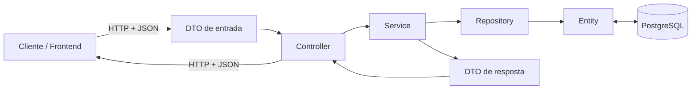
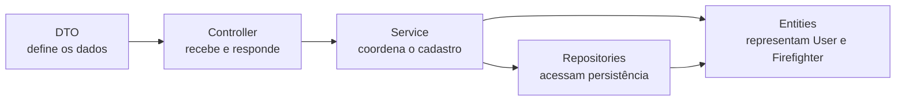
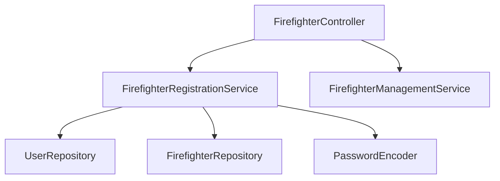

# Backend em camadas

## Objetivo deste capítulo

Este capítulo aprofunda como o backend do Escala 24 está organizado em camadas e como cada camada participa dos casos de uso sem concentrar responsabilidades em um único componente.

> **Pergunta central:** qual é a responsabilidade de cada camada do backend e por que o Escala 24 separa essas responsabilidades?

Ao final, você deverá conseguir:

- explicar as responsabilidades de Controller, Service, Repository, Entity e DTO;
- reconhecer a participação de cada camada em um caso de uso real;
- entender por que o controller não deve concentrar regras de negócio;
- entender por que o service coordena os casos de uso;
- reconhecer como o Spring Data JPA reduz código de persistência;
- diferenciar Entity de DTO;
- compreender o papel da injeção de dependências por construtor;
- entender por que determinadas operações precisam ser transacionais;
- relacionar a separação em camadas com manutenção, testes e segurança.

## 1. A ideia simples: dividir responsabilidades

Imagine que uma única classe recebesse a requisição HTTP, validasse os dados, verificasse regras de negócio, codificasse senhas, executasse SQL, tratasse erros e montasse a resposta.

Isso poderia funcionar em um sistema muito pequeno, mas a classe passaria a conhecer responsabilidades demais. Uma mudança no banco poderia afetar código HTTP; uma nova regra de negócio poderia ficar misturada com detalhes de persistência; e os testes precisariam atravessar muitas responsabilidades ao mesmo tempo.

No Escala 24, o backend separa essas tarefas.



Esse desenho é uma simplificação didática. Na execução real, Entity e Repository trabalham em conjunto com JPA/Hibernate para persistir e recuperar dados; não existe uma “fila física” em que todo objeto obrigatoriamente passa por cada caixa exatamente nessa ordem.

A ideia principal é a responsabilidade:

| Camada | Responsabilidade principal |
| --- | --- |
| Controller | Expor a API HTTP e encaminhar a operação |
| Service | Coordenar o caso de uso e aplicar regras |
| Repository | Fornecer acesso à persistência |
| Entity | Representar o modelo persistido |
| DTO | Definir os dados que entram ou saem da API |

## 2. Onde essas camadas aparecem no projeto

As classes principais ficam abaixo de:

```text
src/main/java/br/com/escala24/
├── controller/
├── dto/
├── entity/
├── exception/
├── repository/
├── security/
├── service/
└── config/
```

Este capítulo concentra-se em `controller`, `dto`, `entity`, `repository` e `service`. Segurança, exceções e configuração interagem com esse fluxo, mas possuem capítulos próprios no guia.

O backend não possui apenas um service genérico. Os casos de uso estão separados em componentes como:

- `FirefighterRegistrationService`;
- `FirefighterManagementService`;
- `HolidayManagementService`;
- `UnavailabilityManagementService`;
- `MonthlyScheduleGenerationService`;
- `MonthlyScheduleManagementService`;
- `DutyReassignmentService`;
- `PasswordChangeService`;
- `SessionAuthenticationService`.

Isso mostra que “Service” não significa necessariamente uma classe única por entidade. Um service pode representar uma responsabilidade ou caso de uso específico.

## 3. Exemplo real que acompanhará as camadas

Para tornar as responsabilidades concretas, este capítulo usa o cadastro de bombeiro como exemplo recorrente. O objetivo aqui **não é acompanhar a operação HTTP completa passo a passo** — isso será feito no capítulo 05 —, mas observar o que cada camada faz dentro do mesmo caso de uso.

Os arquivos centrais são:

- [`FirefighterRegistrationRequest.java`](../../src/main/java/br/com/escala24/dto/FirefighterRegistrationRequest.java);
- [`FirefighterController.java`](../../src/main/java/br/com/escala24/controller/FirefighterController.java);
- [`FirefighterRegistrationService.java`](../../src/main/java/br/com/escala24/service/FirefighterRegistrationService.java);
- [`UserRepository.java`](../../src/main/java/br/com/escala24/repository/UserRepository.java);
- [`FirefighterRepository.java`](../../src/main/java/br/com/escala24/repository/FirefighterRepository.java);
- [`User.java`](../../src/main/java/br/com/escala24/entity/User.java);
- [`Firefighter.java`](../../src/main/java/br/com/escala24/entity/Firefighter.java);
- [`FirefighterRegistrationResponse.java`](../../src/main/java/br/com/escala24/dto/FirefighterRegistrationResponse.java).

A relação entre eles pode ser resumida assim:



Esse diagrama mostra responsabilidades e dependências. Ele não pretende reproduzir todas as chamadas internas realizadas pelos frameworks.

## 4. DTO: o contrato de entrada e saída

DTO significa **Data Transfer Object**, ou objeto de transferência de dados. No Escala 24, DTOs são usados para definir quais dados atravessam as fronteiras da API.

### DTO de entrada

O [`FirefighterRegistrationRequest.java`](../../src/main/java/br/com/escala24/dto/FirefighterRegistrationRequest.java) é um `record` Java — uma forma concisa de declarar uma estrutura voltada a transportar dados — com:

```java
String name
String email
String temporaryPassword
String registration
String phone
```

Além de transportar dados, ele declara validações como `@NotBlank`, `@Email` e `@Size`.

Quando o controller usa:

```java
@Valid @RequestBody FirefighterRegistrationRequest request
```

o Spring transforma o JSON recebido em um objeto Java e aciona as validações declaradas no DTO antes de o fluxo normal prosseguir.

### DTO de resposta

O [`FirefighterRegistrationResponse.java`](../../src/main/java/br/com/escala24/dto/FirefighterRegistrationResponse.java) define o formato devolvido depois do cadastro:

```java
Long firefighterId
Long userId
String name
String email
String registration
String phone
boolean active
boolean mustChangePassword
```

Observe que a senha não aparece na resposta.

Essa é uma das razões para não expor automaticamente uma Entity como contrato da API: o modelo persistido pode possuir campos e relacionamentos que não deveriam ser enviados ao cliente.

### Entity e DTO não são sinônimos

```text
ENTITY
representa o estado persistido e seus relacionamentos

DTO
representa o contrato de dados de uma operação da API
```

Um DTO pode juntar informações de mais de uma entity, omitir campos internos ou possuir apenas os campos necessários para uma operação.

No cadastro de bombeiro, por exemplo, a resposta combina informações de `User` e `Firefighter`.

## 5. Controller: a porta HTTP do caso de uso

O [`FirefighterController.java`](../../src/main/java/br/com/escala24/controller/FirefighterController.java) é anotado com:

```java
@RestController
@RequestMapping("/api/firefighters")
```

`@RestController` indica ao Spring que a classe expõe endpoints HTTP cujos retornos serão tratados como respostas da API. `@RequestMapping` define o caminho base utilizado por aquele controller.

O cadastro é exposto por um método com `@PostMapping`.

De forma simplificada, sua responsabilidade é:

```text
receber a requisição
        ↓
validar o contrato de entrada
        ↓
chamar o service apropriado
        ↓
definir a resposta HTTP
```

No cadastro, o controller chama:

```java
registrationService.register(request)
```

e devolve:

```text
201 Created
```

com o DTO produzido pelo service.

### O que o controller não faz

Nesse fluxo, o controller não:

- consulta diretamente se o e-mail já existe;
- normaliza matrícula;
- cria `User`;
- cria `Firefighter`;
- codifica a senha;
- chama `save()` nos repositories.

Essas decisões ficam fora da camada HTTP.

Isso mantém o controller próximo de sua responsabilidade principal: traduzir uma operação web para uma chamada da aplicação e transformar o resultado em resposta HTTP.

## 6. Service: onde o caso de uso é coordenado

O [`FirefighterRegistrationService.java`](../../src/main/java/br/com/escala24/service/FirefighterRegistrationService.java) é anotado com `@Service`.

Nesse caso de uso, ele:

1. normaliza nome, e-mail, matrícula e telefone;
2. verifica unicidade de e-mail;
3. verifica unicidade de matrícula;
4. cria o `User`;
5. codifica a senha temporária;
6. define o perfil `FIREFIGHTER`;
7. ativa a conta;
8. exige troca posterior da senha;
9. salva o usuário;
10. cria o `Firefighter` associado;
11. salva o bombeiro;
12. monta o DTO de resposta.

O service, portanto, não é apenas um intermediário entre controller e repository. Ele contém a coordenação necessária para realizar o caso de uso.

### Regra de negócio versus detalhe HTTP

O service não precisa saber que o cadastro chegou por um `POST`. Isso pertence ao controller.

Da mesma forma, o controller não precisa saber como normalizar a matrícula ou em qual ordem `User` e `Firefighter` devem ser persistidos.

Essa separação reduz o acoplamento entre a API HTTP e as regras da aplicação.

## 7. Repository: acesso à persistência

Os repositories do projeto usam **JPA (Jakarta Persistence API)**, especificação Java para mapear e manipular dados persistidos por meio de objetos. No Escala 24, o Hibernate é a implementação de persistência usada pelo Spring Data JPA.

Esses repositories são interfaces que estendem `JpaRepository`.

Por exemplo:

```java
public interface UserRepository
        extends JpaRepository<User, Long>
```

Ao estender `JpaRepository`, o projeto recebe operações comuns de persistência, como salvar, buscar e remover entidades, sem precisar escrever manualmente a implementação básica dessas operações.

O [`UserRepository.java`](../../src/main/java/br/com/escala24/repository/UserRepository.java) acrescenta consultas específicas:

```java
Optional<User> findByEmail(String email);

boolean existsByEmail(String email);

boolean existsByRole(Role role);
```

O [`FirefighterRepository.java`](../../src/main/java/br/com/escala24/repository/FirefighterRepository.java) declara, entre outras:

```java
List<Firefighter> findByUserActiveTrueOrderByIdAsc();

Optional<Firefighter> findByUserEmail(String email);

boolean existsByRegistration(String registration);
```

O Spring Data JPA interpreta nomes de métodos compatíveis com suas convenções e gera a implementação de várias dessas consultas.

### `@EntityGraph`

O `FirefighterRepository` usa `@EntityGraph(attributePaths = "user")` em algumas consultas.

No contexto desse repository, isso orienta a consulta a carregar também a associação `user` necessária ao resultado, evitando depender de um acesso posterior separado para esse relacionamento nesses métodos.

O comportamento de carregamento de relacionamentos será aprofundado no capítulo de JPA/Hibernate.

### Repository não é “o banco”

O repository é uma abstração de acesso à persistência.

```text
Service
   ↓
Repository
   ↓
Spring Data JPA / Hibernate
   ↓
PostgreSQL
```

O service pede uma operação em termos de objetos e consultas do domínio da aplicação; JPA/Hibernate realizam a ponte entre esses objetos e o modelo relacional.

## 8. Entity: o modelo persistido

As entities ficam no pacote [`entity`](../../src/main/java/br/com/escala24/entity/).

Entre elas estão:

```text
User
Firefighter
Holiday
Unavailability
MonthlySchedule
DutyAssignment
```

e enums relacionados aos estados e classificações do domínio.

Uma Entity JPA representa dados que possuem correspondência com a persistência e pode declarar:

- tabela;
- colunas;
- chave primária;
- relacionamentos;
- enums;
- restrições de mapeamento.

No cadastro usado como exemplo, `User` representa os dados da conta e `Firefighter` representa os dados operacionais do bombeiro.

O capítulo anterior explicou o significado desses conceitos no domínio. Aqui o ponto principal é outro: **Entity pertence ao modelo interno persistido, enquanto DTO pertence ao contrato de comunicação.**

## 9. Anotações principais do Spring neste fluxo

Anotações são marcações que fornecem metadados ao Java e aos frameworks. No Spring, elas permitem declarar o papel de uma classe ou método sem escrever manualmente toda a infraestrutura necessária.

Neste capítulo, as principais são:

| Anotação | Onde aparece | Papel neste contexto |
| --- | --- | --- |
| `@RestController` | Controller | identifica uma classe que expõe operações HTTP da API |
| `@RequestMapping` | Controller | define um caminho base para os endpoints |
| `@PostMapping` | Controller | associa um método a uma requisição HTTP `POST` |
| `@RequestBody` | parâmetro do Controller | indica que os dados vêm do corpo da requisição |
| `@Valid` | parâmetro do Controller | solicita a validação do objeto recebido |
| `@Service` | Service | identifica um componente responsável pela lógica da aplicação |
| `@Transactional` | Service/método | delimita uma operação transacional |
| `@Entity` | Entity | identifica uma classe persistente gerenciada por JPA |
| `@EntityGraph` | Repository | ajusta o carregamento de relacionamentos em consultas específicas |

A anotação, sozinha, não explica toda a responsabilidade da classe. `@Service`, por exemplo, registra o componente no contexto do Spring, mas é a organização do código do projeto que define quais regras e casos de uso aquele service coordena.

## 10. Injeção de dependências por construtor

Observe o construtor do `FirefighterController`:

```java
public FirefighterController(
        FirefighterRegistrationService registrationService,
        FirefighterManagementService managementService
)
```

O controller não executa:

```java
new FirefighterRegistrationService(...)
```

Ele declara de quais componentes precisa.

O mesmo ocorre no `FirefighterRegistrationService`, que recebe:

```java
UserRepository
FirefighterRepository
PasswordEncoder
```

Esses componentes são fornecidos pelo container do Spring.

Esse mecanismo é chamado **injeção de dependências**: em vez de uma classe criar diretamente as dependências concretas de que precisa, elas são fornecidas externamente.

### Por que usar o construtor?

A injeção por construtor deixa explícito quais dependências são necessárias para criar um objeto válido.

```text
FirefighterRegistrationService
├── precisa de UserRepository
├── precisa de FirefighterRepository
└── precisa de PasswordEncoder
```

Isso também reduz o acoplamento com a criação concreta das dependências e facilita fornecer substitutos controlados em determinados tipos de teste.

### Analogia

Mantendo a analogia organizacional usada nos capítulos anteriores, pense em um responsável que precisa de acesso ao arquivo e a uma ferramenta de segurança para executar seu trabalho. Ele não constrói esses recursos; a organização os disponibiliza.

```text
classe                    → responsável
dependências              → recursos necessários
container do Spring       → organização que fornece os recursos
construtor                → lista explícita do que é necessário
```

O limite da analogia é que, no software, as dependências são objetos gerenciados pelo framework, com contratos e ciclos de vida próprios.

## 11. `@Transactional`: uma operação lógica, várias gravações

O método `register()` do `FirefighterRegistrationService` possui:

```java
@Transactional
```

Isso é particularmente importante porque o cadastro grava dados relacionados em mais de uma entidade.

Primeiro é salvo um `User`. Depois, um `Firefighter` é criado apontando para esse usuário.

Conceitualmente, para o caso de uso, essas duas gravações formam uma única operação:

```text
CADASTRAR BOMBEIRO
├── criar conta User
└── criar Firefighter associado
```

Se a operação transacional falhar com uma exceção que provoque rollback antes da conclusão, as alterações realizadas dentro daquela transação não devem ser confirmadas parcialmente no banco.

Sem essa unidade transacional, um cenário indesejado seria:

```text
User salvo com sucesso
        ↓
falha ao salvar Firefighter
        ↓
cadastro lógico incompleto
```

Com a transação, o objetivo é preservar a atomicidade do caso de uso: ou a operação é confirmada como uma unidade, ou as alterações da transação são revertidas conforme as regras transacionais aplicáveis.

### O que `@Transactional` não significa

Ela não significa que qualquer erro imaginável automaticamente será revertido em qualquer configuração. O comportamento exato depende das regras de transação do Spring, do tipo de exceção, do banco e da forma como a operação é executada.

Para este capítulo, a ideia essencial é: **a fronteira transacional está no service porque é o service que conhece a unidade lógica do caso de uso.**

## 12. Como as camadas se comunicam sem virar uma cadeia rígida

É comum aprender arquitetura em camadas com a imagem:

```text
Controller → Service → Repository → Banco
```

Ela é útil, mas não deve ser interpretada como uma regra de que toda classe precisa chamar exatamente uma classe da camada seguinte.

No projeto real:

- um controller pode depender de mais de um service;
- um service pode usar mais de um repository;
- um service pode usar outro componente de aplicação, como `PasswordEncoder` ou `DayTypeClassifier`;
- um repository pode declarar consultas específicas para atender diferentes casos de uso;
- um DTO de resposta pode combinar dados de mais de uma entity.

O cadastro de bombeiro mostra isso claramente:



Portanto, a arquitetura organiza responsabilidades e dependências; ela não exige uma correspondência de “uma classe em cada camada” para cada funcionalidade.

## 13. Por que não colocar tudo no Controller?

Considere uma alternativa hipotética em que `FirefighterController`:

- valida duplicidade;
- normaliza os dados;
- codifica a senha;
- instancia entities;
- acessa repositories;
- decide regras;
- persiste tudo;
- monta a resposta.

A princípio haveria menos arquivos. Porém o controller passaria a misturar:

```text
HTTP
+
validação do caso de uso
+
regra de negócio
+
segurança de senha
+
persistência
+
montagem de resposta
```

Isso aumenta a quantidade de motivos pelos quais a mesma classe precisaria mudar.

No desenho atual, alterações no contrato HTTP tendem a ficar próximas de controller/DTO; mudanças em regras tendem a ficar no service; mudanças de consulta tendem a ficar no repository; e mudanças de mapeamento persistente ficam nas entities e migrations.

Essa separação não elimina impacto entre arquivos, mas torna as responsabilidades mais localizáveis.

## 14. Por que não retornar Entity diretamente?

Retornar entities diretamente pode parecer mais simples porque evita criar DTOs. No entanto, isso aproxima demais o contrato externo da estrutura interna de persistência.

No Escala 24, separar DTOs das entities traz benefícios concretos:

- a resposta de cadastro não expõe senha;
- uma resposta pode combinar dados de `User` e `Firefighter`;
- validações específicas de entrada ficam no DTO apropriado;
- mudanças internas na entity não precisam automaticamente mudar o JSON público;
- o backend controla explicitamente o que atravessa a API.

Isso também reduz o risco de expor acidentalmente campos internos ou relacionamentos que não pertencem à resposta.

DTOs possuem um custo: é necessário criar e mapear objetos adicionais. No exemplo de cadastro estudado aqui, esse mapeamento é explícito no código. Em troca, o contrato da API fica separado do modelo persistido.

## 15. Como a separação ajuda os testes

A estrutura de testes do projeto acompanha as responsabilidades do backend, com diretórios específicos para:

```text
controller/
dto/
entity/
repository/
service/
```

além de testes de integração.

A existência dessas áreas de teste mostra que o projeto verifica componentes em diferentes níveis. A tabela abaixo é um **mapa conceitual de responsabilidades de teste**, e não afirma que todo diretório cubra exaustivamente todos esses comportamentos:

Exemplos conceituais:

```text
teste de DTO
→ valida o contrato de entrada

teste de controller
→ valida comportamento HTTP

teste de service
→ valida o caso de uso e suas regras

teste de repository
→ valida consultas e persistência

teste de integração
→ valida a cooperação entre partes reais do sistema
```

Isso não significa que todo comportamento precise ter um teste em cada camada. O objetivo é testar a responsabilidade no nível em que ela faz sentido e usar testes de integração para fluxos que dependem da cooperação entre componentes.

## 16. Limites com segurança

A separação em camadas ajuda a posicionar responsabilidades de segurança, mas **não torna a aplicação segura por si só**.

Neste capítulo basta observar duas fronteiras:

- o controller recebe apenas requisições que atravessaram a infraestrutura de segurança aplicável;
- o service de cadastro usa `PasswordEncoder` para codificar a senha antes da persistência.

Autenticação, autorização, sessão, CSRF e as regras completas de acesso pertencem ao capítulo 07. Aqui, esses componentes aparecem apenas quando ajudam a entender a responsabilidade das camadas.

## 17. Limites com tratamento de erros

O projeto possui [`GlobalExceptionHandler.java`](../../src/main/java/br/com/escala24/controller/GlobalExceptionHandler.java), que participa da transformação de falhas em respostas HTTP.

Para o estudo das camadas, o ponto importante é apenas este:

```text
Service detecta uma condição inválida
        ↓
pode lançar uma exceção específica
        ↓
a camada web pode transformar essa falha em resposta HTTP
```

Os tipos de exceção, `ApiErrorResponse`, códigos HTTP e erros de validação serão aprofundados no capítulo 06. Assim, o capítulo atual não mistura a responsabilidade arquitetural das camadas com o estudo completo da estratégia de erros.

## 18. Decisões, alternativas e consequências

A estrutura atual adota uma arquitetura em camadas convencional para o backend Spring Boot.

### Decisão: controllers finos

**Objetivo:** manter detalhes HTTP separados das regras do caso de uso.

**Alternativa:** executar regras e persistência diretamente nos controllers.

**Problema evitado:** controllers com responsabilidades demais e regras difíceis de reutilizar ou testar isoladamente.

**Consequência:** existem mais classes e chamadas entre componentes.

### Decisão: services orientados a responsabilidades/casos de uso

**Objetivo:** concentrar a coordenação das operações da aplicação.

**Alternativa:** criar apenas um service genérico por entity.

**Vantagem do desenho atual:** cadastro e gerenciamento de bombeiros, por exemplo, podem evoluir como responsabilidades distintas.

**Consequência:** é necessário entender qual service representa cada operação, em vez de assumir que existe somente `FirefighterService`.

### Decisão: repositories com Spring Data JPA

**Objetivo:** reduzir código repetitivo de acesso a dados e trabalhar com abstrações de persistência.

**Alternativa:** escrever JDBC/SQL e mapeamento manual para todas as operações.

**Problema evitado:** grande quantidade de código repetitivo para CRUD e consultas simples.

**Consequência:** o time precisa compreender as convenções do Spring Data JPA e o comportamento do Hibernate para evitar consultas ineficientes ou carregamentos inesperados.

### Decisão: DTOs separados das entities

**Objetivo:** controlar explicitamente os contratos externos.

**Alternativa:** serializar entities diretamente.

**Problemas evitados:** exposição acidental de campos internos e acoplamento forte entre API e persistência.

**Consequência:** existe trabalho adicional de mapeamento.

### Decisão: transação na camada de serviço

**Objetivo:** delimitar a unidade lógica do caso de uso.

**Alternativa:** deixar cada gravação ser confirmada independentemente.

**Problema evitado:** persistência parcial de operações compostas.

**Consequência:** é necessário compreender as regras transacionais para não assumir comportamentos de rollback que a configuração não garante.

## 19. Um mapa mental das camadas

```text
BACKEND EM CAMADAS
│
├── DTO
│   ├── contrato de entrada
│   ├── contrato de saída
│   └── validações básicas
│
├── Controller
│   ├── endpoint HTTP
│   ├── request
│   ├── response
│   └── delega o caso de uso
│
├── Service
│   ├── coordena operação
│   ├── aplica regras
│   ├── usa repositories
│   └── define fronteira transacional quando necessário
│
├── Repository
│   ├── acesso à persistência
│   ├── JpaRepository
│   └── consultas específicas
│
└── Entity
    ├── modelo persistido
    ├── colunas
    ├── relacionamentos
    └── estados do domínio
```

## 20. Erros comuns ao interpretar a arquitetura

### “Controller é onde fica toda a lógica”

Não no desenho atual. O controller trata a fronteira HTTP e delega a operação ao service.

### “Service só repassa chamadas para Repository”

Não necessariamente. No cadastro de bombeiro, o service normaliza dados, valida unicidade, codifica senha, cria duas entities, coordena duas persistências e monta a resposta.

### “Repository contém as regras de negócio”

O repository fornece acesso aos dados. Uma consulta pode existir para apoiar uma regra, mas a decisão de negócio pertence ao caso de uso.

### “Entity e DTO são a mesma coisa com nomes diferentes”

Não. Entity representa o modelo persistido; DTO representa dados transferidos em uma operação.

### “Se usamos JPA, não existe SQL”

JPA abstrai boa parte do acesso no código Java, mas os dados continuam sendo persistidos em um banco relacional e consultas SQL são executadas pelo mecanismo de persistência. O projeto também usa migrations SQL para controlar o schema.

### “`@Transactional` é necessária em todo método de service”

Não. Ela deve ser usada quando a operação precisa de uma fronteira transacional adequada. Aplicá-la indiscriminadamente não substitui o entendimento do caso de uso.

### “Separar em camadas impede qualquer dependência entre elas”

Não. As camadas precisam colaborar. O objetivo é organizar dependências e responsabilidades, não eliminar comunicação.

## 21. Onde estudar no código

| Conceito | Arquivo |
| --- | --- |
| Controller | [`FirefighterController.java`](../../src/main/java/br/com/escala24/controller/FirefighterController.java) |
| DTO de entrada | [`FirefighterRegistrationRequest.java`](../../src/main/java/br/com/escala24/dto/FirefighterRegistrationRequest.java) |
| DTO de saída | [`FirefighterRegistrationResponse.java`](../../src/main/java/br/com/escala24/dto/FirefighterRegistrationResponse.java) |
| Service | [`FirefighterRegistrationService.java`](../../src/main/java/br/com/escala24/service/FirefighterRegistrationService.java) |
| Repository de usuário | [`UserRepository.java`](../../src/main/java/br/com/escala24/repository/UserRepository.java) |
| Repository de bombeiro | [`FirefighterRepository.java`](../../src/main/java/br/com/escala24/repository/FirefighterRepository.java) |
| Entity de usuário | [`User.java`](../../src/main/java/br/com/escala24/entity/User.java) |
| Entity de bombeiro | [`Firefighter.java`](../../src/main/java/br/com/escala24/entity/Firefighter.java) |
| Tratamento de exceções | [`GlobalExceptionHandler.java`](../../src/main/java/br/com/escala24/controller/GlobalExceptionHandler.java) |
| Exemplo de service complexo | [`MonthlyScheduleGenerationService.java`](../../src/main/java/br/com/escala24/service/MonthlyScheduleGenerationService.java) |
| Testes | [`src/test/java/br/com/escala24/`](../../src/test/java/br/com/escala24/) |

## Perguntas de revisão

1. Qual é a responsabilidade principal de um Controller no Escala 24?
2. Por que o `FirefighterRegistrationService` não é apenas um intermediário entre controller e repository?
3. Qual é a diferença entre Entity e DTO?
4. Por que a senha temporária aparece no DTO de entrada, mas não no DTO de resposta?
5. O que o projeto ganha ao estender `JpaRepository`?
6. Por que `UserRepository` e `FirefighterRepository` são usados na mesma operação de cadastro?
7. O que significa injeção de dependências por construtor?
8. Por que o método de cadastro de bombeiro é uma boa fronteira para `@Transactional`?
9. O que poderia acontecer se `User` fosse persistido, a criação de `Firefighter` falhasse e as duas operações não fizessem parte da mesma unidade transacional?
10. Por que separar camadas facilita testes sem significar que todo comportamento precisa ser testado cinco vezes?
11. Por que retornar entities diretamente pela API pode aumentar o acoplamento e o risco de exposição de dados?
12. A cadeia `Controller → Service → Repository` deve ser interpretada como uma regra rígida de uma classe para uma classe? Explique.

## Resumo

O backend do Escala 24 divide responsabilidades entre camadas que colaboram para executar os casos de uso.

O **DTO** define os dados que entram e saem da API. O **Controller** recebe a requisição HTTP, delega a operação e monta a resposta. O **Service** coordena o caso de uso e aplica as regras necessárias. O **Repository** oferece acesso à persistência por meio do Spring Data JPA. A **Entity** representa o modelo persistido e seus relacionamentos.

O cadastro de bombeiro demonstra essa colaboração: um JSON é convertido em `FirefighterRegistrationRequest`, o `FirefighterController` chama o `FirefighterRegistrationService`, o service normaliza e valida os dados, usa `UserRepository` e `FirefighterRepository`, cria `User` e `Firefighter`, e devolve um `FirefighterRegistrationResponse`. A operação é transacional porque as duas persistências fazem parte de um único cadastro lógico.

A separação em camadas não existe para aumentar a quantidade de arquivos. Ela existe para tornar explícito **quem é responsável por cada tipo de decisão**.

Uma frase útil para lembrar é:

> **Controller fala HTTP, Service executa o caso de uso, Repository conversa com a persistência, Entity representa o estado persistido e DTO controla o que atravessa a API.**
