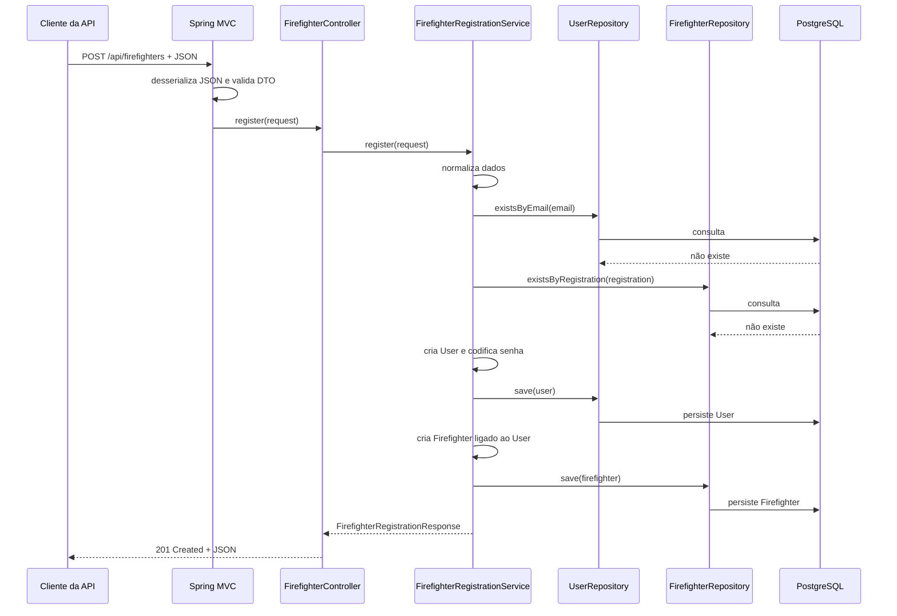
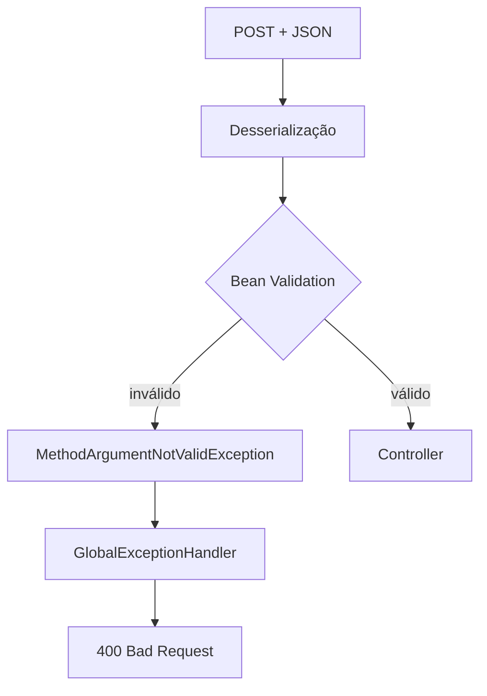
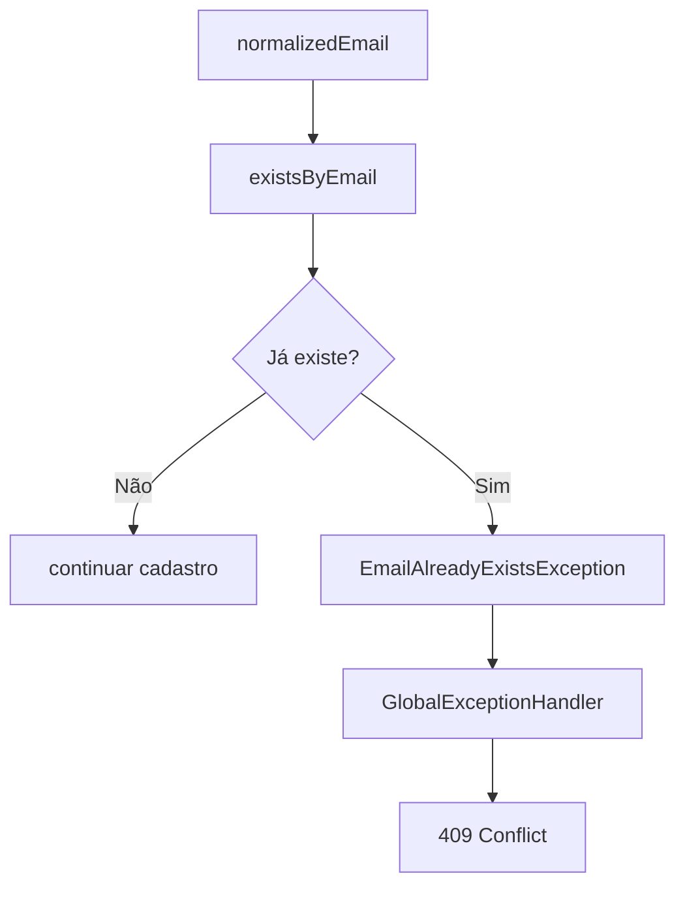
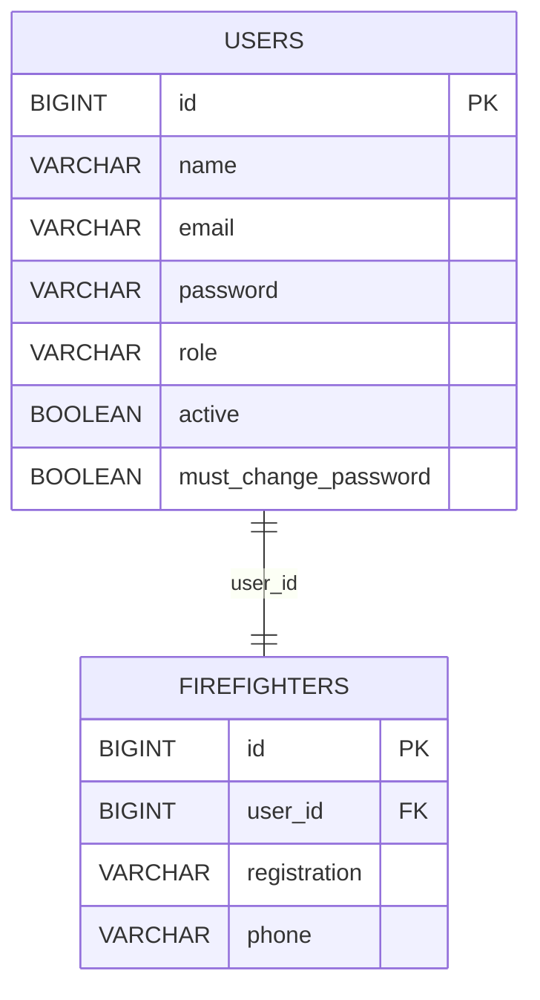
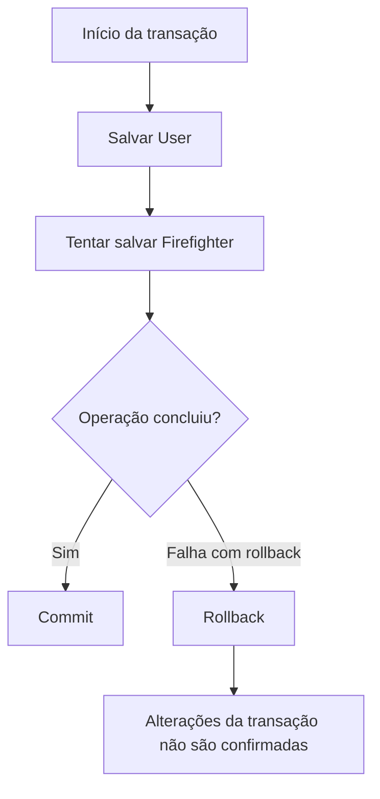
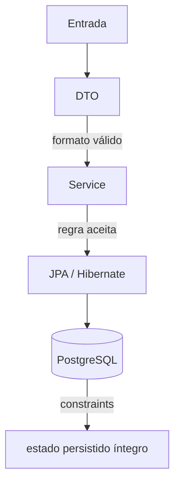

# Fluxo completo de uma requisição

## Objetivo deste capítulo

O capítulo anterior separou as responsabilidades de Controller, Service, Repository, Entity e DTO. Agora vamos acompanhar essas peças trabalhando juntas em uma operação real de escrita do Escala 24.

> **Pergunta central:** o que acontece, passo a passo, desde o momento em que a API recebe um pedido de cadastro de bombeiro até a confirmação no banco e a resposta HTTP?

Ao final, você deverá conseguir:

- acompanhar uma requisição `POST` real de ponta a ponta;
- entender onde o JSON é transformado em objeto Java;
- identificar quando a validação de entrada acontece;
- acompanhar a chamada do Controller ao Service;
- entender as consultas e gravações feitas pelos Repositories;
- relacionar `User` e `Firefighter` com as tabelas persistidas;
- entender o papel da transação durante uma operação composta;
- distinguir o caminho de sucesso dos caminhos de falha;
- reconhecer quando uma operação é interrompida antes de qualquer persistência;
- explicar por que o rollback protege a consistência quando uma falha ocorre dentro da transação.

## 1. O caso de uso escolhido

O fluxo estudado será o **cadastro de bombeiro**.

Ele é adequado porque reúne vários conceitos importantes em uma única operação:

- recebe JSON;
- usa DTO com Bean Validation;
- passa por um Controller;
- chama um Service transacional;
- consulta dois Repositories;
- cria duas Entities relacionadas;
- grava em duas tabelas;
- codifica uma senha;
- possui validações de unicidade;
- pode terminar com sucesso ou falhar antes da conclusão;
- devolve um DTO de resposta.

Os arquivos centrais são:

| Papel | Arquivo |
| --- | --- |
| Entrada | [`FirefighterRegistrationRequest.java`](../../src/main/java/br/com/escala24/dto/FirefighterRegistrationRequest.java) |
| Endpoint | [`FirefighterController.java`](../../src/main/java/br/com/escala24/controller/FirefighterController.java) |
| Caso de uso | [`FirefighterRegistrationService.java`](../../src/main/java/br/com/escala24/service/FirefighterRegistrationService.java) |
| Persistência de usuário | [`UserRepository.java`](../../src/main/java/br/com/escala24/repository/UserRepository.java) |
| Persistência de bombeiro | [`FirefighterRepository.java`](../../src/main/java/br/com/escala24/repository/FirefighterRepository.java) |
| Conta | [`User.java`](../../src/main/java/br/com/escala24/entity/User.java) |
| Bombeiro | [`Firefighter.java`](../../src/main/java/br/com/escala24/entity/Firefighter.java) |
| Saída | [`FirefighterRegistrationResponse.java`](../../src/main/java/br/com/escala24/dto/FirefighterRegistrationResponse.java) |
| Erros HTTP | [`GlobalExceptionHandler.java`](../../src/main/java/br/com/escala24/controller/GlobalExceptionHandler.java) |
| Teste do Controller | [`FirefighterControllerTest.java`](../../src/test/java/br/com/escala24/controller/FirefighterControllerTest.java) |
| Teste do Service | [`FirefighterRegistrationServiceIntegrationTest.java`](../../src/test/java/br/com/escala24/service/FirefighterRegistrationServiceIntegrationTest.java) |

## 2. Visão geral do caminho

Em um cadastro bem-sucedido, o caminho lógico é:



Esse diagrama é uma representação didática. Spring MVC, Spring Data JPA e Hibernate executam etapas internas adicionais. O objetivo é acompanhar as decisões observáveis no código do projeto.

## 3. Etapa 1 — o cliente envia o `POST`

O endpoint de cadastro está em [`FirefighterController.java`](../../src/main/java/br/com/escala24/controller/FirefighterController.java):

```java
@PostMapping
public ResponseEntity<FirefighterRegistrationResponse> register(
        @Valid @RequestBody
        FirefighterRegistrationRequest request
)
```

Como a classe possui:

```java
@RequestMapping("/api/firefighters")
```

o caminho da operação é:

```text
POST /api/firefighters
```

Um corpo compatível com o DTO seria:

```json
{
  "name": "Bombeiro da API",
  "email": "firefighter-api@escala24.com",
  "temporaryPassword": "temporary-password",
  "registration": "REG-API-1",
  "phone": "11999999999"
}
```

Esse formato aparece no teste do Controller e representa o contrato esperado para a operação.

## 4. Etapa 2 — JSON vira `FirefighterRegistrationRequest`

`@RequestBody` informa ao Spring que os dados do parâmetro vêm do corpo da requisição.

O JSON é convertido para:

```java
FirefighterRegistrationRequest
```

O DTO é um `record` com cinco campos:

```text
name
email
temporaryPassword
registration
phone
```

Nesse ponto existe uma distinção importante:

```text
JSON
↓ desserialização
objeto Java
```

**Desserialização** é a transformação de uma representação externa, como JSON, em um objeto que a aplicação consegue manipular.

O Controller não lê manualmente cada chave do JSON. A infraestrutura web do Spring realiza essa conversão conforme o tipo declarado no método.

## 5. Etapa 3 — Bean Validation verifica a entrada

O parâmetro também possui `@Valid`.

Isso faz com que as restrições declaradas em [`FirefighterRegistrationRequest.java`](../../src/main/java/br/com/escala24/dto/FirefighterRegistrationRequest.java) sejam avaliadas.

Entre elas:

```java
@NotBlank
@Email
@Size(...)
```

Por exemplo:

```text
name              → obrigatório, máximo de 150
email             → obrigatório, formato de e-mail, máximo de 150
temporaryPassword → obrigatório, entre 8 e 72
registration      → obrigatório, máximo de 50
phone             → obrigatório, máximo de 20
```

Se os dados forem inválidos, o fluxo normal do Controller não prossegue.

O teste `shouldReturnValidationErrors()` confirma esse comportamento na camada web: uma requisição com nome vazio, e-mail inválido, senha curta, matrícula vazia e telefone vazio recebe:

```text
HTTP 400 Bad Request
```

com erros associados aos campos.

### Caminho da entrada inválida



O [`GlobalExceptionHandler.java`](../../src/main/java/br/com/escala24/controller/GlobalExceptionHandler.java) trata `MethodArgumentNotValidException`, monta um `ApiErrorResponse` e devolve status 400.

Portanto, nesse cenário, o Service de cadastro não precisa começar a persistir dados para depois descobrir que o e-mail nem sequer possui formato válido.

## 6. Etapa 4 — o Controller delega ao Service

Com um DTO válido, o método do Controller executa:

```java
FirefighterRegistrationResponse response =
        registrationService.register(request);
```

O Controller não cria as Entities e não acessa os Repositories.

Sua função neste ponto é encaminhar a operação para o componente que conhece o caso de uso.

Se o Service retornar normalmente, o Controller monta:

```java
return ResponseEntity
        .status(HttpStatus.CREATED)
        .body(response);
```

Isso produzirá `201 Created`.

Mas antes de chegar a essa resposta, ainda há várias etapas dentro do Service.

## 7. Etapa 5 — começa a unidade transacional

O método `register()` de [`FirefighterRegistrationService.java`](../../src/main/java/br/com/escala24/service/FirefighterRegistrationService.java) possui:

```java
@Transactional
```

A operação lógica “cadastrar bombeiro” precisa criar:

```text
User
+
Firefighter associado
```

Por isso, as gravações pertencem à mesma unidade de trabalho.

Uma forma simples de pensar em transação é:

```text
BEGIN
  realizar operações relacionadas
COMMIT
```

ou, quando uma falha que provoque rollback impede a conclusão:

```text
BEGIN
  realizar operações
  falha
ROLLBACK
```

No código Java não existe um `BEGIN` escrito manualmente no método. A infraestrutura transacional do Spring gerencia essa fronteira em torno da chamada.

## 8. Etapa 6 — os dados são normalizados

Antes das consultas, o Service cria versões normalizadas dos valores:

```java
String normalizedName = request.name().trim();

String normalizedEmail = request.email()
        .trim()
        .toLowerCase(Locale.ROOT);

String normalizedRegistration = request.registration()
        .trim()
        .toUpperCase(Locale.ROOT);

String normalizedPhone = request.phone().trim();
```

Assim:

```text
"  Maria da Silva  "      → "Maria da Silva"
"MARIA@ESCALA24.COM"      → "maria@escala24.com"
"  reg-100  "             → "REG-100"
"  11999999999  "         → "11999999999"
```

O teste de integração do Service confirma essas transformações.

### Por que normalizar antes de verificar duplicidade?

Considere:

```text
REG-100
reg-100
  reg-100
```

Para a regra adotada pelo sistema, essas entradas precisam ser comparadas em uma forma consistente.

O mesmo raciocínio vale para:

```text
MARIA@ESCALA24.COM
maria@escala24.com
```

A normalização ocorre antes das verificações de unicidade.

## 9. Etapa 7 — consulta de e-mail duplicado

O Service chama:

```java
validateUniqueEmail(normalizedEmail);
```

e internamente:

```java
if (userRepository.existsByEmail(email)) {
    throw new EmailAlreadyExistsException(email);
}
```

`UserRepository` declara:

```java
boolean existsByEmail(String email);
```

O Spring Data JPA fornece a implementação da consulta a partir do contrato do Repository.

O resultado divide o fluxo:



O tratamento global inclui `EmailAlreadyExistsException` entre as exceções de conflito e devolve:

```text
HTTP 409 Conflict
```

O teste do Controller confirma esse status.

## 10. Etapa 8 — consulta de matrícula duplicada

Se o e-mail estiver disponível, o Service chama:

```java
validateUniqueRegistration(normalizedRegistration);
```

que utiliza:

```java
firefighterRepository.existsByRegistration(registration)
```

Se a matrícula já existir:

```java
throw new RegistrationAlreadyExistsException(registration);
```

Essa exceção também é tratada como:

```text
409 Conflict
```

pelo `GlobalExceptionHandler`.

### Um detalhe importante sobre o momento da falha

As verificações de e-mail e matrícula ocorrem **antes** dos `save()`.

Portanto:

```text
duplicidade detectada
        ↓
exceção
        ↓
nenhuma das gravações do novo cadastro foi iniciada
```

O teste `shouldRejectDuplicateRegistration()` confirma, por exemplo, que o usuário do segundo cadastro não fica persistido quando a matrícula normalizada já existe.

## 11. Etapa 9 — criação do `User`

Com os dados válidos e sem duplicidades conhecidas, o Service cria:

```java
User user = new User();
```

e preenche:

```text
name               = nome normalizado
email              = e-mail normalizado
password           = senha codificada
role               = FIREFIGHTER
active             = true
mustChangePassword = true
```

A senha merece atenção especial:

```java
passwordEncoder.encode(request.temporaryPassword())
```

O valor persistido não é a senha temporária em texto puro.

O teste de integração confirma duas coisas:

```text
senha persistida != senha recebida
```

e:

```text
passwordEncoder.matches(senha recebida, senha persistida) == true
```

Os detalhes criptográficos e o fluxo de troca obrigatória pertencem ao capítulo de segurança. Aqui importa entender que a transformação acontece antes da persistência do `User`.

## 12. Etapa 10 — `UserRepository.save(user)`

O Service executa:

```java
User savedUser = userRepository.save(user);
```

A Entity [`User.java`](../../src/main/java/br/com/escala24/entity/User.java) está mapeada para:

```java
@Table(name = "users")
```

Seu identificador usa:

```java
@GeneratedValue(strategy = GenerationType.IDENTITY)
```

Portanto, o objeto salvo passa a possuir o identificador gerado pela persistência.

De forma conceitual:

```text
User Java
        ↓
JPA / Hibernate
        ↓
tabela users
```

Não é necessário escrever manualmente um `INSERT INTO users ...` dentro do Service.

### O que o banco ainda protege

A coluna de e-mail está mapeada como única na Entity e a estrutura do banco também possui unicidade para o e-mail.

Isso é importante porque a consulta `existsByEmail()` melhora o comportamento da aplicação, mas não deve ser confundida com a garantia final de unicidade do banco.

Entre uma consulta e uma gravação podem existir situações concorrentes. A restrição persistida continua sendo uma proteção de integridade.

## 13. Etapa 11 — criação do `Firefighter`

Depois de obter `savedUser`, o Service cria:

```java
Firefighter firefighter = new Firefighter();
```

e define:

```java
firefighter.setUser(savedUser);
firefighter.setRegistration(normalizedRegistration);
firefighter.setPhone(normalizedPhone);
```

A Entity [`Firefighter.java`](../../src/main/java/br/com/escala24/entity/Firefighter.java) está associada à tabela:

```text
firefighters
```

e possui uma relação um-para-um com `User`:

```java
@OneToOne(...)
@JoinColumn(name = "user_id", ...)
```

Portanto, o novo bombeiro não repete todos os dados da conta. Ele referencia o `User` já criado.



O diagrama resume apenas os campos relevantes para compreender este fluxo.

## 14. Etapa 12 — `FirefighterRepository.save(firefighter)`

O Service executa:

```java
Firefighter savedFirefighter =
        firefighterRepository.save(firefighter);
```

Conceitualmente:

```text
Firefighter Java
        ↓
JPA / Hibernate
        ↓
tabela firefighters
        ↓
user_id referencia users.id
```

A migration [`V2__separate_users_and_firefighters.sql`](../../src/main/resources/db/migration/V2__separate_users_and_firefighters.sql) confirma que `firefighters.user_id` é:

```text
NOT NULL
UNIQUE
FOREIGN KEY → users(id)
```

e que `registration` também é única.

Assim, o relacionamento que aparece nas Entities possui uma estrutura correspondente no banco.

## 15. Etapa 13 — montagem do DTO de resposta

Depois das persistências, o Service retorna:

```java
new FirefighterRegistrationResponse(...)
```

A resposta reúne dados das duas Entities:

```text
firefighterId      ← Firefighter
userId             ← User
name               ← User
email              ← User
registration       ← Firefighter
phone              ← Firefighter
active              ← User
mustChangePassword ← User
```

A senha não faz parte do DTO de resposta.

Esse ponto demonstra novamente por que DTO e Entity possuem papéis diferentes: o retorno da API é construído especificamente para o contrato da operação.

## 16. Etapa 14 — resposta `201 Created`

O DTO volta ao Controller.

Então:

```java
ResponseEntity
        .status(HttpStatus.CREATED)
        .body(response)
```

produz a resposta de sucesso.

O teste `shouldRegisterFirefighter()` verifica:

```text
HTTP 201
```

e confirma campos como:

```text
firefighterId
userId
active
mustChangePassword
```

O caminho de sucesso pode ser resumido:

```mermaid
flowchart LR
    A[POST] --> B[DTO válido]
    B --> C[Controller]
    C --> D[Service]
    D --> E[normalização]
    E --> F[consultas de unicidade]
    F --> G[criar User]
    G --> H[salvar User]
    H --> I[criar Firefighter]
    I --> J[salvar Firefighter]
    J --> K[Response DTO]
    K --> L[201 Created]
```



## 17. Três momentos diferentes em que a operação pode parar

É importante não tratar todas as falhas como se acontecessem no mesmo ponto.

### Caso A — entrada inválida

Exemplo:

```json
{
  "name": "",
  "email": "invalid-email",
  "temporaryPassword": "short",
  "registration": "",
  "phone": ""
}
```

Resultado observado no teste web:

```text
Bean Validation falha
→ Controller não executa o caso de uso normalmente
→ 400 Bad Request
```

### Caso B — conflito detectado pelo Service

Exemplo:

```text
e-mail já cadastrado
```

ou:

```text
matrícula já cadastrada
```

Resultado:

```text
Service consulta Repository
→ detecta conflito
→ lança exceção
→ não chega aos save() do novo cadastro
→ 409 Conflict
```

### Caso C — falha depois que a transação já começou a modificar a persistência

Esse é o cenário em que o conceito de rollback se torna especialmente importante.

Imagine uma falha durante a segunda parte do cadastro:

```text
User foi preparado/salvo dentro da transação
        ↓
Firefighter deveria ser salvo
        ↓
ocorre uma falha que marca a transação para rollback
```

Como o método é transacional, as alterações dessa unidade de trabalho não devem ser confirmadas parcialmente quando a transação é revertida.



### Cuidado: rollback não é “qualquer erro = desfazer tudo”

No comportamento padrão do Spring, exceções não verificadas (`RuntimeException`) normalmente provocam rollback. Exceções verificadas (`checked exceptions`) não possuem exatamente a mesma regra padrão.

Além disso, o comportamento depende da configuração transacional e de como a exceção atravessa a fronteira do método.

Portanto, a afirmação correta não é:

> “`@Transactional` desfaz qualquer erro.”

A ideia correta é:

> “`@Transactional` cria uma fronteira de transação, e as regras de rollback determinam quando as alterações dessa transação serão revertidas.”

## 18. O que os testes realmente comprovam

É importante separar comportamento confirmado por teste de uma explicação conceitual.

### Confirmado pelo `FirefighterControllerTest`

O teste da camada web confirma:

- `POST /api/firefighters`;
- JSON compatível com o DTO;
- retorno `201 Created` no cadastro válido;
- erros de Bean Validation retornando `400`;
- e-mail duplicado representado como `409`;
- chamada do Controller ao `FirefighterRegistrationService`.

### Confirmado pelo `FirefighterRegistrationServiceIntegrationTest`

O teste de integração do Service confirma:

- normalização de nome, e-mail, matrícula e telefone;
- criação de `User`;
- criação de `Firefighter`;
- associação entre os dois;
- perfil `FIREFIGHTER`;
- conta ativa;
- troca de senha obrigatória;
- senha persistida de forma codificada;
- rejeição de e-mail duplicado;
- rejeição de matrícula duplicada;
- ausência do novo `User` quando a matrícula duplicada é detectada;
- requisição inválida rejeitada antes de alterar as contagens de usuários e bombeiros.

### O que este capítulo explica conceitualmente

A explicação do rollback em uma falha ocorrida **depois de uma primeira gravação e antes da conclusão da segunda** deriva da semântica de `@Transactional` usada pelo método.

O teste de integração atual verifica vários cenários de sucesso e rejeição, mas não contém um teste que force artificialmente uma falha exatamente entre `userRepository.save()` e `firefighterRepository.save()` para demonstrar esse rollback intermediário.

Essa distinção é importante: a documentação não deve apresentar como “teste existente” algo que o teste atual não executa.

## 19. Validação de aplicação e restrição do banco trabalham juntas

O cadastro possui proteções em mais de um nível.

### No DTO

```text
@NotBlank
@Email
@Size
```

Protegem formato e presença dos dados.

### No Service

```text
existsByEmail
existsByRegistration
```

Permitem detectar conflitos e lançar exceções específicas antes da gravação.

### Nas Entities e no banco

```text
email UNIQUE
registration UNIQUE
user_id UNIQUE
user_id FOREIGN KEY
```

Protegem a integridade persistida.

Essas verificações não são equivalentes.



A aplicação procura fornecer uma resposta clara ao usuário; o banco mantém garantias estruturais sobre os dados.

## 20. O que JPA e Hibernate fazem no meio do caminho

No código do Service aparecem chamadas como:

```java
userRepository.save(user);
firefighterRepository.save(firefighter);
```

Não aparecem comandos SQL escritos manualmente.

Isso acontece porque:

```text
Repository
↓
Spring Data JPA
↓
JPA / Hibernate
↓
JDBC
↓
PostgreSQL
```

**JDBC** é a API Java de comunicação com bancos relacionais. O Hibernate utiliza essa infraestrutura para executar as operações necessárias no banco.

O capítulo de JPA/Hibernate aprofundará:

- estado das Entities;
- contexto de persistência;
- `save()`;
- geração de identificadores;
- relacionamentos;
- carregamento `LAZY`;
- `EntityGraph`;
- consultas derivadas.

Neste capítulo basta entender que a chamada Java ao Repository termina produzindo operações de persistência no PostgreSQL por meio dessa pilha.

## 21. Uma requisição não é uma única função

Depois de acompanhar o fluxo, fica mais fácil perceber que:

```text
POST /api/firefighters
```

não significa apenas “executar o método `register()`”.

A operação envolve uma sequência de responsabilidades:

```text
protocolo HTTP
↓
desserialização
↓
validação
↓
Controller
↓
Service
↓
transação
↓
normalização
↓
consultas
↓
criação das Entities
↓
persistência
↓
restrições do banco
↓
DTO de resposta
↓
serialização
↓
HTTP
```

**Serialização**, no caminho de volta, é a transformação do objeto Java de resposta em uma representação que possa ser enviada ao cliente, normalmente JSON na API.

## 22. Por que estudar o fluxo completo?

Quando ocorre um bug, saber apenas “o endpoint não funcionou” é pouco.

O fluxo completo permite fazer perguntas melhores:

```text
O JSON chegou no formato esperado?
        ↓
A desserialização funcionou?
        ↓
Bean Validation rejeitou algum campo?
        ↓
O Controller chamou o Service?
        ↓
O Service normalizou corretamente?
        ↓
A consulta encontrou duplicidade?
        ↓
A transação foi aberta?
        ↓
Qual save falhou?
        ↓
O banco rejeitou alguma constraint?
        ↓
Qual exceção virou qual resposta HTTP?
```

Essa forma de raciocínio ajuda a localizar a camada responsável pelo problema.

Também evita uma prática comum em início de desenvolvimento: alterar várias partes do sistema ao mesmo tempo sem saber em qual etapa a falha realmente aconteceu.

## 23. Analogia: um processo administrativo

Imagine um pedido formal de cadastro em uma organização.

```text
formulário recebido
        ↓
conferência dos campos
        ↓
setor responsável recebe o pedido
        ↓
regras internas são verificadas
        ↓
cadastros relacionados são registrados
        ↓
operação é confirmada
        ↓
protocolo de resposta é emitido
```

No paralelo didático:

```text
formulário             → JSON / DTO
conferência            → Bean Validation
setor de entrada       → Controller
processo interno       → Service
arquivo/cadastro       → Repository + banco
registros relacionados → User + Firefighter
confirmação            → commit
protocolo              → DTO + resposta HTTP
```

O limite da analogia é que uma transação de banco possui garantias técnicas de atomicidade e isolamento que um processo administrativo humano não reproduz exatamente.

## 24. Decisões e consequências observadas neste fluxo

### Validar antes de executar o caso de uso

**Decisão:** usar Bean Validation no DTO.

**Benefício:** dados evidentemente inválidos são rejeitados cedo.

**Consequência:** regras de formato ficam distribuídas no contrato de entrada, enquanto regras do domínio continuam no Service.

### Normalizar antes de consultar unicidade

**Decisão:** padronizar e-mail e matrícula antes das consultas.

**Benefício:** diferenças de caixa e espaços não criam comparações inconsistentes dentro da regra adotada.

**Consequência:** os consumidores da API podem receber de volta uma representação normalizada, não necessariamente a grafia exata enviada.

### Consultar duplicidade antes do `save()`

**Decisão:** verificar e-mail e matrícula no Service.

**Benefício:** a aplicação consegue lançar exceções específicas e produzir respostas de conflito compreensíveis.

**Limite:** a consulta prévia não substitui as constraints de unicidade do banco em cenários concorrentes.

### Criar `User` e `Firefighter` na mesma transação

**Decisão:** delimitar `register()` com `@Transactional`.

**Benefício:** o cadastro composto possui uma unidade lógica de persistência.

**Consequência:** é necessário entender corretamente propagação, commit e regras de rollback.

### Responder com DTO próprio

**Decisão:** montar `FirefighterRegistrationResponse`.

**Benefício:** a API controla explicitamente o que devolve e não expõe a senha.

**Consequência:** existe código adicional de mapeamento.

## 25. Onde estudar cada etapa no código

| Etapa | Arquivo |
| --- | --- |
| JSON e endpoint | [`FirefighterController.java`](../../src/main/java/br/com/escala24/controller/FirefighterController.java) |
| Validações do request | [`FirefighterRegistrationRequest.java`](../../src/main/java/br/com/escala24/dto/FirefighterRegistrationRequest.java) |
| Normalização e regras | [`FirefighterRegistrationService.java`](../../src/main/java/br/com/escala24/service/FirefighterRegistrationService.java) |
| Consulta/salvamento de User | [`UserRepository.java`](../../src/main/java/br/com/escala24/repository/UserRepository.java) |
| Consulta/salvamento de Firefighter | [`FirefighterRepository.java`](../../src/main/java/br/com/escala24/repository/FirefighterRepository.java) |
| Mapeamento de User | [`User.java`](../../src/main/java/br/com/escala24/entity/User.java) |
| Mapeamento de Firefighter | [`Firefighter.java`](../../src/main/java/br/com/escala24/entity/Firefighter.java) |
| Estrutura relacional | [`V2__separate_users_and_firefighters.sql`](../../src/main/resources/db/migration/V2__separate_users_and_firefighters.sql) |
| Resposta de sucesso | [`FirefighterRegistrationResponse.java`](../../src/main/java/br/com/escala24/dto/FirefighterRegistrationResponse.java) |
| Respostas de erro | [`GlobalExceptionHandler.java`](../../src/main/java/br/com/escala24/controller/GlobalExceptionHandler.java) |
| Comportamento HTTP | [`FirefighterControllerTest.java`](../../src/test/java/br/com/escala24/controller/FirefighterControllerTest.java) |
| Persistência e regras | [`FirefighterRegistrationServiceIntegrationTest.java`](../../src/test/java/br/com/escala24/service/FirefighterRegistrationServiceIntegrationTest.java) |

## Perguntas de revisão

1. Qual endpoint inicia o cadastro de bombeiro?
2. Qual é a diferença entre desserialização e serialização nesse fluxo?
3. Em que momento Bean Validation atua?
4. O Service é chamado quando o DTO falha na validação web normal? Por quê?
5. Por que e-mail e matrícula são normalizados antes das consultas?
6. Quais Repositories participam do cadastro e por quê?
7. Por que o `User` precisa ser criado antes de montar o `Firefighter` neste fluxo?
8. Qual relação existe entre `firefighters.user_id` e `users.id`?
9. Qual status HTTP é devolvido no cadastro bem-sucedido?
10. Qual status é usado quando o e-mail já existe?
11. Qual é a diferença entre detectar duplicidade no Service e manter uma constraint `UNIQUE` no banco?
12. O que `@Transactional` acrescenta ao cadastro composto?
13. Por que não é correto dizer que `@Transactional` “desfaz qualquer tipo de erro”?
14. Quais comportamentos de rollback são realmente exercitados pelos testes atuais e quais são explicados apenas pela semântica transacional?
15. Por que o DTO de resposta não precisa ser igual às Entities persistidas?
16. Como conhecer o fluxo completo ajuda a investigar um bug?

## Resumo

O cadastro de bombeiro começa com:

```text
POST /api/firefighters
```

O Spring desserializa o JSON em `FirefighterRegistrationRequest` e aplica Bean Validation. Se a entrada for inválida, a camada web devolve `400 Bad Request`.

Com uma entrada válida, o `FirefighterController` delega ao `FirefighterRegistrationService`. O Service abre sua unidade transacional, normaliza os dados, consulta e-mail e matrícula, codifica a senha, cria e persiste `User`, cria e persiste `Firefighter` associado e monta `FirefighterRegistrationResponse`.

Quando um conflito de e-mail ou matrícula é detectado antes das gravações, uma exceção específica interrompe o fluxo e é representada como `409 Conflict`.

Quando a operação transacional é concluída normalmente, as alterações podem ser confirmadas e o Controller devolve:

```text
201 Created
```

Se ocorrer uma falha dentro da transação que satisfaça as regras de rollback, as alterações daquela unidade de trabalho são revertidas em vez de serem confirmadas parcialmente.

Os testes atuais confirmam o caminho de sucesso, normalização, senha codificada, rejeição de duplicidades e rejeição de dados inválidos sem persistência. A documentação também explica o rollback intermediário decorrente de `@Transactional`, mas deixa explícito que o teste atual não força uma falha exatamente entre as duas chamadas de `save()`.

Uma frase útil para lembrar é:

> **Uma requisição de escrita atravessa várias decisões: primeiro validar, depois executar o caso de uso, persistir como uma unidade coerente e só então responder ao cliente.**
