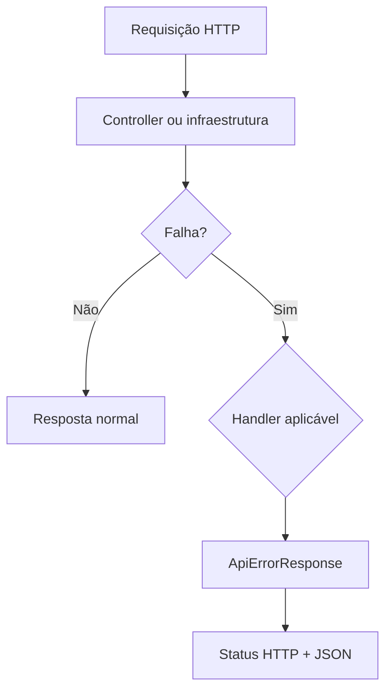
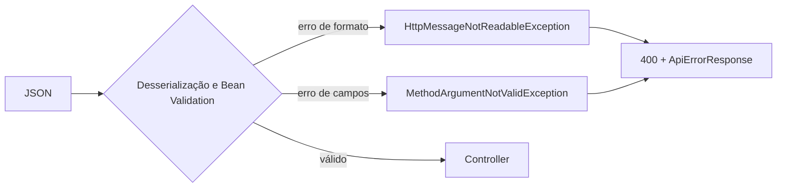
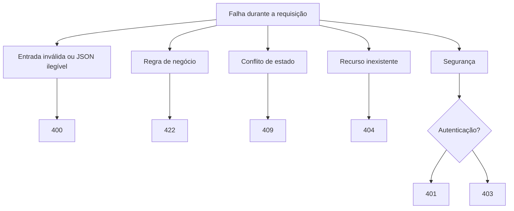

# Tratamento de erros

## Objetivo deste capítulo

Uma API não responde apenas quando tudo dá certo. Ela também precisa explicar,
de forma consistente, por que uma requisição não pôde ser concluída.

> **Pergunta central:** como o Escala 24 transforma falhas de validação, regras
> de negócio, conflitos, recursos inexistentes e segurança em respostas HTTP?

Neste capítulo, veremos o tratamento implementado no backend. A segurança será
abordada somente até o ponto necessário para entender `401 Unauthorized` e
`403 Forbidden`; o funcionamento completo do Spring Security permanece no
capítulo dedicado ao tema.

## 1. Ideia simples: uma falha precisa de uma resposta compreensível

Considere duas respostas possíveis para uma requisição inválida:

```text
500 Internal Server Error
```

ou:

```json
{
  "status": 400,
  "message": "A requisição possui campos inválidos",
  "fieldErrors": {
    "email": "deve ser um endereço de e-mail válido"
  }
}
```

A segunda resposta é mais útil para o cliente da API. Ela informa o status,
uma mensagem e, quando aplicável, quais campos precisam ser corrigidos.

No Escala 24, o contrato comum está em
[`ApiErrorResponse.java`](../../src/main/java/br/com/escala24/dto/ApiErrorResponse.java):

```java
LocalDateTime timestamp
int status
String error
String message
String path
Map<String, String> fieldErrors
```

Esse DTO não é uma garantia de que toda falha possível chegará nesse formato.
Ele é o formato utilizado pelos handlers explícitos do projeto.

## 2. O ponto central: `GlobalExceptionHandler`

O [`GlobalExceptionHandler.java`](../../src/main/java/br/com/escala24/controller/GlobalExceptionHandler.java)
é anotado com `@RestControllerAdvice`. Isso permite que o Spring MVC encaminhe
exceções lançadas durante o processamento dos controllers para métodos
centralizados, em vez de cada controller montar respostas de erro sozinho.

O fluxo pode ser resumido assim:



O handler recebe a exceção, escolhe um status, usa a mensagem da exceção (ou
uma mensagem fixa) e chama `buildResponse(...)`. Esse método preenche os
campos comuns, inclusive o caminho da requisição.

## 3. Validação de entrada: `400 Bad Request`

### Conceito

Validação de entrada verifica se os dados recebidos respeitam o contrato da
operação. Ela não decide, por exemplo, se uma escala já publicada pode ser
alterada; essa é uma regra do domínio.

### Implementação real

DTOs como [`FirefighterRegistrationRequest.java`](../../src/main/java/br/com/escala24/dto/FirefighterRegistrationRequest.java)
declaram restrições Bean Validation, como `@NotBlank`, `@Email` e `@Size`.
Quando o controller usa `@Valid @RequestBody`, o Spring MVC pode lançar
`MethodArgumentNotValidException` antes de executar o fluxo normal do service.

O handler então devolve:

```text
HTTP 400 Bad Request
message: A requisição possui campos inválidos
fieldErrors: erros agrupados por campo
```

O teste [`FirefighterControllerTest.java`](../../src/test/java/br/com/escala24/controller/FirefighterControllerTest.java)
verifica esse cenário para cadastro de bombeiro. Testes equivalentes aparecem
em `HolidayControllerTest`, `UnavailabilityControllerTest` e
`MonthlyScheduleControllerTest`.

JSON malformado segue outro caminho, mas também recebe `400`: o handler trata
`HttpMessageNotReadableException` e usa a mensagem fixa
`A requisição possui formato inválido`.



O fato de o Spring disparar essas exceções é comportamento do framework; o
status e o formato padronizado são decisões implementadas pelo projeto.

## 4. Regra de negócio violada: `422 Unprocessable Content`

### Conceito

Aqui a requisição tem formato válido, mas não pode ser realizada porque viola
uma condição do domínio.

### Exemplos reais

O handler `handleBusinessRule(...)` associa `422` às seguintes exceções:

| Exceção | Situação representada |
| --- | --- |
| `InactiveFirefighterException` | bombeiro inativo receberia um plantão |
| `FirefighterUnavailableForDutyException` | existe indisponibilidade aprovada |
| `MandatoryRestViolationException` | há plantão em data adjacente |
| `IncompleteMonthlyScheduleException` | a escala não possui todos os plantões necessários |
| `NoEligibleFirefighterException` | nenhum candidato pode assumir a data |
| `InvalidUnavailabilityPeriodException` | a data final precede a inicial |
| exceções de senha | a troca viola as regras de senha |

Exemplo observado em [`UnavailabilityControllerTest.java`](../../src/test/java/br/com/escala24/controller/UnavailabilityControllerTest.java):
`InvalidUnavailabilityPeriodException` resulta em `422`.

Esse status não significa que todos os erros de domínio do sistema tenham sido
exaustivamente testados em um único lugar. Ele descreve o mapeamento atual do
handler; a cobertura efetiva depende dos testes de cada controller e service.

O uso de `422` aqui é uma decisão do projeto para representar determinadas
regras de negócio violadas. O código HTTP, sozinho, não define a regra do
domínio; ele apenas comunica ao cliente como o backend classificou aquela
falha.

## 5. Conflitos: `409 Conflict`

### Conceito

Conflito ocorre quando a requisição é compreensível, mas não pode ser aplicada
porque colide com o estado atual do sistema.

### Exemplos reais

`handleConflict(...)` devolve `409` para situações como:

- e-mail ou matrícula já cadastrados;
- escala do mês já existente;
- tentativa de alterar ou publicar uma escala em estado incompatível;
- indisponibilidade já analisada;
- feriado duplicado;
- aprovação que exige remanejamento prévio.

No cadastro, [`FirefighterControllerTest.java`](../../src/test/java/br/com/escala24/controller/FirefighterControllerTest.java)
verifica que `EmailAlreadyExistsException` resulta em `409`. O service de
cadastro também possui testes de integração para e-mail e matrícula duplicados,
mas esses testes verificam a exceção no service, não o status HTTP.

## 6. Recurso inexistente: `404 Not Found`

O método `handleNotFound(...)` trata as exceções específicas de recurso não
encontrado:

```text
MonthlyScheduleNotFoundException
DutyAssignmentNotFoundException
FirefighterNotFoundException
UnavailabilityNotFoundException
HolidayNotFoundException
```

A resposta é `404 Not Found`, com a mensagem produzida pela exceção. Por
exemplo, o teste de desativação em
[`FirefighterControllerTest.java`](../../src/test/java/br/com/escala24/controller/FirefighterControllerTest.java)
verifica `404` e o campo `path`.

Isso representa uma decisão explícita do domínio: o service lança uma exceção
específica e o handler a converte em resposta HTTP. Não é uma conclusão baseada
somente no nome das classes; o agrupamento está no código do handler.

## 7. Autenticação e autorização

Essas falhas acontecem na infraestrutura de segurança e não são tratadas pelo
`GlobalExceptionHandler`.

### `401 Unauthorized`

`RestAuthenticationEntryPoint` devolve `401` quando a autenticação é necessária
ou quando o login recebe credenciais inválidas. A resposta também usa
`ApiErrorResponse`, mas é escrita diretamente no `HttpServletResponse`.

### `403 Forbidden`

`RestAccessDeniedHandler` devolve `403` quando o usuário está autenticado, mas
não possui permissão para o recurso. `AdministratorRequiredException`, por
outro lado, é uma regra de aplicação tratada pelo `GlobalExceptionHandler` e
também resulta em `403`.

Os testes de [`AuthenticationIntegrationTest.java`](../../src/test/java/br/com/escala24/controller/AuthenticationIntegrationTest.java),
[`HolidaySecurityIntegrationTest.java`](../../src/test/java/br/com/escala24/controller/HolidaySecurityIntegrationTest.java)
e [`UnavailabilityApiIntegrationTest.java`](../../src/test/java/br/com/escala24/controller/UnavailabilityApiIntegrationTest.java)
verificam exemplos de `401` e `403`. O capítulo de segurança detalhará sessão,
CSRF e regras de acesso.

## 8. Mapa dos tratamentos implementados



Esta é a taxonomia observada nos handlers atuais, não uma promessa de que toda
exceção futura será automaticamente classificada dessa forma.

## 9. O que não está implementado neste tratamento

O código analisado não possui, no `GlobalExceptionHandler`, um handler
explícito para toda exceção inesperada, como `Exception.class`. Portanto, este
capítulo não afirma que qualquer falha desconhecida terá necessariamente o
mesmo `ApiErrorResponse`.

Não foi identificada, no tratamento explícito analisado para este capítulo,
uma política própria para erros de banco, timeouts, indisponibilidade do
PostgreSQL ou observabilidade. Essas situações podem receber tratamento padrão
do Spring Boot ou depender da infraestrutura; não foram inventariadas como uma
categoria implementada pelo Escala 24.

## 10. Consequências e alternativas

Centralizar o mapeamento reduz duplicação e mantém os controllers focados em
casos de sucesso. O custo é que uma nova exceção customizada precisa ser
associada conscientemente a um handler; caso contrário, ela pode não receber o
status pretendido.

Uma alternativa seria retornar um tipo de resultado explícito em cada service,
sem usar exceções para controle de fluxo. O projeto atual escolhe exceções
customizadas para comunicar falhas de domínio até a fronteira HTTP.

Outra alternativa seria criar uma hierarquia de exceções com status embutido.
Isso reduziria listas no handler, mas aproximaria o domínio de detalhes HTTP.
Hoje o Escala 24 mantém esse mapeamento no controller advice, separando a
regra da decisão de transporte.

## 11. Erros comuns ao estudar este código

- Confundir `400` de validação com `422` de regra de negócio.
- Dizer que todo `403` vem do `GlobalExceptionHandler`; o handler de acesso
  negado pertence ao Spring Security.
- Dizer que os testes comprovam todo o tratamento; cada teste cobre apenas os
  cenários que executa.
- Assumir que toda exceção inesperada vira automaticamente `ApiErrorResponse`.
- Usar o status HTTP como substituto da mensagem da regra: o status classifica
  o tipo de falha, enquanto a mensagem explica o caso concreto.

## 12. Onde estudar no código

- Contrato de resposta: [`ApiErrorResponse.java`](../../src/main/java/br/com/escala24/dto/ApiErrorResponse.java)
- Mapeamento de exceções: [`GlobalExceptionHandler.java`](../../src/main/java/br/com/escala24/controller/GlobalExceptionHandler.java)
- Exceções de domínio: [`exception/`](../../src/main/java/br/com/escala24/exception/)
- Segurança HTTP: [`RestAuthenticationEntryPoint.java`](../../src/main/java/br/com/escala24/security/RestAuthenticationEntryPoint.java)
  e [`RestAccessDeniedHandler.java`](../../src/main/java/br/com/escala24/security/RestAccessDeniedHandler.java)
- Regras de acesso: [`SecurityConfig.java`](../../src/main/java/br/com/escala24/config/SecurityConfig.java)
- Testes de API: [`src/test/java/br/com/escala24/controller/`](../../src/test/java/br/com/escala24/controller/)

## Perguntas de revisão

1. Qual é a diferença entre `MethodArgumentNotValidException` e
   `InvalidUnavailabilityPeriodException`?
2. Por que e-mail duplicado é tratado como `409`, e não como erro de formato?
3. Qual componente devolve `401` para uma requisição sem autenticação?
4. Qual é a diferença entre `AdministratorRequiredException` e
   `AccessDeniedException`?
5. O que os testes atuais verificam sobre `fieldErrors`?
6. O que ainda não pode ser afirmado sobre exceções inesperadas?
7. Por que o projeto separa a exceção de domínio da decisão sobre qual status
   HTTP devolver?

## Resumo

O Escala 24 possui um contrato comum de erro em `ApiErrorResponse` e concentra
boa parte do mapeamento HTTP no `GlobalExceptionHandler`. Atualmente, validação
e formato inválido resultam em `400`, conflitos em `409`, recursos inexistentes
em `404` e regras de negócio mapeadas resultam em `422`. Autenticação e
autorização usam handlers próprios e resultam em `401` ou `403`.

Essas conclusões distinguem o que está implementado no código, o que é
verificado por testes específicos e o que é comportamento fornecido pelo
framework.

Uma frase útil para lembrar é:

> **A exceção explica o que falhou; o tratamento de erros transforma essa falha em uma resposta HTTP previsível para quem consome a API.**
