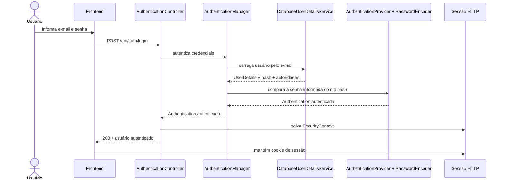
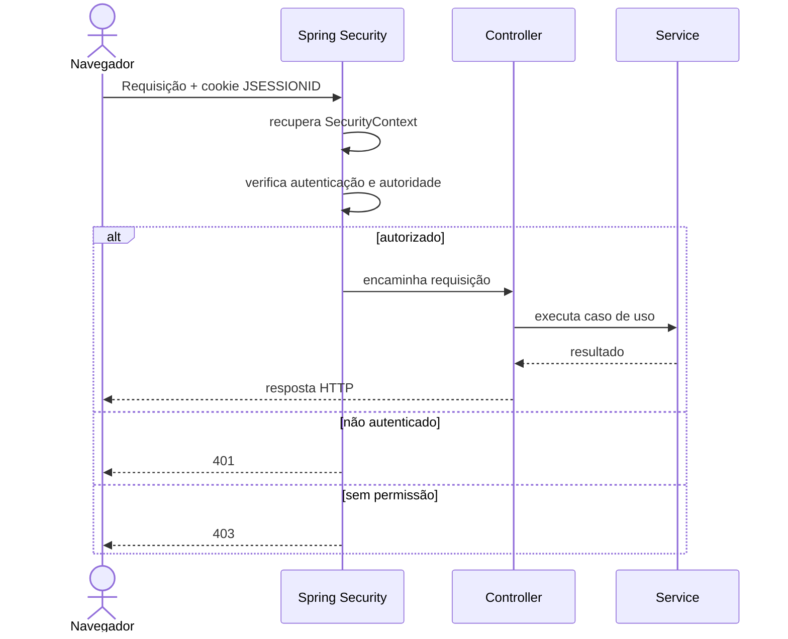
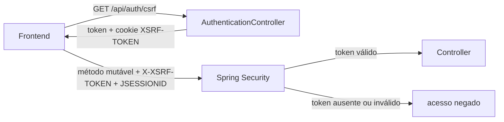

# Segurança

## Objetivo deste capítulo

Este capítulo explica como a segurança está implementada atualmente no Escala
24: autenticação, sessão, autorização, proteção contra CSRF, armazenamento de
senhas e respostas para falhas de acesso.

> **Pergunta central:** como o Escala 24 identifica o usuário, mantém sua
> sessão e impede que ele execute operações que não pertencem ao seu perfil?

O foco é a implementação real do projeto. O tratamento geral de erros foi
explicado no capítulo 06; aqui, `401` e `403` serão retomados somente sob a
perspectiva de segurança.

## 1. Visão geral da segurança no Escala 24

É útil separar duas perguntas:

```text
Autenticação: quem é o usuário?
Autorização: o que esse usuário pode fazer?
```

No Escala 24, o fluxo principal da interface web é baseado em sessão:



Depois do login, o navegador envia o cookie de sessão nas requisições da mesma
origem. O Spring Security recupera a identidade associada à sessão antes de
avaliar a autorização da rota.

| Componente | Responsabilidade observada |
| --- | --- |
| `SecurityConfig` | filtros, sessão, CSRF, logout e regras de acesso |
| `DatabaseUserDetailsService` | carrega a conta e constrói autoridades |
| `SessionAuthenticationService` | autentica e salva o contexto na sessão |
| `RestAuthenticationEntryPoint` | responde a falhas de autenticação com `401` |
| `RestAccessDeniedHandler` | responde a acesso não autorizado com `403` |
| `PasswordConfig` | fornece o `BCryptPasswordEncoder` |

## 2. Autenticação

Autenticar é verificar se as credenciais apresentadas correspondem a uma conta
válida. No projeto, o usuário informa e-mail e senha; a autorização só pode ser
avaliada depois que essa identidade foi estabelecida.

O endpoint de login é:

```http
POST /api/auth/login
```

O [`AuthenticationController.java`](../../src/main/java/br/com/escala24/controller/AuthenticationController.java)
recebe um `LoginRequest` validado e delega ao
[`SessionAuthenticationService.java`](../../src/main/java/br/com/escala24/service/SessionAuthenticationService.java).
Esse service cria um token não autenticado, chama
`AuthenticationManager.authenticate(...)` e salva o `SecurityContext` na
sessão HTTP.

O `AuthenticationManager` utiliza o
[`DatabaseUserDetailsService.java`](../../src/main/java/br/com/escala24/security/DatabaseUserDetailsService.java),
que normaliza o e-mail, busca o `User` no repository e monta um `UserDetails`
com o hash persistido, o estado ativo e as autoridades da conta.

O provider de autenticação, usando o `PasswordEncoder`, compara a senha
informada com o valor persistido. O `DatabaseUserDetailsService` fornece os
dados da conta; ele não realiza essa comparação. A aplicação não compara
manualmente a senha em texto puro com a coluna `password`.

Se o login for aceito, o controller devolve `AuthenticatedUserResponse`, que
contém nome, e-mail, perfil e `mustChangePassword`, mas não a senha. Se as
credenciais forem inválidas, o
[`RestAuthenticationEntryPoint.java`](../../src/main/java/br/com/escala24/security/RestAuthenticationEntryPoint.java)
responde `401 Unauthorized` com `Credenciais inválidas`.

O teste `shouldRejectInvalidCredentialsWithoutCreatingSession()` em
[`AuthenticationIntegrationTest.java`](../../src/test/java/br/com/escala24/controller/AuthenticationIntegrationTest.java)
verifica status, mensagem, caminho e ausência de sessão nesse cenário.

## 3. Sessão HTTP

Uma **sessão HTTP** é o estado mantido pelo servidor para associar requisições
posteriores à autenticação. O **cookie** é o valor enviado pelo navegador que
permite localizar essa sessão.

```text
servidor: SecurityContext associado à sessão
navegador: cookie JSESSIONID que identifica a sessão
```

O cookie não é a identidade completa do usuário nem substitui as verificações
do servidor.

`SecurityConfig` usa `SessionCreationPolicy.IF_REQUIRED`. O
`SessionAuthenticationService` salva o `SecurityContext` por meio de
`HttpSessionSecurityContextRepository`, e requisições posteriores podem
recuperar a identidade por meio de `Principal`.

O projeto configura a estratégia
`ChangeSessionIdAuthenticationStrategy` dentro de um
`CompositeSessionAuthenticationStrategy`. Assim, o identificador da sessão é
renovado na autenticação. O teste `shouldChangeSessionIdAfterAuthentication()`
compara os identificadores antes e depois do login.

No arquivo [`application.properties`](../../src/main/resources/application.properties),
os cookies de sessão estão configurados assim:

```properties
server.servlet.session.cookie.http-only=true
server.servlet.session.cookie.same-site=lax
server.servlet.session.cookie.secure=${SERVER_SERVLET_SESSION_COOKIE_SECURE:false}
```

Logo, `HttpOnly` é verdadeiro e `SameSite` é `Lax`. `Secure` depende da
propriedade de ambiente e assume `false` quando nenhum valor é fornecido.

O logout é `POST /api/auth/logout`. A configuração invalida a sessão, limpa a
autenticação, remove `JSESSIONID` e responde `204 No Content`. O teste
`shouldInvalidateSessionOnLogout()` verifica a invalidação e confirma que uma
consulta posterior anônima recebe `401`.

## 4. Autorização e perfis

```text
login aceito    → identidade autenticada
rota autorizada → operação permitida para essa identidade
```

Os perfis persistidos em [`Role.java`](../../src/main/java/br/com/escala24/entity/Role.java)
são `ADMIN` e `FIREFIGHTER`. O `DatabaseUserDetailsService` transforma esses
valores em autoridades `ROLE_ADMIN` e `ROLE_FIREFIGHTER` por meio de
`.roles(user.getRole().name())`.

As regras configuradas em
[`SecurityConfig.java`](../../src/main/java/br/com/escala24/config/SecurityConfig.java)
incluem:

| Grupo | Acesso |
| --- | --- |
| `GET /api/auth/csrf` | público |
| `POST /api/auth/login` | público no controle de rota; continua sujeito a CSRF |
| `GET /api/users/me` | usuário autenticado |
| `PUT /api/users/me/password` | usuário autenticado |
| `GET /api/holidays/**` | `ADMIN` ou `FIREFIGHTER` |
| demais métodos em `/api/holidays/**` | `ADMIN` |
| `GET /api/unavailabilities/pending` | `ADMIN` |
| `PATCH /api/unavailabilities/*/approval` e `PATCH /api/unavailabilities/*/rejection` | `ADMIN` |
| `POST /api/unavailabilities` | `FIREFIGHTER` |
| `GET /api/unavailabilities/me` | `FIREFIGHTER` |
| todos os métodos em `/api/firefighters/**` | `ADMIN` |
| `GET /api/monthly-schedules/**` | `ADMIN` ou `FIREFIGHTER` |
| demais métodos em `/api/monthly-schedules/**` | `ADMIN` |
| demais métodos em `/api/**` | `ADMIN` ou `FIREFIGHTER` |

O verbo HTTP faz diferença: consultar uma escala é permitido aos dois perfis,
mas gerar, publicar ou remanejar exige a regra administrativa correspondente.

## 5. Proteção dos endpoints



O frontend pode esconder um botão, mas o backend precisa impedir uma chamada
direta à API. Os testes de segurança exercitam esse princípio com requisições
MockMvc independentes da interface visual.

Os testes usam frequentemente `httpBasic(...)` para fornecer credenciais ao
MockMvc. Isso é um recurso dos testes; não muda o fluxo de login baseado em
sessão usado pelo frontend. A configuração também habilita HTTP Basic, mas a
interface inicia a sessão por `/api/auth/login`.

## 6. CSRF

CSRF, ou **Cross-Site Request Forgery** (falsificação de requisição entre
sites), é o risco de um site malicioso tentar induzir o navegador de uma pessoa
autenticada a enviar uma operação para outro site. Ele importa especialmente
quando a autenticação depende de cookies enviados automaticamente.

CSRF não é autenticação:

- autenticação responde “quem está fazendo a requisição?”;
- CSRF ajuda a verificar se uma requisição mutável possui o token esperado.

`SecurityConfig` habilita CSRF no modo SPA e usa
`CookieCsrfTokenRepository.withHttpOnlyFalse()`.

O endpoint público `GET /api/auth/csrf`, implementado pelo
`AuthenticationController`, retorna `CsrfToken` e disponibiliza o cookie
`XSRF-TOKEN`. Ele não é `HttpOnly` porque o JavaScript precisa lê-lo para
enviar o cabeçalho da próxima requisição protegida.

Em [`frontend/app.js`](../../frontend/app.js), `getCsrfToken()` procura o cookie
e, caso necessário, chama `/api/auth/csrf`. Depois, `apiRequest(...)` considera
seguros `GET`, `HEAD`, `OPTIONS` e `TRACE`; para os demais métodos envia:

```http
X-XSRF-TOKEN: <valor do token>
```

As chamadas usam `credentials: "same-origin"`, permitindo que os cookies de
sessão e CSRF acompanhem requisições da mesma origem. O `JSESSIONID` identifica
a sessão no servidor; o `XSRF-TOKEN` é o token CSRF que o JavaScript lê e
reenvia no cabeçalho. Eles têm finalidades diferentes.



Os testes de `AuthenticationIntegrationTest` verificam a obtenção do token,
rejeição de login sem CSRF e limpeza do token anterior após a autenticação. Os
demais testes usam `.with(csrf())` para representar requisições mutáveis com
proteção válida.

## 7. Senhas e BCrypt

Uma senha em texto puro pode ser lida diretamente. Um hash de senha é uma
representação de mão única usada para comparação; não é texto que a aplicação
descriptografa para recuperar a senha original.

```text
senha informada
        ↓ BCryptPasswordEncoder
hash persistido em users.password
```

O [`PasswordConfig.java`](../../src/main/java/br/com/escala24/config/PasswordConfig.java)
fornece `BCryptPasswordEncoder` como `PasswordEncoder`. O campo `User.password`
armazena o resultado codificado, não a senha em texto puro.

No cadastro de bombeiro e no bootstrap inicial do administrador, a senha é
codificada antes da persistência. O teste de integração do cadastro verifica
que o valor persistido não é o texto recebido e que o encoder consegue
validá-lo.

## 8. Troca obrigatória de senha

No cadastro e no bootstrap inicial, `mustChangePassword` começa como `true`.
O login pode ser concluído, mas o `DatabaseUserDetailsService` atribui somente
`PASSWORD_CHANGE_REQUIRED` enquanto essa condição estiver ativa.

Essa autoridade não equivale a `ROLE_ADMIN` ou `ROLE_FIREFIGHTER`. Por isso,
rotas protegidas por perfil ficam inacessíveis até a troca, enquanto as rotas
necessárias para consultar o usuário e alterar a senha continuam autenticadas.

`PasswordChangeService` exige:

1. senha atual correta, usando `passwordEncoder.matches(...)`;
2. confirmação igual à nova senha;
3. nova senha diferente da senha atual;
4. nova senha entre 8 e 72 caracteres, conforme `PasswordChangeRequest`.

Depois, grava um novo hash e define `mustChangePassword` como `false`. O
`UserAccountController` autentica novamente a sessão com a nova senha.

Os testes `shouldBlockApiWhilePasswordChangeIsRequired()` e
`shouldChangePasswordAndRestoreRoleAccess()` verificam o bloqueio, a persistência
do novo hash e a restauração das autoridades do perfil.

## 9. `401 Unauthorized` e `403 Forbidden`

```text
401 → não há autenticação válida para a requisição
403 → há uma identidade, mas ela não possui a permissão necessária
```

No projeto, `RestAuthenticationEntryPoint` produz `401` para acesso anônimo a
recurso protegido e para credenciais inválidas no login. `RestAccessDeniedHandler`
produz `403` quando uma autoridade autenticada não satisfaz a regra da rota.

`AdministratorRequiredException` também resulta em `403`, mas essa decisão vem
de uma regra de aplicação no service, não diretamente da autorização declarada
no `SecurityFilterChain`.

Os testes `FirefighterSecurityIntegrationTest`,
`HolidaySecurityIntegrationTest`, `MonthlyScheduleSecurityIntegrationTest`,
`UnavailabilityApiIntegrationTest` e `PasswordChangeIntegrationTest` exercitam
acesso anônimo, perfis, usuário inativo e troca de senha pendente.

## 10. Como frontend e backend cooperam sem confiar um no outro

O frontend usa o perfil retornado pelo backend para esconder ações
administrativas, mostrar a troca obrigatória de senha e limitar a navegação
visual. Isso melhora a experiência, mas não é autorização.

Por exemplo, `navigateTo(...)` em `frontend/app.js` verifica o perfil antes de
abrir a página de bombeiros, mas a proteção real está em `SecurityConfig`, que
exige `ROLE_ADMIN` para `/api/firefighters/**`.

| Tipo | Exemplo |
| --- | --- |
| Regra de segurança | somente `ADMIN` acessa `/api/firefighters/**` |
| Regra de negócio | bombeiro inativo não recebe plantão |
| Decisão de interface | esconder o botão de geração para `FIREFIGHTER` |

O backend continua sendo a fronteira confiável mesmo quando a API é chamada sem
usar a interface.

## 11. Decisões, alternativas e consequências

| Decisão | Problema resolvido | Consequência ou alternativa |
| --- | --- | --- |
| Sessão HTTP | mantém o usuário identificado entre chamadas | exige proteção CSRF e invalidação no logout; tokens stateless seriam outra opção |
| Roles `ADMIN` e `FIREFIGHTER` | centraliza permissões no `SecurityConfig` | regras mais granulares exigiriam outra modelagem |
| BCrypt | evita senha em texto puro e permite comparação segura | a senha original não é recuperável |
| Token CSRF | reduz o risco de operações mutáveis forjadas usando cookies | o frontend precisa obter e enviar o token |
| Handlers próprios | mantém `401` e `403` no formato JSON da API | devem permanecer alinhados ao `ApiErrorResponse` |

## 12. Limitações da implementação atual

Não foi identificada na implementação analisada uma funcionalidade de:

- recuperação de senha por e-mail;
- autenticação multifator (MFA);
- OAuth2 ou OpenID Connect;
- múltiplas organizações com isolamento entre tenants;
- rate limiting implementado na aplicação;
- bloqueio de conta após tentativas consecutivas;
- política de expiração periódica de senha.

Também não foi identificada uma configuração própria de HTTPS no backend. O
atributo `Secure` do cookie é configurável por ambiente e assume `false` por
padrão na propriedade analisada; a terminação TLS pode depender da
infraestrutura de execução.

Essas observações não constituem uma auditoria completa de segurança
operacional.

## 13. Erros comuns ao estudar segurança

- Confundir login aceito com autorização para todas as rotas.
- Tratar `JSESSIONID` como a identidade completa do usuário.
- Confundir cookie CSRF com cookie de sessão.
- Pensar que CSRF substitui autenticação.
- Chamar o hash BCrypt de criptografia reversível.
- Considerar que esconder um botão protege uma operação.
- Tratar `403` de `AccessDeniedHandler` e `403` de regra de domínio como se
  viessem exatamente do mesmo ponto.
- Usar testes com `httpBasic(...)` como prova de que o frontend faz login por
  Basic; nos testes, esse mecanismo facilita autenticar requisições MockMvc.

## 14. Onde estudar no código

| Assunto | Arquivo |
| --- | --- |
| Filtros, sessão, CSRF e rotas | [`SecurityConfig.java`](../../src/main/java/br/com/escala24/config/SecurityConfig.java) |
| Login e token CSRF | [`AuthenticationController.java`](../../src/main/java/br/com/escala24/controller/AuthenticationController.java) |
| Contexto da sessão | [`SessionAuthenticationService.java`](../../src/main/java/br/com/escala24/service/SessionAuthenticationService.java) |
| Usuário no Spring Security | [`DatabaseUserDetailsService.java`](../../src/main/java/br/com/escala24/security/DatabaseUserDetailsService.java) |
| Respostas `401` e `403` | [`RestAuthenticationEntryPoint.java`](../../src/main/java/br/com/escala24/security/RestAuthenticationEntryPoint.java), [`RestAccessDeniedHandler.java`](../../src/main/java/br/com/escala24/security/RestAccessDeniedHandler.java) |
| Hash e troca de senha | [`PasswordConfig.java`](../../src/main/java/br/com/escala24/config/PasswordConfig.java), [`PasswordChangeService.java`](../../src/main/java/br/com/escala24/service/PasswordChangeService.java) |
| Conta e perfis | [`User.java`](../../src/main/java/br/com/escala24/entity/User.java), [`Role.java`](../../src/main/java/br/com/escala24/entity/Role.java) |
| Frontend e CSRF | [`frontend/app.js`](../../frontend/app.js) |

## Perguntas de revisão

1. Qual é a diferença entre autenticação e autorização?
2. Como o `AuthenticationManager` encontra o usuário do login?
3. Onde o `SecurityContext` autenticado é salvo?
4. Qual é a diferença entre sessão HTTP e cookie `JSESSIONID`?
5. Qual proteção contra session fixation está configurada?
6. Quais rotas exigem `ADMIN` ou `FIREFIGHTER`?
7. Por que `GET /api/auth/csrf` é público, mas uma requisição `POST` pode exigir token?
8. Por que o cookie `XSRF-TOKEN` precisa ser legível pelo JavaScript?
9. Por que CSRF não é uma forma de autenticação?
10. Qual é a diferença entre hash BCrypt e criptografia reversível?
11. O que acontece com as autoridades enquanto `mustChangePassword` é verdadeiro?
12. Por que esconder um botão não substitui `SecurityConfig`?
13. Por que os testes usam `httpBasic(...)` sem definir o fluxo principal da interface?
14. Qual componente produz `401` e qual produz `403`?
15. Quais limitações de segurança não foram identificadas como implementadas?

## Resumo

O Escala 24 autentica usuários por e-mail e senha, carrega suas contas do banco
e mantém o `SecurityContext` em uma sessão HTTP. O identificador da sessão é
renovado no login, o logout invalida a sessão e as rotas são protegidas por
autorização baseada nos perfis `ADMIN` e `FIREFIGHTER`.

No fluxo configurado, requisições que não usam métodos seguros (`GET`, `HEAD`,
`OPTIONS` e `TRACE`) exigem um token CSRF válido; isso inclui `POST`, `PUT`,
`PATCH` e `DELETE`, sem uma rota de API ignorada na configuração atual. O
frontend obtém o token em `/api/auth/csrf`,
lê o cookie `XSRF-TOKEN` e envia `X-XSRF-TOKEN`. As senhas são armazenadas como
hashes BCrypt, e senhas temporárias exigem troca antes da recuperação das
autoridades normais do perfil.

O frontend adapta a experiência, mas o backend permanece responsável por
impedir acessos não autorizados. Os testes verificam cenários específicos de
login, sessão, logout, CSRF, perfis, usuário inativo, troca obrigatória de
senha, `401` e `403`; eles não constituem, sozinhos, uma garantia abrangente de
segurança.

Uma frase útil para lembrar é:

> **Autenticar identifica a pessoa, autorizar limita a operação, e o backend precisa aplicar essa decisão mesmo quando a interface não é usada.**
