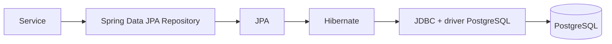

# 09 — JPA e repositories

## Objetivo deste capítulo

O capítulo 08 mostrou o modelo relacional no PostgreSQL. Agora o foco passa a
ser a ponte entre esse modelo e o código Java: como entities representam dados
persistidos e como repositories consultam e alteram esses dados.

> **Pergunta central:** como o Escala 24 representa o modelo relacional em
> objetos Java e como a aplicação acessa esses dados sem escrever toda a
> comunicação com o banco manualmente?

## Do objeto Java ao banco

Um objeto Java e uma linha de banco são modelos diferentes. O objeto possui
estado e comportamento dentro da aplicação; a linha possui valores em colunas
e participa das regras do PostgreSQL. A persistência é o processo de manter
esse estado entre execuções da aplicação.

No Escala 24, o caminho conceitual é:

```text
objeto Java
    ↕
JPA / Spring Data JPA
    ↕
Hibernate
    ↕
JDBC
    ↕
PostgreSQL
```

Essa representação é uma simplificação didática. O código usa as abstrações de
Spring Data JPA e JPA; não há chamadas JDBC manuais nos repositories analisados.

## O que é ORM

**ORM** (*Object-Relational Mapping*, ou mapeamento objeto-relacional) é a
técnica de relacionar objetos da aplicação a dados de um banco relacional.

Uma entity não é literalmente uma tabela. Ela é uma classe que descreve como
determinados dados persistidos podem ser representados e manipulados na
aplicação. Por exemplo:

```text
Firefighter (objeto Java)
        ↕ mapeamento
firefighters (tabela e suas linhas)
```

O ORM reduz o trabalho repetitivo de converter colunas em atributos e
referências entre tabelas em objetos relacionados. Ele não elimina as regras
do banco nem as decisões de negócio dos services.

## JPA, Hibernate e JDBC

Esses nomes representam responsabilidades diferentes:

- **JPA** (*Jakarta Persistence API*) é a especificação e API usada para
  declarar mapeamentos e operações de persistência;
- **Hibernate** é o provedor ORM que implementa a especificação JPA utilizada
  pela aplicação;
- **JDBC** (*Java Database Connectivity*) é a API de nível mais baixo usada
  para comunicação Java com bancos relacionais.

O `pom.xml` confirma `spring-boot-starter-data-jpa` e o driver `postgresql`.
O código dos repositories estende interfaces do Spring Data JPA, e não abre
conexões JDBC diretamente. Em termos práticos, Spring Data JPA fornece as abstrações usadas pelos repositories, Hibernate implementa o mapeamento e as operações de persistência definidas pela JPA, e o driver PostgreSQL participa da comunicação com o banco por meio de JDBC.



O diagrama mostra responsabilidades conceituais sobrepostas, não uma cadeia
de classes que o service chama manualmente em cada operação.

## Entities no Escala 24

As entities atuais são `User`, `Firefighter`, `MonthlySchedule`,
`DutyAssignment`, `Unavailability` e `Holiday`. Todas usam `@Entity` e
`@Id`, com identificadores gerados por `GenerationType.IDENTITY`, alinhados às
colunas `BIGSERIAL` das migrations.

Alguns mapeamentos representativos são:

```java
@Entity
@Table(name = "firefighters")
public class Firefighter {
    @Id
    @GeneratedValue(strategy = GenerationType.IDENTITY)
    private Long id;
}
```

`@Entity` informa que a classe participa do mapeamento de persistência e
`@Table` explicita a tabela. `@Id` identifica a chave primária e
`@GeneratedValue` delega a geração do identificador à estratégia configurada
para o banco.

`@Column` informa detalhes de uma coluna, como nome, obrigatoriedade, tamanho
ou unicidade. Por exemplo, `User.email` usa `nullable = false`, `unique = true`
e `length = 150`. O nome de atributo nem sempre é o nome da coluna: em
`MonthlySchedule`, `year` usa `@Column(name = "schedule_year")`.

Enums como `Role`, `ScheduleStatus`, `DayType`, `UnavailabilityType` e
`UnavailabilityStatus` usam `@Enumerated(EnumType.STRING)`. Assim, seus nomes
textuais são persistidos, em vez de a aplicação depender da posição numérica
do enum.

As annotations da entity ajudam a alinhar Java e banco, mas não substituem a
leitura das migrations. Por exemplo, a constraint de coerência de revisão de
`unavailabilities` existe no banco e não é reproduzida como uma única
annotation na entity.

## Como os relacionamentos são mapeados

O lado que possui a coluna FK usa `@JoinColumn`. O capítulo 08 identificou as
mesmas referências no banco; no Java, elas aparecem assim:

| Relação | Mapeamento real |
| --- | --- |
| `firefighters.user_id → users.id` | `Firefighter.user` com `@OneToOne`, `@JoinColumn(name = "user_id")`, `optional = false` e `FetchType.LAZY` |
| `duty_assignments.monthly_schedule_id → monthly_schedules.id` | `DutyAssignment.monthlySchedule` com `@ManyToOne`, FK obrigatória e `LAZY` |
| `duty_assignments.firefighter_id → firefighters.id` | `DutyAssignment.firefighter` com `@ManyToOne`, FK obrigatória e `LAZY` |
| `unavailabilities.firefighter_id → firefighters.id` | `Unavailability.firefighter` com `@ManyToOne`, FK obrigatória e `LAZY` |
| `unavailabilities.reviewed_by_user_id → users.id` | `Unavailability.reviewedBy` com `@ManyToOne` e `@JoinColumn` opcional |

`optional = false` e `nullable = false` expressam no mapeamento que a relação
é obrigatória. Em `reviewedBy`, a ausência de `optional = false` é coerente
com o fato de uma indisponibilidade pendente ainda não ter revisor.

As entities não possuem coleções `@OneToMany` para esses lados inversos. O
mapeamento é, portanto, predominantemente unidirecional: para chegar ao
bombeiro de um plantão, parte-se de `DutyAssignment`; não há uma coleção
declarada de plantões dentro de `Firefighter`.

Também não foram identificados `cascade` ou `orphanRemoval` nesses
relacionamentos. A remoção e a persistência das entidades relacionadas não
devem ser presumidas a partir do mapeamento.

## Repositories

Um **repository** é a abstração usada pela aplicação para acessar e persistir
um conjunto de dados. No Escala 24, existem repositories para `User`,
`Firefighter`, `MonthlySchedule`, `DutyAssignment`, `Unavailability` e
`Holiday`.

Cada um declara a entity gerenciada e o tipo da chave:

```java
public interface HolidayRepository
        extends JpaRepository<Holiday, Long> {
    Optional<Holiday> findByDate(LocalDate date);
}
```

O primeiro tipo genérico é `Holiday`; o segundo é `Long`, tipo de `Holiday.id`.
Ao estender `JpaRepository`, a interface recebe operações comuns sem precisar
de uma implementação manual para cada uma.

## O que o `JpaRepository` fornece

Entre as operações herdadas utilizadas no projeto estão:

- `findById`, para localizar um registro pela PK;
- `findAll`, para listar registros;
- `save`, para inserir ou atualizar uma entity;
- `existsById`, para verificar existência;
- `delete`, para remover uma entity;
- `flush`, utilizado em testes para sincronizar a operação pendente com o
  banco.

O repository não é o banco nem representa uma transação completa de negócio.
Ele oferece uma porta de acesso aos dados; o service ainda decide em que ordem
consultar, validar e alterar entidades.

## Métodos derivados de consulta

Spring Data interpreta partes do nome de determinados métodos e monta a
consulta correspondente. O nome não é um SQL escrito manualmente.

Por exemplo, em `MonthlyScheduleRepository`:

```java
Optional<MonthlySchedule> findByYearAndMonth(int year, int month);
```

O nome expressa uma busca em que `year` e `month` devem corresponder aos
valores recebidos. Já:

```java
List<Holiday> findByDateBetweenOrderByDateAsc(
        LocalDate startDate,
        LocalDate endDate
);
```

expressa um intervalo de datas com ordenação crescente. Outros exemplos reais
usam `existsBy`, como `existsByEmail`,
`existsByYearAndMonth` e
`existsByFirefighterIdAndDutyDateBetween`.

Não é necessário escrever a implementação desses métodos na interface. Também
não se deve afirmar o SQL exato produzido sem observar a execução concreta do
provedor.

## Consultas personalizadas

Não foram identificados `@Query`, JPQL ou SQL nativo nos repositories atuais.
As necessidades observadas são atendidas por operações herdadas, métodos
derivados e `@EntityGraph`.

Isso não significa que consultas personalizadas sejam impossíveis em Spring
Data JPA; significa apenas que elas não fazem parte da implementação atual
analisada.

## Exemplo real no Escala 24

Considere a classificação de uma data durante a geração de uma escala:

```text
MonthlyScheduleGenerationService
        ↓
DayTypeClassifier
        ↓
HolidayRepository.existsByDate(date)
        ↓
Holiday
        ↓
holidays no PostgreSQL
```

O service de geração precisa saber se uma data é feriado. O classifier usa o
repository para consultar a existência da data; o resultado participa da
decisão de usar `WEEKEND_OR_HOLIDAY`. A entity `Holiday` mapeia a tabela
`holidays`, enquanto Hibernate/JPA abstrai a conversão entre a operação Java e
o acesso ao banco.

Outro fluxo mostra uma consulta com relacionamentos:

```text
UnavailabilityManagementService
        ↓
UnavailabilityRepository.findByStatusOrderByRequestedAtAsc(...)
        ↓
Unavailability + firefighter + user
        ↓
unavailabilities, firefighters e users
```

O service decide que precisa listar indisponibilidades por estado; o repository
declara a consulta. A resposta e as regras de revisão continuam sendo
responsabilidade das camadas superiores.

## Service x repository

O capítulo 04 já apresentou a separação em camadas. Aqui, a distinção pode ser
resumida assim:

```text
Controller
    ↓
Service: decide e aplica o caso de uso
    ↓
Repository: consulta ou persiste dados
    ↓
JPA / Hibernate
    ↓
PostgreSQL
```

Por exemplo, `HolidayManagementService` verifica a existência e normaliza o
nome antes de chamar `holidayRepository.save(holiday)`. O repository não decide
se o nome deve ser normalizado nem qual resposta HTTP será devolvida.

Um método de consulta pode carregar a informação necessária para uma regra de
negócio, mas a decisão baseada no resultado pertence ao service. Isso mantém o
repository concentrado no acesso aos dados.

## O que não deve ficar no repository

No modelo atual, repositories não montam respostas HTTP, não validam DTOs e não
fazem autorização. Também não concentram a regra completa de geração,
remanejamento ou revisão de indisponibilidades.

Isso não proíbe que um repository ofereça uma consulta orientada por uma
necessidade do negócio. Por exemplo, `existsByFirefighterIdAndStatus...` ajuda
a descobrir uma indisponibilidade sobreposta; quem decide o que fazer diante
do resultado é o service.

## Carregamento de relacionamentos

Quando o código explicita `fetch = FetchType.LAZY`, como nas associações de
`Firefighter`, `DutyAssignment` e `Unavailability.firefighter`, o acesso ao
objeto relacionado é configurado para ser adiado até ser necessário, dentro
das condições de uso do contexto de persistência.

`Unavailability.reviewedBy` não especifica `fetch`, portanto segue o padrão da
anotação `@ManyToOne` definido pela JPA, em vez de uma escolha explícita do
projeto.

Os repositories usam `@EntityGraph` em consultas que retornam dados para a
API, incluindo caminhos como `firefighter.user`. Essa é uma instrução explícita
da consulta para buscar associações necessárias naquele carregamento. Não há,
no material analisado, evidência suficiente para afirmar uma política geral de
performance ou a existência de um problema N+1.

## Persistência e transações

Os services delimitam casos de uso com `@Transactional` e, em consultas, com
`@Transactional(readOnly = true)`. Há exemplos em
`HolidayManagementService`, `MonthlyScheduleGenerationService` e
`UnavailabilityManagementService`.

Dentro de uma transação, várias operações de repository podem participar do
mesmo caso de uso. Por isso, `save()` significa que uma entity foi entregue ao
contexto de persistência; não significa isoladamente que toda a regra de
negócio terminou ou que o commit já ocorreu naquele exato ponto.

## Entity x DTO

Uma entity representa dados persistidos e seus mapeamentos. Um **DTO** (*Data
Transfer Object*, objeto de transferência de dados) representa dados que entram
ou saem da API. Eles podem compartilhar campos, mas possuem responsabilidades
diferentes.

Por exemplo, `Holiday` contém o estado persistido, enquanto `HolidayResponse`
define a forma de exposição da resposta. Essa separação evita que o formato da
API dependa diretamente de todos os detalhes da persistência.

## Analogia: o arquivo da corporação

Podemos imaginar a entity como uma ficha estruturada, o repository como o
arquivista que sabe localizar e guardar fichas, JPA como o conjunto de regras
que descreve o arquivamento, Hibernate como o mecanismo que executa essas
regras e PostgreSQL como o arquivo central.

A analogia termina aí: entity e tabela continuam sendo modelos diferentes, e
Hibernate não compreende por conta própria o significado de uma regra de
negócio. Ele executa o mapeamento e a persistência definidos para a aplicação.

## Por que foi feito assim

O código atual permite algumas conclusões técnicas:

- os mapeamentos declarativos reduzem conversões repetitivas entre colunas e
  objetos;
- repositories específicos deixam explícita a entity e a chave que gerenciam;
- métodos derivados atendem consultas simples sem SQL manual;
- services permanecem responsáveis pela ordem das operações e pelas decisões
  de negócio;
- `@EntityGraph` explicita dados relacionados necessários em consultas
  específicas.

Essas são consequências observáveis da estrutura. Não constituem uma
afirmação sobre a intenção histórica dos autores.

## Erros comuns e cuidados

- Dizer que uma entity é literalmente uma tabela. Ela mapeia dados persistidos
  relacionados a uma tabela.
- Confundir JPA, que é uma especificação/API, com Hibernate, que é o provedor
  ORM.
- Achar que `JpaRepository` é o banco. Ele é uma abstração de acesso a dados.
- Presumir que cada método de repository precisa de implementação manual.
- Colocar autorização ou regra de negócio complexa no repository.
- Expor uma entity diretamente só porque ela possui os campos necessários.
- Tratar `save()` como sinônimo de toda uma transação de negócio.
- Confundir relacionamento Java com a FK: o mapeamento representa uma
  referência cuja integridade também é definida no banco.
- Presumir `LAZY`, `EAGER`, cascade ou `orphanRemoval` sem verificar a
  annotation concreta.

## Onde estudar no código

| Assunto | Arquivo |
| --- | --- |
| Entities e annotations | [`User.java`](../../src/main/java/br/com/escala24/entity/User.java), [`Firefighter.java`](../../src/main/java/br/com/escala24/entity/Firefighter.java), [`MonthlySchedule.java`](../../src/main/java/br/com/escala24/entity/MonthlySchedule.java), [`DutyAssignment.java`](../../src/main/java/br/com/escala24/entity/DutyAssignment.java), [`Unavailability.java`](../../src/main/java/br/com/escala24/entity/Unavailability.java), [`Holiday.java`](../../src/main/java/br/com/escala24/entity/Holiday.java) |
| Repositories | [`UserRepository.java`](../../src/main/java/br/com/escala24/repository/UserRepository.java), [`FirefighterRepository.java`](../../src/main/java/br/com/escala24/repository/FirefighterRepository.java), [`MonthlyScheduleRepository.java`](../../src/main/java/br/com/escala24/repository/MonthlyScheduleRepository.java), [`DutyAssignmentRepository.java`](../../src/main/java/br/com/escala24/repository/DutyAssignmentRepository.java), [`UnavailabilityRepository.java`](../../src/main/java/br/com/escala24/repository/UnavailabilityRepository.java), [`HolidayRepository.java`](../../src/main/java/br/com/escala24/repository/HolidayRepository.java) |
| Exemplo de service transacional | [`HolidayManagementService.java`](../../src/main/java/br/com/escala24/service/HolidayManagementService.java), [`MonthlyScheduleGenerationService.java`](../../src/main/java/br/com/escala24/service/MonthlyScheduleGenerationService.java) |
| Dependências e persistência | [`pom.xml`](../../pom.xml), [`application.properties`](../../src/main/resources/application.properties) |
| Estrutura relacional | [`V5__create_monthly_schedules_and_duty_assignments.sql`](../../src/main/resources/db/migration/V5__create_monthly_schedules_and_duty_assignments.sql), [`V6__create_unavailabilities.sql`](../../src/main/resources/db/migration/V6__create_unavailabilities.sql), [`V7__create_holidays.sql`](../../src/main/resources/db/migration/V7__create_holidays.sql) |

## Perguntas de revisão

1. Qual é a diferença entre JPA e Hibernate?
2. Por que uma entity não deve ser definida simplesmente como “uma tabela
   Java”?
3. O que `JpaRepository<Firefighter, Long>` informa?
4. Como Spring Data interpreta `findByYearAndMonth`?
5. Qual é a diferença entre a responsabilidade de um service e a de um
   repository?
6. Como a FK de `duty_assignments` para `firefighters` aparece em
   `DutyAssignment`?
7. Por que `@EntityGraph` é usado em algumas consultas?
8. Por que `save()` não representa sozinho todo o caso de uso transacional?

## Resumo

As entities do Escala 24 mapeiam objetos Java para dados persistidos, e os
repositories oferecem acesso tipado a essas entities. JPA define a abstração,
Hibernate implementa o ORM e JDBC participa da comunicação com o PostgreSQL.

Os relacionamentos usam `@JoinColumn` no lado das FKs, consultas simples usam
métodos derivados e não foram identificadas queries personalizadas nos
repositories atuais. Services continuam responsáveis por regras, decisões e
transações dos casos de uso; repositories concentram o acesso aos dados.

Uma frase útil para lembrar é:

> **A entity representa o dado, o repository acessa o dado e o service decide o que o sistema deve fazer com ele.**
