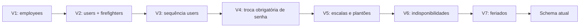
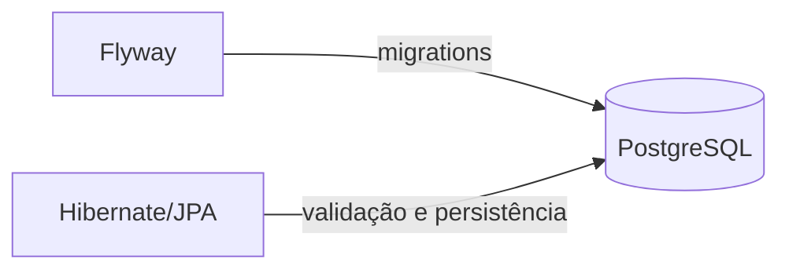

# 10 — Flyway e migrations

## Objetivo deste capítulo

Este capítulo explica como o Escala 24 cria e evolui a estrutura do banco de
dados de forma controlada. O foco é o uso real do Flyway, a sequência de
migrations e sua relação com JPA/Hibernate.

> **Pergunta central:** como o Escala 24 transforma um banco vazio no schema
> atual e registra essa evolução sem perder o histórico?

O capítulo 08 apresentou o modelo relacional final e o capítulo 09 mostrou
como as entities o representam. Aqui, migrations são analisadas como arquivos
que transformam o schema ao longo do tempo. O funcionamento do PostgreSQL e
das constraints permanece sendo o assunto do capítulo 08.

## Por que o banco precisa evoluir

O banco de uma aplicação não nasce necessariamente com todas as tabelas
prontas. Novas funcionalidades podem exigir tabelas, colunas, restrições ou
índices. Se cada ambiente receber alterações diferentes, desenvolvimento,
testes e produção deixam de ter estruturas comparáveis.

Uma **migration** é uma alteração versionada do schema. Ela registra uma etapa
reproduzível da evolução do banco, em vez de depender de uma instrução manual
sem histórico.

## O papel do Flyway

Flyway é a ferramenta usada pelo projeto para localizar migrations, verificar
quais já foram aplicadas e executar as pendentes em ordem. O `pom.xml` confirma
`spring-boot-starter-flyway` e o suporte de banco PostgreSQL.

A propriedade `spring.flyway.enabled=true` habilita esse processo na
inicialização da aplicação. O Flyway não representa entities nem aplica regras
de negócio: sua responsabilidade é controlar a evolução estrutural registrada
nos arquivos de migration.

## As migrations do Escala 24

O diretório
[`src/main/resources/db/migration`](../../src/main/resources/db/migration/)
contém sete migrations versionadas:

| Versão | Arquivo | Alteração principal |
| --- | --- | --- |
| V1 | `V1__create_employee_table.sql` | cria a estrutura inicial `employees`, com conta, senha, matrícula e dados de contato |
| V2 | `V2__separate_users_and_firefighters.sql` | renomeia `employees` para `users`, adiciona `role`, cria `firefighters`, migra dados e remove colunas específicas antigas |
| V3 | `V3__rename_users_id_sequence.sql` | renomeia a sequência do identificador para `users_id_seq` |
| V4 | `V4__add_password_change_requirement.sql` | adiciona `users.must_change_password` com padrão `TRUE` |
| V5 | `V5__create_monthly_schedules_and_duty_assignments.sql` | cria escalas mensais, plantões, constraints e índice de busca por bombeiro/data |
| V6 | `V6__create_unavailabilities.sql` | cria indisponibilidades, regras de revisão e índices de período |
| V7 | `V7__create_holidays.sql` | cria feriados, unicidade por data e validação de nome não vazio |

Essa tabela resume o papel de cada arquivo; ela não substitui a leitura do
SQL quando for necessário conhecer uma coluna ou constraint específica.

## Convenção de nomes e ordem

Os arquivos seguem o formato usado pelo projeto:

```text
V1__create_employee_table.sql
│ │                         └─ extensão SQL
│ └─ descrição após dois underscores
└── versão da migration
```

O `V` identifica uma migration versionada, o número define sua versão, os dois
underscores separam a versão da descrição e `.sql` indica o arquivo SQL.

As versões são aplicadas em ordem crescente. No Escala 24:



O schema final é o resultado acumulado. V1, isoladamente, não descreve o
estado atual: ela cria `employees`, mas V2 transforma essa estrutura em
`users` e `firefighters`, e as versões seguintes acrescentam outros dados.

## Banco novo x banco existente

Em um banco novo, ainda não há migrations registradas. Durante a inicialização,
o Flyway aplica V1, V2 e as demais versões pendentes até V7.

Em um banco existente, o Flyway consulta seu histórico e aplica somente as
versões que ainda não foram registradas como executadas. Por exemplo:

```text
Banco novo:       V1 → V2 → V3 → V4 → V5 → V6 → V7
Banco com V1–V5:                         V6 → V7
```

Essa descrição representa o comportamento padrão do Flyway usado pelo projeto;
ela não significa que um banco parcialmente alterado manualmente será
automaticamente corrigido.

## `flyway_schema_history`

O Flyway mantém uma tabela de histórico chamada `flyway_schema_history`. Ela
registra as migrations que foram aplicadas, incluindo informações que permitem
identificar sua versão e seu estado de execução.

O histórico funciona como um livro de registro: antes de executar uma versão, o Flyway verifica se ela já consta como aplicada. Entre os dados usados pelo Flyway está o checksum, uma soma de verificação do conteúdo da migration. O checksum funciona como uma identificação calculada a partir do conteúdo do arquivo e ajuda o Flyway a perceber quando uma migration registrada anteriormente foi modificada.

O código da aplicação não consulta diretamente essa tabela. Sua existência e
seu uso são responsabilidades do Flyway, conforme o comportamento da
ferramenta habilitada pelo Spring Boot.

## Por que migrations aplicadas não devem ser editadas

Uma migration aplicada passa a fazer parte do histórico compartilhado. Editá-la
depois pode produzir situações diferentes em ambientes que já a executaram e
ambientes que ainda serão criados. Também pode provocar divergência de
checksum e comprometer a reprodutibilidade.

```text
Errado:   alterar V5 depois que ela já foi aplicada
Correto:  criar V8 com a nova alteração
```

Como o projeto possui atualmente migrations de V1 a V7, uma alteração posterior poderia ser registrada, por exemplo, em uma nova migration V8, sem reescrever o significado histórico das versões anteriores. Editar um arquivo antigo não é tecnicamente
impossível, mas é uma prática insegura para ambientes compartilhados.

## Exemplo real: de `employees` para `users` e `firefighters`

A evolução entre V1 e V2 mostra por que é necessário considerar a sequência
completa:

1. V1 cria `employees` com dados comuns e dados específicos de bombeiro na
   mesma tabela;
2. V2 renomeia a tabela para `users` e renomeia a constraint da chave primária;
3. V2 adiciona `role` e preenche seu valor a partir de `administrator`;
4. V2 cria `firefighters` com `user_id`, matrícula e telefone;
5. V2 copia para `firefighters` os registros que não eram administradores;
6. V2 remove de `users` as colunas `registration`, `phone` e `administrator`.

O resultado é um modelo que separa a conta do sistema dos dados específicos do
bombeiro. Esse é um exemplo de migration que cria, altera, migra dados e
remove estrutura antiga.

V3 completa essa transição renomeando a sequência do identificador para
`users_id_seq`; V4 acrescenta a necessidade de troca obrigatória de senha.

## Flyway x Hibernate

Flyway e Hibernate não fazem a mesma coisa:

| Componente | Responsabilidade no projeto |
| --- | --- |
| Flyway | evolui o schema por migrations versionadas e mantém o histórico |
| JPA/Hibernate | mapeia entities e executa operações de persistência |
| PostgreSQL | armazena os dados e aplica constraints do banco |

Essa separação pode ser resumida assim:



O diagrama não significa que Hibernate executa as migrations. São caminhos
distintos que convergem no mesmo banco.

## `ddl-auto=validate`

O arquivo [`application.properties`](../../src/main/resources/application.properties)
define:

```properties
spring.jpa.hibernate.ddl-auto=validate
spring.flyway.enabled=true
```

Com `validate`, o Hibernate valida na inicialização se o schema encontrado é
compatível com os mapeamentos esperados pelas entities. Ele não deve criar ou
alterar automaticamente as tabelas nessa configuração.

Assim, a divisão de responsabilidades é:

```text
Flyway   → evolui o schema
Hibernate → valida o mapeamento contra o schema e persiste dados
```

`validate` não verifica se toda regra de negócio está correta e não substitui
as migrations. Também não é uma prova de que todas as consultas de uma
aplicação produzirão o resultado esperado.

## Falhas e cuidados

Na inicialização, uma migration pode falhar porque seu SQL é inválido, depende
de uma estrutura que não existe ou encontra um banco inacessível. Esses casos
devem ser distinguidos:

- uma migration inválida é uma falha lógica ou estrutural do SQL;
- um banco inacessível é uma falha de conexão ou infraestrutura;
- um schema incompatível com as entities pode fazer a validação do Hibernate
  falhar depois da etapa de migrations.

Em qualquer desses casos, a aplicação pode não concluir sua inicialização. O
comportamento exato de mensagens e encerramento depende da integração do
Spring Boot, Flyway, Hibernate e infraestrutura; não há, neste capítulo, uma
afirmação de que todo erro produzirá a mesma resposta.

Cuidados importantes:

- não apagar migrations antigas porque o banco atual já funciona;
- não renumerar versões já aplicadas;
- não fazer alterações manuais sem registrar a evolução necessária;
- não confundir migration executada com regra de negócio validada.

## Analogia: o livro de ordens da corporação

Uma migration pode ser vista como uma ordem oficial para alterar o arquivo da
corporação. O Flyway verifica quais ordens já foram executadas, e
`flyway_schema_history` funciona como o livro de registro. Uma nova alteração
recebe uma nova ordem numerada.

A analogia termina aí: o Flyway não interpreta o significado do domínio. Ele
executa scripts versionados e compara seu histórico; quem define as condições
formais do banco é o SQL, e quem aplica regras de negócio é a aplicação.

## Por que foi feito assim

O uso combinado de migrations e `ddl-auto=validate` permite que a evolução
estrutural seja explícita e versionada, enquanto os mapeamentos JPA sejam
conferidos contra o banco existente. O histórico também oferece uma sequência
reproduzível para novos ambientes.

Essa é uma consequência observável da configuração atual. O código não permite
atribuir uma intenção histórica mais específica aos autores.

## Erros comuns

- Tratar migration como backup. Ela descreve alterações de schema; não é uma
  cópia dos dados.
- Achar que V1 representa necessariamente o schema final.
- Confundir Flyway com Hibernate.
- Acreditar que `ddl-auto=validate` cria tabelas.
- Editar ou renumerar migrations já aplicadas.
- Apagar migrations antigas só porque o banco atual está funcionando.
- Supor que uma migration executada com sucesso garante que a regra de negócio
  esteja correta.

## Onde estudar no código

| Assunto | Arquivo |
| --- | --- |
| Habilitação do Flyway e validação JPA | [`application.properties`](../../src/main/resources/application.properties) |
| Dependências | [`pom.xml`](../../pom.xml) |
| Criação inicial | [`V1__create_employee_table.sql`](../../src/main/resources/db/migration/V1__create_employee_table.sql) |
| Separação de contas e bombeiros | [`V2__separate_users_and_firefighters.sql`](../../src/main/resources/db/migration/V2__separate_users_and_firefighters.sql) |
| Sequência e troca de senha | [`V3__rename_users_id_sequence.sql`](../../src/main/resources/db/migration/V3__rename_users_id_sequence.sql), [`V4__add_password_change_requirement.sql`](../../src/main/resources/db/migration/V4__add_password_change_requirement.sql) |
| Escalas e plantões | [`V5__create_monthly_schedules_and_duty_assignments.sql`](../../src/main/resources/db/migration/V5__create_monthly_schedules_and_duty_assignments.sql) |
| Indisponibilidades | [`V6__create_unavailabilities.sql`](../../src/main/resources/db/migration/V6__create_unavailabilities.sql) |
| Feriados | [`V7__create_holidays.sql`](../../src/main/resources/db/migration/V7__create_holidays.sql) |
| Testes de inicialização e persistência | [`PostgreSqlTestContainerConfiguration.java`](../../src/test/java/br/com/escala24/config/PostgreSqlTestContainerConfiguration.java) e testes de repository |

## Perguntas de revisão

1. Por que o estado final do banco não pode ser deduzido lendo apenas V1?
2. Como o Flyway sabe quais migrations já foram executadas?
3. Qual é a diferença entre Flyway e Hibernate?
4. Por que uma migration aplicada não deve ser alterada?
5. O que acontece com um banco que já possui V1–V5 quando V6 e V7 estão
   pendentes?
6. Qual é o papel de `spring.jpa.hibernate.ddl-auto=validate`?
7. Por que uma correção futura normalmente deve ser registrada em uma nova
   migration?

## Resumo

O Flyway controla a evolução do schema por migrations versionadas. No Escala
24, V1–V7 são aplicadas em ordem e produzem o modelo atual, enquanto
`flyway_schema_history` registra o que já foi executado. Um banco novo percorre
todo o histórico; um banco existente recebe apenas as versões pendentes.

Flyway evolui o schema, Hibernate/JPA mapeia e persiste entities, e
`ddl-auto=validate` confere a compatibilidade sem assumir a criação automática
das tabelas. Migrations aplicadas devem ser preservadas; correções futuras
devem ser novas versões.

Uma frase útil para lembrar é:

> **Flyway registra a evolução do banco; Hibernate usa o schema que essa evolução produziu.**
