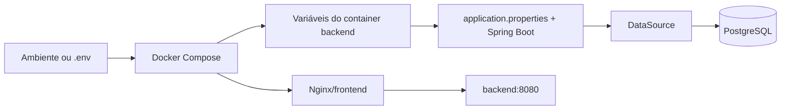

# 11 — Configuração e ambientes

## Objetivo deste capítulo

Este capítulo explica como o Escala 24 recebe valores que podem variar entre
execuções, sem misturar esses valores com o comportamento implementado no
código. O foco é o fluxo real entre `application.properties`, variáveis de
ambiente, Docker Compose, frontend, desktop e testes.

> **Pergunta central:** como o Escala 24 recebe as configurações necessárias
> para funcionar em diferentes contextos de execução?

“Ambiente”, aqui, significa um contexto de execução com determinados valores e
serviços disponíveis. Isso não quer dizer que o projeto possua profiles formais
como `dev`, `staging` ou `prod`: não foram identificados profiles Spring
explícitos no código atual.

## Código e configuração não são a mesma coisa

**Código** define comportamentos: como o login funciona, como uma escala é
gerada ou como uma indisponibilidade é validada.

**Configuração** fornece valores que podem mudar sem alterar esses
comportamentos: endereço do banco, usuário da conexão, porta publicada ou
habilitação do administrador inicial.

Um **secret** é uma configuração sensível, como uma senha. Ele precisa de
cuidados adicionais e não deve ser exposto em documentação, logs ou arquivos
versionados com seu valor real.

No Escala 24, `spring.datasource.password` é configuração de conexão e também
um secret. Já `spring.jpa.show-sql` é uma configuração comum; não contém uma
credencial.

## `application.properties`

O arquivo [`application.properties`](../../src/main/resources/application.properties)
é a configuração padrão do backend. O Spring Boot lê essas propriedades e
monta os componentes necessários para a aplicação.

As propriedades podem receber um valor externo com a forma:

```text
${VARIAVEL:valor-padrao}
```

`VARIAVEL` é a fonte externa e `valor-padrao` é usado quando ela não está
definida. O arquivo atual agrupa configurações importantes assim:

| Grupo | Exemplos reais | Finalidade |
| --- | --- | --- |
| Datasource | `spring.datasource.url`, `username`, `password` | conexão do backend com PostgreSQL |
| JPA | `spring.jpa.hibernate.ddl-auto=validate`, `spring.jpa.show-sql` | validação do mapeamento e controle de SQL exibido |
| Flyway | `spring.flyway.enabled=true` | habilitação das migrations |
| Sessão | propriedades `server.servlet.session.cookie.*` | atributos do cookie de sessão |
| Bootstrap | `escala24.bootstrap.admin.*` | configuração opcional do administrador inicial |
| Observabilidade/execução | actuator de health e shutdown gracioso | exposição do health check e encerramento controlado |

O código também liga as propriedades `escala24.bootstrap.admin.*` ao record
[`InitialAdminProperties.java`](../../src/main/java/br/com/escala24/config/InitialAdminProperties.java)
com `@ConfigurationProperties`. Portanto, essa configuração não é apenas um
texto consultado manualmente: o Spring a transforma em um objeto tipado.

## Variáveis de ambiente

Uma variável de ambiente permite fornecer um valor à aplicação sem gravá-lo
diretamente no código-fonte. No projeto, o Compose passa variáveis para o
container do backend, e o Spring Boot as utiliza nas propriedades
correspondentes.

As variáveis relevantes são:

| Variável | Finalidade | Default no backend | Sensível? |
| --- | --- | --- | --- |
| `SPRING_DATASOURCE_URL` | URL JDBC do PostgreSQL | URL local definida no arquivo | pode revelar topologia, mas não é senha |
| `SPRING_DATASOURCE_USERNAME` | usuário do banco | usuário local definido no arquivo | não, mas pode ser informação interna |
| `SPRING_DATASOURCE_PASSWORD` | senha do banco | não há fallback útil | sim |
| `SPRING_JPA_SHOW_SQL` | controla exibição de SQL | `false` | não |
| `SERVER_SERVLET_SESSION_COOKIE_SECURE` | atributo `Secure` do cookie de sessão | `false` | não |
| `ESCALA24_INITIAL_ADMIN_ENABLED` | habilita criação inicial de administrador | `false` | não |
| `ESCALA24_INITIAL_ADMIN_NAME` | nome do administrador inicial | vazio | não |
| `ESCALA24_INITIAL_ADMIN_EMAIL` | e-mail do administrador inicial | vazio | não |
| `ESCALA24_INITIAL_ADMIN_PASSWORD` | senha temporária inicial | vazio | sim |

Os nomes acima são documentados sem reproduzir senhas. Em especial, o fato de
uma propriedade possuir fallback vazio não significa que qualquer valor vazio
seja aceito: `InitialAdminBootstrap` exige nome, e-mail e senha quando o
bootstrap está habilitado.

## Configuração do PostgreSQL

No desenvolvimento local, `application.properties` possui uma URL JDBC padrão
para PostgreSQL local e recebe usuário e senha por propriedades externas. No
Compose, o backend recebe uma URL que usa o nome do serviço `postgres` e a
porta interna `5432`:

```text
variáveis do ambiente
        ↓
Docker Compose
        ↓
SPRING_DATASOURCE_URL / USERNAME / PASSWORD
        ↓
Spring Boot DataSource
        ↓
PostgreSQL
```

O nome `postgres` funciona dentro da rede do Compose; ele não é necessariamente
um hostname acessível diretamente pelo navegador ou pelo host. A distinção
entre rede interna e porta publicada é importante: o Compose principal publica
PostgreSQL na porta definida por `POSTGRES_PORT`, enquanto o backend usa a
porta interna do serviço.

Essa conexão é a entrada para as responsabilidades dos capítulos anteriores:
Flyway evolui o schema, Hibernate valida e persiste entities, e PostgreSQL
aplica as regras do banco.

## Defaults e sobrescrita

Há expressões reais como:

```properties
spring.jpa.show-sql=${SPRING_JPA_SHOW_SQL:false}
server.servlet.session.cookie.secure=${SERVER_SERVLET_SESSION_COOKIE_SECURE:false}
```

Se a variável estiver disponível no ambiente do processo, seu valor pode ser
usado; caso contrário, o fallback da expressão é usado. No Compose também
aparece a sintaxe `${VARIAVEL:-false}`, que é interpretada pelo próprio
Compose antes de o container iniciar.

Essas duas resoluções ocorrem em camadas diferentes: Compose prepara as
variáveis do container, e Spring Boot resolve as propriedades da aplicação.
Este capítulo não assume uma precedência universal para toda a hierarquia de
configuração do Spring; documenta apenas os fallbacks observados no projeto.

## Configuração no Docker Compose

Existem dois arquivos Compose relevantes:

- [`docker-compose.yml`](../../docker-compose.yml) constrói localmente backend
  e frontend;
- [`desktop/deployment/docker-compose.yml`](../../desktop/deployment/docker-compose.yml)
  usa imagens versionadas do backend e do frontend para a distribuição desktop.

Nos dois casos, o serviço `postgres` recebe `POSTGRES_DB`,
`POSTGRES_USER` e `POSTGRES_PASSWORD`. O serviço `backend` recebe as variáveis
`SPRING_DATASOURCE_*` e as configurações de execução. O backend depende do
health check do PostgreSQL; o frontend depende do health check do backend.

No Compose principal:

- PostgreSQL publica a porta do host definida por `POSTGRES_PORT` para a porta
  interna `5432`;
- backend apenas expõe a porta interna `8080` para a rede do Compose;
- frontend publica a porta do host `3000` para a porta `80` do Nginx.

No Compose do desktop, PostgreSQL não publica uma porta para o host, o backend
continua exposto apenas internamente e o frontend publica `3000:80`. O Nginx
encaminha `/api/` para `backend:8080`, mantendo a interface e a API sob a
mesma origem.

O arquivo Compose de desktop usa `${ESCALA24_VERSION:-1.2.0}` para selecionar
as imagens versionadas. Isso configura a distribuição, mas não muda a
responsabilidade do backend ou do banco.

## `.env` e `.env.example`

O arquivo `.env` pode conter os valores específicos de uma instalação, inclusive
senhas. O arquivo [`.env.example`](../../.env.example) é um modelo com as
variáveis esperadas e valores de exemplo; ele não deve ser tratado como um
cofre de secrets.
Por isso, .env.example pode ser versionado para documentar quais variáveis são necessárias, enquanto valores sensíveis reais devem permanecer fora do repositório.

Há também um modelo específico para a distribuição desktop em
[`desktop/deployment/.env.example`](../../desktop/deployment/.env.example).
Ele inclui a versão das imagens e as configurações do administrador inicial.

O [`.gitignore`](../../.gitignore) ignora `.env`. Isso reduz o risco de um
arquivo local de ambiente ser versionado acidentalmente, mas não substitui o
cuidado com cópias, logs ou outros canais de armazenamento.

No cliente Electron, `desktop/main.js` gera o `.env` da instalação com uma
senha aleatória para o PostgreSQL e os dados fornecidos na configuração inicial.
O arquivo é criado no diretório de deployment do usuário, não como parte do
código-fonte do repositório.

## Frontend e desktop

O frontend não possui uma URL de API externalizada em uma variável própria. As
chamadas em `frontend/app.js` usam caminhos relativos como `/api/auth/login`.
Isso funciona porque o Nginx serve a interface e encaminha `/api/` para o
backend.

O desktop define `http://localhost:3000` como origem da aplicação e abre essa
URL após iniciar o Compose. Ele também pode exibir uma tela de configuração,
preparar o diretório de deployment e iniciar os serviços locais. Portanto, a
camada desktop fornece configuração e orquestração da execução; não substitui
o frontend, o backend ou o PostgreSQL.

## Ambiente de testes

Os testes de integração importam
[`PostgreSqlTestContainerConfiguration.java`](../../src/test/java/br/com/escala24/config/PostgreSqlTestContainerConfiguration.java),
que cria um `PostgreSQLContainer` e o registra com `@ServiceConnection`.
Esse mecanismo fornece dinamicamente os dados de conexão para o contexto de
teste, em vez de depender necessariamente do PostgreSQL local usado no
desenvolvimento.

O teste
[`InitialAdminBootstrapIntegrationTest.java`](../../src/test/java/br/com/escala24/config/InitialAdminBootstrapIntegrationTest.java)
usa `@TestPropertySource` para fornecer propriedades específicas ao cenário do
administrador inicial. Isso representa um contexto diferente de configuração,
mas não é um profile Spring.

Os testes dependem de Docker/Testcontainers para iniciar o PostgreSQL; essa é
uma característica da infraestrutura de testes, não uma configuração do
ambiente de produção.

## Profiles Spring, CORS e outras ausências

Não foram identificados `spring.profiles.active`, `@Profile` ou arquivos
`application-dev.properties`, `application-test.properties` ou equivalentes.
Assim, o projeto varia seus valores principalmente por propriedades e variáveis
de ambiente, não por uma separação formal de profiles Spring.

Também não foi identificada uma configuração própria de CORS no código
analisado. Como frontend e API são servidos sob a mesma origem pelo Nginx, o
frontend usa caminhos relativos; isso não permite concluir que CORS seja uma
política geral configurada para outras origens.

## Configuração x secret

Uma forma prática de separar os conceitos é:

| Categoria | Exemplo no Escala 24 |
| --- | --- |
| Código | regra que decide como o administrador inicial é criado |
| Configuração | `POSTGRES_PORT`, `SPRING_JPA_SHOW_SQL` ou versão da imagem |
| Secret | `POSTGRES_PASSWORD` e `ESCALA24_INITIAL_ADMIN_PASSWORD` |

Um secret ainda é uma configuração, mas não deve ser tratado como um valor
comum. Os arquivos de exemplo indicam o formato esperado; os valores reais
devem ser fornecidos pelo ambiente de execução e protegidos por seus
mecanismos apropriados.

## Fluxo real de configuração



Em execução direta do backend, a etapa Compose pode não participar: as
variáveis são fornecidas ao processo e Spring Boot resolve as propriedades. No
desktop, Electron prepara o deployment e inicia o Compose local.

## Analogia: a ficha entregue no início do turno

Podemos imaginar o código como os procedimentos da corporação, a configuração
como as informações do posto onde ela está operando e uma variável de ambiente
como uma ficha entregue no início do turno. Um secret seria uma informação
restrita nessa ficha; `.env.example` seria o formulário em branco que mostra
quais campos precisam ser preenchidos.

A analogia termina aí: o Spring Boot resolve propriedades segundo suas regras,
o Compose prepara containers e o sistema operacional fornece variáveis. Uma
ficha humana não representa toda essa cadeia técnica.

## Por que foi feito assim

O código atual concentra defaults gerais em `application.properties` e permite que diferentes contextos de execução forneçam valores externos por meio de variáveis de ambiente, inclusive através do Docker Compose. Isso deixa o
mesmo backend utilizável com PostgreSQL local, containers de desenvolvimento,
distribuição desktop e PostgreSQL temporário dos testes.

O uso de caminhos relativos no frontend e do proxy Nginx reduz a necessidade de
uma URL de API diferente para cada execução web. O desktop acrescenta a
preparação do ambiente local, mas mantém os mesmos serviços centrais.

Essas são consequências observáveis da configuração. Não constituem uma
afirmação sobre intenções históricas que não estejam registradas no código.

## Erros comuns e cuidados

- Colocar senha diretamente no código ou versionar um `.env` real.
- Confundir `.env.example` com um arquivo de secrets.
- Achar que `${VARIAVEL:default}` sempre exige que a variável exista.
- Confundir a porta interna do container com a porta publicada no host.
- Documentar um valor local como se fosse universal.
- Presumir que existem profiles `dev` e `prod` sem verificar o repositório.
- Tratar configuração como se fosse regra de negócio.
- Achar que `application.properties` é a única fonte possível de valores.
- Expor secrets em documentação ou logs.

## Onde estudar no código

| Assunto | Arquivo |
| --- | --- |
| Propriedades do backend | [`application.properties`](../../src/main/resources/application.properties) |
| Configuração tipada do bootstrap | [`InitialAdminProperties.java`](../../src/main/java/br/com/escala24/config/InitialAdminProperties.java), [`InitialAdminBootstrap.java`](../../src/main/java/br/com/escala24/config/InitialAdminBootstrap.java) |
| Compose de desenvolvimento | [`docker-compose.yml`](../../docker-compose.yml) |
| Compose do desktop | [`desktop/deployment/docker-compose.yml`](../../desktop/deployment/docker-compose.yml), [`desktop/main.js`](../../desktop/main.js) |
| Modelos de ambiente | [`.env.example`](../../.env.example), [`desktop/deployment/.env.example`](../../desktop/deployment/.env.example), [`.gitignore`](../../.gitignore) |
| Proxy e API do frontend | [`frontend/nginx.conf`](../../frontend/nginx.conf), [`frontend/app.js`](../../frontend/app.js) |
| Configuração de testes | [`PostgreSqlTestContainerConfiguration.java`](../../src/test/java/br/com/escala24/config/PostgreSqlTestContainerConfiguration.java), [`InitialAdminBootstrapIntegrationTest.java`](../../src/test/java/br/com/escala24/config/InitialAdminBootstrapIntegrationTest.java) |

## Perguntas de revisão

1. Qual é a diferença entre código, configuração e secret?
2. Como `${VARIAVEL:default}` funciona em uma propriedade real do projeto?
3. Como as variáveis do Compose chegam ao `DataSource` do Spring Boot?
4. Qual é a diferença entre a porta interna do PostgreSQL e a porta publicada
   no host?
5. Por que `.env.example` pode ser versionado, mas um `.env` real exige
   cuidado?
6. O projeto utiliza profiles Spring explicitamente? Que mecanismo usa para
   variar valores?
7. Por que o frontend usa caminhos relativos para a API?
8. Como Testcontainers fornece uma configuração diferente para os testes?

## Resumo

O Escala 24 mantém propriedades padrão em `application.properties` e permite
substituí-las por variáveis de ambiente. Docker Compose fornece valores aos
containers, o frontend usa o proxy Nginx e o desktop prepara uma instalação
local com seu próprio `.env`. Os testes usam PostgreSQL temporário por
Testcontainers.

O projeto não possui profiles Spring explícitos identificados. Configurações
como senhas do banco e do administrador inicial são secrets e não devem ser
expostas. Valores de configuração variam entre contextos, mas o código e as
regras de negócio continuam sendo definidos pela aplicação.

Uma frase útil para lembrar é:

> **O código define o comportamento; a configuração informa onde e com quais valores esse comportamento será executado.**
