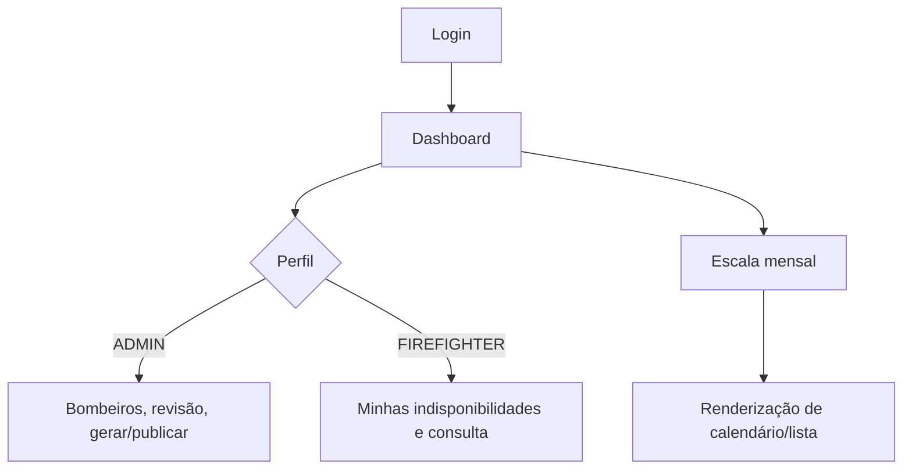

# 11 — Frontend

## Objetivo deste capítulo

Este capítulo apresenta a interface web do Escala 24 e como ela transforma
ações do usuário em telas e formulários.

> **Pergunta central:** como a interface organiza navegação, dados, estados e
> ações para administradores e bombeiros?

## Estrutura real

O frontend é um cliente sem framework JavaScript: `index.html` define a
estrutura, `styles.css` a apresentação e `app.js` o comportamento. O script usa
DOM, `querySelector`, eventos, `classList`, `innerHTML` e `fetch`.

Há telas de login e dashboard, navegação para escala, bombeiros, feriados,
indisponibilidades e configurações. Formulários são apresentados em dialogs
modais; listas, calendário, indicadores e mensagens são renderizados conforme
os dados recebidos.

## Estados e perfis

`app.js` mantém estado do usuário, escala, feriados, bombeiros e
indisponibilidades. Exibe loading nos botões, toasts de sucesso/erro, mensagens
de lista vazia e feedback de falhas. `applyUser` mostra ações administrativas
apenas para `ADMIN`; bombeiros veem suas indisponibilidades e não as ações de
gestão. A tela também exige troca de senha quando `mustChangePassword` é true.

Exemplos de ações são criar/editar feriados, cadastrar/desativar bombeiro,
solicitar/revisar indisponibilidade, gerar/publicar/remanejar escala e exportar
PDF/XLSX.

Esconder um botão é apenas experiência de interface. A autorização real deve
ser garantida pelo backend; um usuário pode alterar o JavaScript ou chamar a
API diretamente.

## Onde estudar no código

- [`index.html`](../../frontend/index.html)
- [`styles.css`](../../frontend/styles.css)
- [`app.js`](../../frontend/app.js)
- [`16 — Publicação e remanejamento`](./16-publicacao-e-remanejamento.md)
- [`12 — Integração com API`](./12-integracao-com-api.md)

## Limites e cuidados

O frontend não substitui validação, autenticação ou autorização do servidor.
Renderização de dados depende do contrato da API e falhas de rede precisam ser
tratadas pelo cliente.

## Perguntas de revisão

1. Qual a responsabilidade de HTML, CSS e JavaScript?
2. O que significa o frontend não usar framework?
3. Como a interface diferencia ADMIN e FIREFIGHTER?
4. Por que esconder um botão não protege uma operação?
5. Quais estados de erro e loading aparecem?
6. Onde os dados da escala são renderizados?

## Resumo

O frontend é uma aplicação JavaScript baseada em DOM, com telas, dialogs,
listas e calendário. Ele adapta ações ao perfil e apresenta estados de carga e
erro, mas a segurança permanece responsabilidade do backend.

> **Frase de fixação:** a interface orienta o usuário; o backend autoriza.
