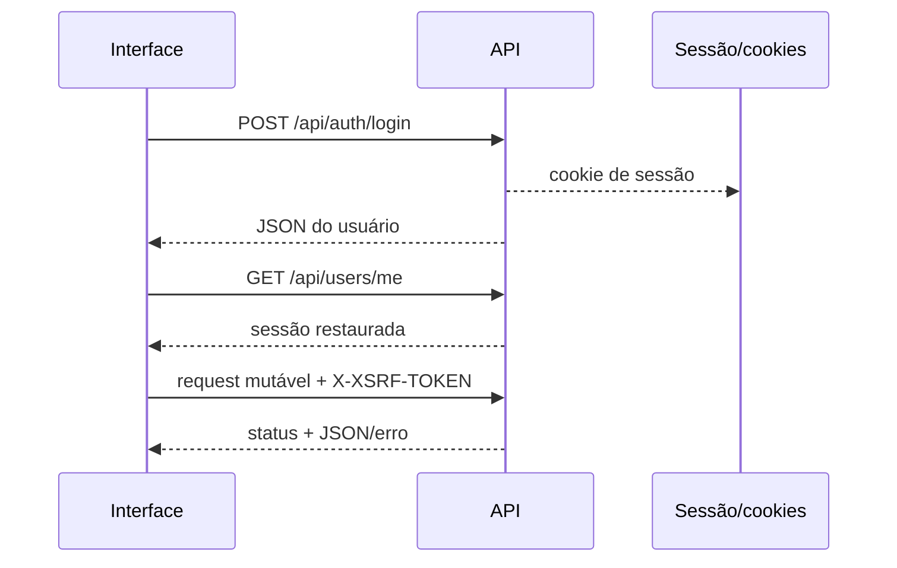

# 12 — Integração com API

## Objetivo deste capítulo

Este capítulo explica a comunicação entre `frontend/app.js` e a API HTTP.

> **Pergunta central:** como uma ação da interface vira request, recebe response
> e atualiza a tela com segurança?

## A função central de request

`apiRequest` usa `fetch` com `credentials: "same-origin"`. Para métodos que
alteram dados, obtém o token CSRF, envia JSON e inclui `X-XSRF-TOKEN`. Respostas
204 retornam `null`; respostas não bem-sucedidas viram `Error` com status,
mensagem e `fieldErrors`, permitindo feedback comum.

O navegador usa caminhos relativos como `/api/auth/login`, portanto frontend e
API ficam sob a mesma origem servida pelo Nginx. Cookies de sessão são enviados
pela mesma origem; a sessão pode ser recuperada por `/api/users/me`.

## Login, logout e CSRF

O login envia e-mail/senha a `/api/auth/login`; o usuário retornado abre o
dashboard. `restoreSession` chama `/api/users/me` ao iniciar. Logout chama
`/api/auth/logout` e retorna à tela de login.

`getCsrfToken` lê `XSRF-TOKEN` dos cookies e, quando necessário, consulta
`/api/auth/csrf`; o valor é enviado no header `X-XSRF-TOKEN`. O cookie de sessão
e o token CSRF cumprem papéis diferentes: um identifica a sessão, o outro
protege requisições contra falsificação.

Depois de criar, revisar ou atualizar, `app.js` recarrega a lista ou escala;
depois de trocar senha, busca o usuário novamente e reaplica o perfil.

## Request x response e limites

Request é o que o frontend envia: método, caminho, headers e corpo. Response é
status, headers e corpo devolvidos pelo backend. O frontend trata status, mas
não prova a regra de negócio nem substitui os testes de controller/integração.

## Onde estudar no código

- [`app.js`](../../frontend/app.js)
- [`AuthenticationController.java`](../../src/main/java/br/com/escala24/controller/AuthenticationController.java)
- [`SecurityConfig.java`](../../src/main/java/br/com/escala24/config/SecurityConfig.java)
- [`15 — Geração de escalas`](./15-geracao-de-escalas.md)
- [`07 — Segurança`](./07-seguranca.md)

## Perguntas de revisão

1. Por que existe uma função central de request?
2. O que `credentials: "same-origin"` permite?
3. Qual a diferença entre cookie de sessão e token CSRF?
4. Como o frontend recupera a sessão?
5. Como erros de campo chegam ao formulário?
6. O que acontece depois de uma operação bem-sucedida?

## Resumo

O frontend usa `fetch`, JSON, cookies de mesma origem e headers CSRF. Uma função
central interpreta status e erros, enquanto as telas atualizam seus dados após
as operações.

> **Frase de fixação:** request leva a intenção; response traz resultado ou
> explicação da falha.
