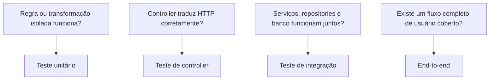

# 12 — Testes: visão geral

## Objetivo deste capítulo

Este capítulo apresenta como o Escala 24 verifica seu comportamento. O foco é
a estratégia geral e a divisão de responsabilidades entre os níveis de teste;
os capítulos 13 a 16 detalharão, respectivamente, testes unitários, integração,
controller e ponta a ponta.

> **Pergunta central:** quais tipos de teste existem no Escala 24, o que cada
> um procura validar e por que mais de um nível é necessário?

O código atual e os testes existentes são a fonte da verdade. Assim, este
capítulo não transforma uma prática comum de Java ou Spring em uma afirmação
sobre o projeto.

## O que é um teste automatizado

Um teste automatizado prepara uma situação, executa um comportamento e verifica
um resultado esperado:

```text
Preparar → Executar → Verificar
```

Essa ideia corresponde ao padrão conceitual Arrange, Act, Assert (preparar,
agir e verificar). A estrutura ajuda a ler os testes, mas não significa que
todo teste do repositório siga formalmente três blocos com esses nomes.

## A estratégia encontrada no repositório

No estado atual há 38 classes de teste e 148 métodos anotados com `@Test` em
`src/test/java`. Elas se distribuem por pacotes que refletem a aplicação:
`config`, `controller`, `dto`, `entity`, `repository` e `service`.
Esses números descrevem apenas o estado atual da suíte na versão documentada e não representam, por si só, cobertura ou qualidade dos testes.

O conjunto combina testes rápidos e isolados com testes que inicializam a
aplicação e um banco PostgreSQL real em container. Essa combinação responde a
perguntas diferentes:



Os três primeiros grupos existem no repositório. Não foi identificada uma
suíte end-to-end dedicada: alguns testes de integração exercitam fluxos
amplos, mas isso não os transforma automaticamente em testes de ponta a ponta.

## Testes unitários e isolados

Nos testes unitários identificados no Escala 24, o contexto Spring não é inicializado e não há dependência de banco de dados. Eles
verificam uma unidade em memória, normalmente com AssertJ e, quando necessário,
Mockito.

Exemplos reais:

- os testes em `dto` exercitam validações de entrada, como campos obrigatórios,
  limites e consistência de datas;
- `DutyAssignmentTest` verifica comportamento da entidade;
- `InitialAdminBootstrapTest` usa mocks de `UserRepository` e
  `PasswordEncoder` para verificar decisões do bootstrap sem persistir;
- `MonthlyScheduleExportDataServiceTest`, `MonthlySchedulePdfServiceTest` e
  `MonthlyScheduleSpreadsheetServiceTest` isolam serviços de exportação com
  dependências simuladas quando aplicável.

Mockito aparece de duas formas: mocks criados diretamente em testes unitários
e `@MockitoBean` nos testes de controller. AssertJ é usado nas asserções. O
`pom.xml` não declara JUnit, Mockito ou AssertJ como dependências individuais;
eles são fornecidos pelos starters de teste do Spring Boot usados pelo projeto.

## Testes de controller e web

Quatro classes usam `@WebMvcTest`: `FirefighterControllerTest`,
`HolidayControllerTest`, `MonthlyScheduleControllerTest` e
`UnavailabilityControllerTest`. Elas usam `MockMvc` para enviar requisições
HTTP simuladas ao controller selecionado, com serviços substituídos por
`@MockitoBean`. O `GlobalExceptionHandler` é importado, e os filtros de
segurança são desabilitados nesses slices (`addFilters = false`).

Esse grupo verifica contrato web, status HTTP, corpo JSON, cabeçalhos e a
interação do controller com seu serviço. Ele não prova a persistência nem a
configuração completa de segurança.

Há também testes de integração de controller, como
`AuthenticationIntegrationTest`, `FirefighterSecurityIntegrationTest`,
`HolidaySecurityIntegrationTest`, `MonthlyScheduleSecurityIntegrationTest`,
`PasswordChangeIntegrationTest` e `UnavailabilityApiIntegrationTest`. Eles
usam `MockMvc` com o contexto real e, conforme o cenário, exercitam sessão,
autenticação, CSRF, autorização e persistência. Portanto, “usar MockMvc” não
é suficiente para classificar um teste como unitário: o contexto e as
dependências efetivamente carregados importam.

## Testes de integração

O projeto define a anotação composta `@IntegrationTest`. Ela combina
`@SpringBootTest` com a importação de `PostgreSqlTestContainerConfiguration`.
As classes que a utilizam carregam a aplicação, seus beans e configurações,
em vez de testar uma classe isolada.

Essa configuração registra um `PostgreSQLContainer` baseado na imagem
`postgres:17-alpine` e usa `@ServiceConnection` para fornecer a conexão ao
Spring Boot. O banco dos testes, portanto, não é um mock; é uma instância
PostgreSQL iniciada pelo Testcontainers, com Docker disponível.

Os grupos principais são:

| Pacote | O que os testes verificam |
| --- | --- |
| `repository` | consultas, filtros, ordenação e gravação através dos repositories |
| `entity` | mapeamento e persistência de entidades relacionadas |
| `service` | regras e fluxos de serviço junto ao contexto e ao banco |
| `controller` | fluxos HTTP completos, incluindo segurança e dados persistidos |
| `config` | bootstrap do administrador no contexto real e propriedades de teste |

Muitas dessas classes usam `@Transactional`, o que delimita a transação do
teste e ajuda a evitar que seus dados permaneçam entre cenários. Isso é uma
característica observada nos testes, não uma garantia de que toda execução
externa seja revertida da mesma maneira.

## Tecnologias realmente utilizadas

O `pom.xml` reúne as dependências de teste do Spring Boot e os módulos necessários para testar persistência, segurança, web e integração com PostgreSQL/Testcontainers. O código dos testes confirma o uso de:

- JUnit Jupiter, por meio de `@Test`;
- Spring Boot Test, `@SpringBootTest` e slices como `@WebMvcTest`;
- MockMvc para chamadas HTTP em memória;
- Mockito para mocks e verificações de colaboração;
- AssertJ para asserções fluentes;
- Spring Security Test, incluindo post-processadores como `csrf()` e
  `httpBasic()`;
- Testcontainers com PostgreSQL.

O JaCoCo também está configurado no `pom.xml`: no ciclo `verify`, gera relatório
e exige cobertura mínima de 90% de linhas e 85% de branches para o bundle.
Essa configuração é uma meta/verificação de cobertura do build; não substitui
a análise de quais comportamentos cada teste exercita.

## O que cada nível consegue responder

Nenhum nível cobre todas as perguntas. Um teste unitário localiza rapidamente
uma falha em uma regra ou transformação, mas não revela incompatibilidade com
PostgreSQL. Um teste de controller verifica o contrato HTTP de um slice, mas
os testes com filtros desabilitados não validam segurança. A integração cobre
a colaboração entre beans, migrations, JPA e banco, mas custa mais tempo e
depende de Docker. Um fluxo amplo ainda pode deixar de representar o uso real
do frontend ou do cliente desktop.

Por isso, a leitura correta da suíte é complementar:

```text
unidade isolada
      + contrato HTTP
      + integração com Spring e PostgreSQL
      = evidências diferentes sobre o mesmo sistema
```

## Limites da cobertura identificada

A existência de um teste não comprova todos os caminhos de um componente. Em
particular, não há no diretório analisado uma suíte dedicada que inicie o
frontend/desktop e atravesse o sistema como um usuário real. A documentação
dos capítulos seguintes deve continuar indicando o cenário específico coberto,
sem generalizar o resultado para toda a aplicação.

## Onde estudar no código

- [`src/test/java`](../../src/test/java/) — estrutura completa da suíte;
- [`IntegrationTest.java`](../../src/test/java/br/com/escala24/IntegrationTest.java) — contexto compartilhado de integração;
- [`PostgreSqlTestContainerConfiguration.java`](../../src/test/java/br/com/escala24/config/PostgreSqlTestContainerConfiguration.java) — PostgreSQL em Testcontainers;
- [`pom.xml`](../../pom.xml) — dependências e regra JaCoCo;
- [`README.md`](./README.md) — roteiro dos capítulos.

## Perguntas de revisão

1. Por que um teste com MockMvc pode ser unitário de controller ou integração?
2. O que o PostgreSQL em Testcontainers acrescenta em relação a um mock?
3. Qual comportamento não é comprovado pelos testes de controller com filtros desabilitados?
4. Por que a meta de cobertura do JaCoCo não garante, sozinha, uma suíte adequada?

## Resumo

O Escala 24 usa uma estratégia em camadas: testes isolados para unidades,
testes de controller para o contrato web, e testes de integração com o
contexto Spring e PostgreSQL real para persistência e fluxos entre componentes.
Mockito, MockMvc, AssertJ, Spring Security Test, Testcontainers e JUnit são
tecnologias efetivamente presentes nos testes atuais. Não há uma suíte
end-to-end dedicada identificada.

> **Frase de fixação:** testes diferentes fazem perguntas diferentes; a
> estratégia do Escala 24 combina essas respostas sem confundi-las.
