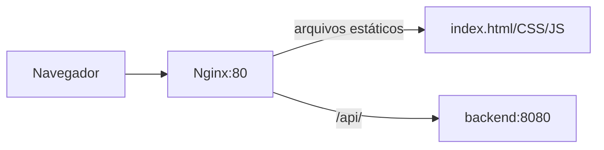

# 13 — Nginx

## Objetivo deste capítulo

Este capítulo explica como Nginx entrega a interface e encaminha a API.

> **Pergunta central:** como o navegador acessa arquivos estáticos e API sob a
> mesma origem?

## Configuração real

`frontend/nginx.conf` escuta na porta 80, usa `/usr/share/nginx/html` como raiz
e aplica `try_files` para servir `index.html`. O `location /api/` encaminha para
`http://backend:8080` e repassa Host, IP real, cadeia de proxies e protocolo.

Nginx funciona como servidor web e proxy reverso: recebe a requisição do
navegador e escolhe servir arquivo ou encaminhar ao backend. No Compose,
`backend:8080` é endereço interno; o navegador acessa a porta publicada do
frontend, não precisa conhecer esse hostname.

Proxy reverso não é automaticamente balanceamento de carga. O projeto declara
um único destino `backend:8080`; não há configuração de múltiplos upstreams ou
load balancing.

O Dockerfile do frontend copia arquivos e essa configuração para `nginx:alpine`.
Os dois Compose publicam `3000:80` e conectam frontend e backend pela rede
interna.

## Limites

Nginx não implementa autorização da aplicação, não substitui Spring Security e
não torna a infraestrutura de produção completa. Sua responsabilidade aqui é
entrega/proxy.

## Onde estudar no código

- [`nginx.conf`](../../frontend/nginx.conf)
- [`frontend/Dockerfile`](../../frontend/Dockerfile)
- [`docker-compose.yml`](../../docker-compose.yml)
- [`12 — Integração com API`](./12-integracao-com-api.md)
- [`21 — Docker`](./21-docker.md)

## Perguntas de revisão

1. O que Nginx serve diretamente?
2. Para onde `/api/` é encaminhado?
3. Por que `backend:8080` funciona entre containers?
4. O que é proxy reverso?
5. Por que este projeto não deve ser descrito como load balancing?
6. Qual porta o navegador acessa no Compose local?

## Resumo

Nginx entrega arquivos estáticos na porta 80 e encaminha `/api/` ao backend
interno. Ele cria uma origem conveniente, mas não é mecanismo de autorização ou
balanceamento neste projeto.

> **Frase de fixação:** Nginx recebe a requisição; o destino depende do caminho.
