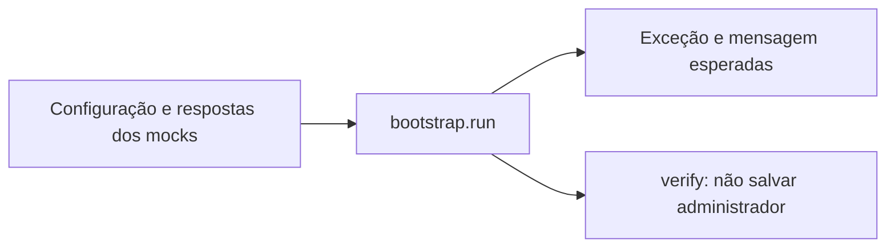

# 13 — Testes unitários

## Objetivo deste capítulo

Este capítulo explica como o Escala 24 testa unidades de comportamento sem inicializar a aplicação inteira nem depender de PostgreSQL. O foco está na preparação de entradas, no controle das dependências e na verificação de resultados e interações.

> **Pergunta central:** como o Escala 24 testa uma unidade de comportamento de forma isolada e como controla as dependências necessárias?

O capítulo 12 apresentou a estratégia geral. Aqui, `@WebMvcTest` e testes com `@IntegrationTest` ficam apenas como contraste; controller e integração serão aprofundados nos capítulos seguintes.

## O que significa testar uma unidade

Para fins deste guia, os testes do Escala 24 são classificados como unitários quando executam sem o contexto Spring completo, sem PostgreSQL/Testcontainers e verificam uma unidade pequena ou um comportamento isolado. A unidade pode ser uma classe, uma entity em memória ou uma validação de DTO. Ela pode usar objetos reais simples e mocks para substituir dependências.

O inventário encontrou nove classes nesse grupo:

| Área | Classes | Foco |
| --- | --- | --- |
| `dto` | `DutyReassignmentRequestTest`, `FirefighterRegistrationRequestTest`, `MonthlyScheduleGenerationRequestTest`, `PasswordChangeRequestTest` | Bean Validation executada diretamente sobre objetos de entrada |
| `entity` | `DutyAssignmentTest` | cálculo de período em uma entity como objeto Java |
| `config` | `InitialAdminBootstrapTest` | decisões do bootstrap com repositories e encoder simulados |
| `service` | `MonthlyScheduleExportDataServiceTest`, `MonthlySchedulePdfServiceTest`, `MonthlyScheduleSpreadsheetServiceTest` | seleção de escala e geração de PDF/planilha com dependências controladas |

Os demais testes de `entity`, `repository`, `service` e `controller` que usam `@IntegrationTest`, `@SpringBootTest`, banco ou Testcontainers não entram nessa classificação. O nome `*Test` não é suficiente para decidir o nível.

## Estrutura de um teste

Os testes seguem, de modo conceitual, três movimentos:

```text
Preparar → Executar → Verificar
```

Em `DutyAssignmentTest`, por exemplo, o teste prepara uma data em `DutyAssignment`, executa indiretamente `getStartDateTime()` e `getEndDateTime()`, e verifica os horários com AssertJ:

```java
assignment.setDutyDate(LocalDate.of(2026, 8, 10));

assertThat(assignment.getStartDateTime())
        .isEqualTo(LocalDateTime.of(2026, 8, 10, 8, 0));
```

Isso é uma forma de leitura equivalente a Arrange, Act, Assert (preparar, agir e verificar), não uma afirmação de que todos os métodos estão formalmente separados em blocos com esses nomes.

## JUnit Jupiter utilizado nos testes isolados

O recurso comum é `@Test`, que marca cada cenário executável. O projeto também usa parametrização no `InitialAdminBootstrapTest`:

- `@ParameterizedTest` executa o mesmo comportamento para várias entradas;
- `@MethodSource("invalidConfigurations")` fornece um `Stream<Arguments>` com configurações inválidas e a mensagem esperada.

Assim, um método verifica nome ausente, e-mail em branco, senha fora do limite, e-mail inválido e outros casos sem duplicar toda a estrutura do teste. Não foram identificados `@BeforeEach`, `@AfterEach`, `@Nested`, `@ValueSource` ou `@Captor` nesse conjunto unitário.

## AssertJ e asserções

Executar o código não basta: o teste precisa verificar o resultado. AssertJ é usado com `assertThat(...)` para expressar expectativas. Os testes isolados verificam igualdade de valores, coleções vazias, propriedades de violações com `extracting(...).contains(...)`, identidade com `isSameAs`, propriedades de PDF/planilha e exceções com `assertThatThrownBy(...)`.

Nos DTOs, por exemplo, uma entrada válida deve produzir `assertThat(violations).isEmpty()`. Para uma entrada inválida, os testes extraem `propertyPath` e verificam os campos que devem ser rejeitados.

## Testando falhas esperadas

Uma operação rejeitada também é um comportamento correto quando a entrada viola uma regra. `MonthlyScheduleExportDataServiceTest.shouldRejectDraftSchedule` configura uma escala `DRAFT` e espera `UnpublishedScheduleExportException`. `InitialAdminBootstrapTest` faz o mesmo para configurações inválidas e e-mail já usado.

```java
assertThatThrownBy(() -> bootstrap.run(arguments))
        .isInstanceOf(IllegalStateException.class)
        .hasMessageContaining(expectedMessage);
```

O teste verifica que, naquele cenário inválido, o bootstrap recusa a operação; não diz que a exceção deve ocorrer em qualquer situação.

## Mockito e isolamento

Um mock é um objeto controlado pelo teste que substitui uma dependência real. Ele permite testar uma unidade sem fazer o repository consultar banco, usar um encoder real ou executar um serviço colaborador completo.

Nos testes unitários, Mockito aparece como:

- `@Mock`, inicializado por `@ExtendWith(MockitoExtension.class)` nos três testes de service;
- `mock(UserRepository.class)` e `mock(PasswordEncoder.class)` criados diretamente no `InitialAdminBootstrapTest`;
- `when(...).thenReturn(...)` e `thenThrow(...)` para definir respostas;
- `verify(...)`, `never()` e matchers `any(...)` e `eq(...)` para verificar interações.

Não foram encontrados `@InjectMocks`, `given(...)`, `times(...)`, `ArgumentCaptor` ou `@Captor` nesse grupo. `@MockitoBean` existe nos testes de controller, mas pertence ao capítulo 15.

### Preparando respostas

Configurar um stub significa definir previamente como a dependência simulada responderá:

```java
when(managementService.findByYearAndMonth(2027, 8))
        .thenReturn(schedule(ScheduleStatus.PUBLISHED));
```

Depois, o teste chama o serviço real e verifica a escala publicada. No cenário de rascunho, o mesmo método retorna `DRAFT` e a unidade lança a exceção.

### Verificando interações

`assertThat` verifica estado ou resultado. `verify` responde a outra pergunta: a unidade chamou a dependência esperada?

No bootstrap, quando a configuração é inválida ou o e-mail está em uso:

```java
verify(userRepository, never())
        .saveAndFlush(any(User.class));
```

Isso confirma que não houve gravação depois da rejeição. No PDF, `verify(templateEngine)` confirma o processamento do template correto. Verificar interações é útil quando delegar ou não delegar uma ação faz parte do comportamento; não significa que toda chamada interna precisa ser verificada.

## DTOs e entity em memória

Os quatro testes de DTO criam um `Validator` diretamente com `Validation.buildDefaultValidatorFactory().getValidator()`. Eles verificam entradas válidas e inválidas para identificador de bombeiro, cadastro, ano/mês de escala e troca de senha. As violações são examinadas por `propertyPath`. Não há controller, contexto Spring ou banco envolvidos.

`DutyAssignmentTest` cria uma entity, define `dutyDate` e verifica que o plantão começa às 8h da data e termina às 8h do dia seguinte. Isso testa Java em memória, não JPA. Já `MonthlySchedulePersistenceIntegrationTest` e `UnavailabilityPersistenceIntegrationTest` pertencem ao capítulo 14.

## Testes de service

Os três testes usam `@ExtendWith(MockitoExtension.class)`, sem `@SpringBootTest`:

- `MonthlyScheduleExportDataServiceTest` isola a aceitação de escalas publicadas;
- `MonthlySchedulePdfServiceTest` controla o serviço de dados e o `TemplateEngine`, verificando rejeição, PDF, texto, páginas e layout;
- `MonthlyScheduleSpreadsheetServiceTest` controla o serviço de dados, gera o XLSX em memória e lê o workbook com Apache POI para verificar células, datas, filtro e linhas. Também grava uma cópia em `target/spreadsheet-qa/`. Essa escrita local é um efeito auxiliar do teste e não envolve banco de dados, contexto Spring ou serviço externo; por isso, dentro da classificação adotada neste guia, o teste continua sendo tratado como isolado.

Eles mostram que um teste unitário pode gerar PDF ou planilha, desde que as dependências relevantes sejam controladas e a infraestrutura completa não seja carregada.

## Estudo de caso: `InitialAdminBootstrapTest`

Este teste separa configuração, decisão e persistência:



Em `shouldRejectEmailUsedByAnotherUser`, o teste cria mocks de `UserRepository` e `PasswordEncoder`, configura ausência de administrador e existência do e-mail, cria o bootstrap real, executa `run` e verifica a `IllegalStateException`. Em seguida, verifica que `saveAndFlush` nunca foi chamado.

Ele prova a decisão para esse cenário e a ausência da gravação. Não prova a persistência real, o hash produzido pelo encoder, a inicialização do Spring ou todos os fluxos possíveis do bootstrap.

## Isolamento, determinismo e nomenclatura

O isolamento reduz a quantidade de componentes reais necessários. Isso tende a exigir menos infraestrutura e facilita localizar uma falha, mas oferece menos evidência sobre integração real.

Os testes controlam datas explícitas, entradas fixas e respostas dos mocks. O teste de PDF prepara uma `Clock` controlada, e o de planilha lê os bytes gerados em memória. Isso favorece resultados repetíveis para as condições preparadas, sem provar que toda a suíte é perfeitamente determinística.

Os nomes seguem o padrão observado `should...`, como `shouldRejectDraftSchedule`, `shouldAcceptValidYearAndMonth` e `shouldCalculateTwentyFourHourDutyPeriod`. Eles comunicam cenário e expectativa melhor que nomes genéricos.

## O que prova e o que não prova

Conforme o cenário, um teste unitário pode provar um resultado para uma entrada, a rejeição de entrada inválida, uma decisão isolada, uma interação permitida ou proibida e propriedades de uma saída gerada.

Ele não prova automaticamente funcionamento do PostgreSQL, constraints, SQL, mapeamento JPA, migrations, endpoint HTTP, segurança completa, integração entre beans ou fluxo do frontend/desktop. Um mock de repository não executa SQL, não testa JPA e não prova constraints. A integração real com banco será detalhada no capítulo 14.

## Analogia da corporação

Um teste unitário é como verificar isoladamente se um supervisor toma a decisão correta diante de uma situação controlada. Um mock substitui outro setor por uma resposta combinada; `verify` confirma que uma solicitação foi — ou não foi — enviada ao setor simulado. No software, contudo, o mock é um objeto programável pelo teste; a analogia não representa exatamente sua técnica.

## Erros comuns e cuidados

- não classificar automaticamente como unitário um teste que carrega contexto Spring ou infraestrutura real; analisar quais componentes e dependências participam da execução;
- não considerar que um mock prova o comportamento do repository real;
- não testar apenas se um método termina sem exceção: faça uma asserção ou verificação coerente;
- evitar verificar detalhes internos irrelevantes e tornar o teste frágil;
- não confundir linhas executadas com comportamento adequadamente verificado.

Testes unitários contribuem para cobertura, mas cobertura não substitui asserções significativas nem testes de integração.

## Onde estudar no código

- [`InitialAdminBootstrapTest.java`](../../src/test/java/br/com/escala24/config/InitialAdminBootstrapTest.java) — parametrização, mocks, exceções e `verify`;
- [`DutyAssignmentTest.java`](../../src/test/java/br/com/escala24/entity/DutyAssignmentTest.java) — entity em memória;
- [`DutyReassignmentRequestTest.java`](../../src/test/java/br/com/escala24/dto/DutyReassignmentRequestTest.java) — Bean Validation direta;
- [`MonthlyScheduleExportDataServiceTest.java`](../../src/test/java/br/com/escala24/service/MonthlyScheduleExportDataServiceTest.java) — stub, resultado e exceção;
- [`MonthlySchedulePdfServiceTest.java`](../../src/test/java/br/com/escala24/service/MonthlySchedulePdfServiceTest.java) — mock de template e saída PDF;
- [`MonthlyScheduleSpreadsheetServiceTest.java`](../../src/test/java/br/com/escala24/service/MonthlyScheduleSpreadsheetServiceTest.java) — saída XLSX verificada em memória;
- [`12 — Testes: visão geral`](./12-testes-visao-geral.md) — classificação geral.

## Perguntas de revisão

1. O que torna um teste unitário isolado no contexto do Escala 24?
2. Por que um mock de `UserRepository` não testa PostgreSQL?
3. Qual é a diferença entre `assertThat` e `verify`?
4. Para que serve `when(...).thenReturn(...)`?
5. Por que uma exceção esperada pode representar um teste bem-sucedido?
6. Qual a diferença entre testar `DutyAssignment` em memória e seu mapeamento JPA?
7. O que o estudo de caso do bootstrap prova e o que deixa sem evidência?
8. Por que cobertura de código não garante, sozinha, bons testes?

## Resumo

Os testes unitários do Escala 24 executam sem o contexto Spring completo e sem PostgreSQL. Eles cobrem validações de DTO, comportamento Java de entity, decisões de configuração e geração de PDF/planilha. JUnit Jupiter organiza os cenários, AssertJ verifica resultados e Mockito controla dependências e interações. Essa abordagem oferece evidência precisa sobre unidades isoladas, mas não substitui testes de integração, web ou ponta a ponta.

> **Frase de fixação:** isolar uma unidade esclarece o comportamento verificado — e também deixa claro o que o teste ainda não pode provar.
