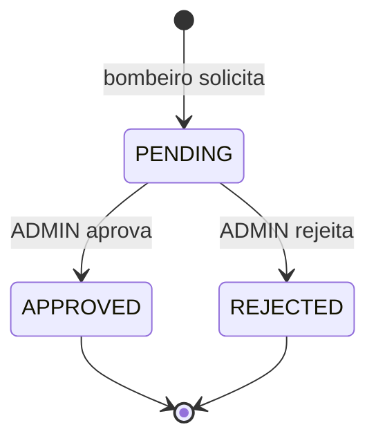

# 14 — Indisponibilidades

## Objetivo deste capítulo

Este capítulo explica como bombeiros informam períodos em que não podem
assumir plantões e como administradores os revisam.

> **Pergunta central:** como o sistema registra, revisa e aplica uma
> indisponibilidade sem confundir solicitação com decisão aprovada?

## Modelo e estados

Uma `Unavailability` relaciona bombeiro, tipo (`VACATION`, `MEDICAL_LEAVE`,
`PERSONAL_COMMITMENT` ou `OTHER`), datas inicial/final e motivo. Nasce
`PENDING`, pode passar a `APPROVED` ou `REJECTED` e, quando revisada, registra
`reviewedBy` e `reviewedAt`.

O período precisa terminar no mesmo dia ou depois do início. A migration V6
reforça FK, enums, datas e coerência entre status e campos de revisão.

## Fluxo e regras

Bombeiro ativo solicita e consulta suas próprias indisponibilidades. Admin lista
pendentes e pode aprovar/rejeitar. Revisão repetida lança
`UnavailabilityAlreadyReviewedException`. Aprovar um período que já contém
plantão lança `DutyReassignmentRequiredException`: o conflito precisa ser
remanejado antes da aprovação.

Somente indisponibilidade `APPROVED` impede elegibilidade na geração e no
remanejamento. `PENDING` ainda aguarda decisão e `REJECTED` não bloqueia o
plantão. O service normaliza motivo vazio para `null` e exige usuário
administrador ativo na revisão.

## Onde estudar no código

- [`UnavailabilityManagementService.java`](../../src/main/java/br/com/escala24/service/UnavailabilityManagementService.java)
- [`Unavailability.java`](../../src/main/java/br/com/escala24/entity/Unavailability.java)
- [`UnavailabilityController.java`](../../src/main/java/br/com/escala24/controller/UnavailabilityController.java)
- [`V6__create_unavailabilities.sql`](../../src/main/resources/db/migration/V6__create_unavailabilities.sql)
- [`UnavailabilityApiIntegrationTest.java`](../../src/test/java/br/com/escala24/controller/UnavailabilityApiIntegrationTest.java)

## Limites e cuidados

Solicitar não aprova automaticamente. A regra de sobreposição com plantões é
verificada na aprovação; a geração considera aprovadas. A autorização do endpoint e a persistência são responsabilidades complementares.

## Perguntas de revisão

1. Qual estado uma solicitação recebe inicialmente?
2. Quem pode revisar?
3. Que dados identificam a revisão?
4. Por que uma aprovação pode exigir remanejamento?
5. Qual diferença entre PENDING e APPROVED na geração?
6. Que constraints V6 protegem o modelo?

## Resumo

Indisponibilidade é uma solicitação revisável, não um bloqueio imediato. O
sistema registra estados, revisor e data, e aplica somente aprovações às regras
de escala.

> **Frase de fixação:** pedir indisponibilidade não é o mesmo que tê-la aprovada.
