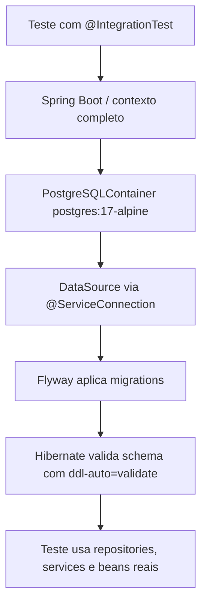
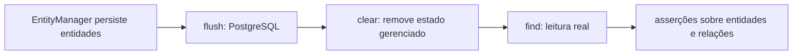

# 14 — Testes de integração

## Objetivo deste capítulo

Este capítulo explica como o Escala 24 verifica a colaboração entre partes
reais do backend usando o contexto Spring e um PostgreSQL temporário. O foco é
o que os testes de repository, persistência, service e configuração conseguem
provar além dos testes isolados do capítulo 13.

> **Pergunta central:** como o Escala 24 verifica que diferentes componentes
> funcionam juntos com Spring, JPA, Flyway e PostgreSQL?

## O que significa integração no Escala 24

Um teste de integração reúne componentes reais para observar sua colaboração.
Em vez de substituir um repository por um mock, o teste pode usar o repository
real, o Hibernate, as migrations e o banco PostgreSQL de teste.

Isso não significa que todo `@SpringBootTest` seja end-to-end. Os testes de
integração do projeto normalmente entram por uma classe, repository ou service;
alguns entram por HTTP com MockMvc. Nenhum deles inicia o frontend ou o cliente
desktop como um usuário real.

## `@IntegrationTest`

`IntegrationTest.java` é uma annotation criada pelo próprio projeto. Ela reúne:

```java
@SpringBootTest
@Import(PostgreSqlTestContainerConfiguration.class)
```

Também possui `@Target(TYPE)`, `@Retention(RUNTIME)`, `@Inherited` e
`@Documented`. Assim, uma classe de teste pode declarar apenas `@IntegrationTest`
e receber o mesmo contexto completo e a mesma configuração de banco. A
annotation não é nativa do Spring; é uma convenção local para reduzir repetição
e padronizar a suíte.

## PostgreSQL com Testcontainers

`PostgreSqlTestContainerConfiguration` é uma `@TestConfiguration` que declara
um bean `PostgreSQLContainer` com a imagem `postgres:17-alpine`:

```java
@Bean
@ServiceConnection
PostgreSQLContainer postgreSqlContainer() {
    return new PostgreSQLContainer(
            DockerImageName.parse("postgres:17-alpine"));
}
```

`@ServiceConnection` permite que o Spring Boot obtenha dinamicamente os dados
de conexão do container para o `DataSource` e para o Flyway. O teste não precisa
montar manualmente URL, usuário e porta do container.

Em termos simples, a execução usa um PostgreSQL temporário controlado pelo
teste, e não necessariamente o banco de desenvolvimento. Isso exige Docker
disponível. O container é software real isolado; não é um mock nem representa
toda a infraestrutura de produção.

## Como o contexto é montado

O fluxo observado é:



O projeto mantém `spring.flyway.enabled=true` e
`spring.jpa.hibernate.ddl-auto=validate`. Portanto, ao inicializar o contexto de teste, a configuração da aplicação faz com que o Flyway aplique as migrations disponíveis ao banco temporário e, em seguida, o Hibernate valide os mapeamentos contra o schema resultante. Essa sequência é a integração entre o ambiente de teste e a configuração normal da aplicação; não substitui a explicação
detalhada das migrations do capítulo 10.

## Inventário dos testes de integração

Os testes integrados aparecem nos seguintes grupos:

| Grupo | Exemplos | Evidência principal |
| --- | --- | --- |
| Aplicação/configuração | `Escala24ApplicationTests`, `InitialAdminBootstrapIntegrationTest` | contexto e bootstrap com propriedades reais |
| Repository | seis classes em `repository` | consultas, existência, filtros, ordenação e contagens |
| Persistência de entities | `MonthlySchedulePersistenceIntegrationTest`, `UnavailabilityPersistenceIntegrationTest` | gravação, leitura, relacionamentos e valores persistidos |
| Services | testes de geração, publicação, indisponibilidade, feriados, bombeiros, classificação e remanejamento | services, repositories e regras colaborando |
| Controller/security | `AuthenticationIntegrationTest`, testes `*SecurityIntegrationTest` e `UnavailabilityApiIntegrationTest` | contexto real acessado por HTTP e segurança integrada |

Os grupos de controller serão aprofundados no capítulo 15. Aqui eles aparecem
apenas para registrar que integração também pode atravessar a camada web.

## Testes de repository

Os testes de repository usam `@Autowired` para obter interfaces reais e
`@Transactional` para o cenário. Por exemplo,
`DutyAssignmentRepositoryIntegrationTest` persiste usuários, bombeiro,
escalas e plantões em meses diferentes. Depois verifica:

- plantões de janeiro ordenados por data;
- existência de um plantão em uma data e ausência em outra;
- plantão anterior ao início de março;
- contagem de plantões especiais e de dias úteis no período anual.

Isso exercita repository + Spring Data/JPA + Hibernate + PostgreSQL. Um mock de
repository do capítulo 13 poderia responder uma lista combinada pelo teste,
mas não verificaria a consulta real nem a tradução dessa consulta para o banco.

Outros exemplos verificam busca por e-mail e matrícula, feriados em ordem
cronológica, escala por ano/mês e indisponibilidades pendentes ou aprovadas em
períodos.

## Persistência de entities e constraints

`MonthlySchedulePersistenceIntegrationTest` usa `EntityManager` para persistir
usuário, bombeiro, escala e plantão. Após `flush()` e `clear()`, busca o plantão
novamente e verifica data, enum, escala relacionada, bombeiro e horários
calculados. Isso testa a entity como objeto persistido, não apenas seu método
Java em memória.

`UnavailabilityPersistenceIntegrationTest` faz o mesmo com uma
indisponibilidade de compromisso pessoal e verifica enum, período, motivo,
status inicial `PENDING`, data da solicitação e ausência de revisão.

O `flush()` é importante nesses cenários porque sincroniza o contexto de
persistência com o banco antes da leitura:

```text
persist/save
      ↓
flush() → SQL enviado ao PostgreSQL
      ↓
clear() → contexto local limpo
      ↓
find() → leitura de uma entidade persistida
```

Nos services e repositories, `saveAndFlush()` e `flush()` também aparecem para
garantir que dados preparados estejam sincronizados antes da operação seguinte
ou para fazer o banco aplicar as constraints no ponto desejado. Isso não quer
dizer que `save()` nunca possa provocar SQL; documenta apenas o uso explícito
observado nos cenários.

## Services integrados

Os testes de service usam `@IntegrationTest`, `@Autowired` e, em geral,
`@Transactional`. Entre os comportamentos exercitados estão:

- classificação de dias com feriados persistidos;
- geração de escala completa, equilíbrio, descanso e indisponibilidades;
- publicação ou rejeição de escala incompleta/publicada;
- criação e revisão de indisponibilidades;
- criação, atualização e remoção de feriados;
- cadastro, ativação e desativação de bombeiros;
- remanejamento de plantões e descanso obrigatório.

Nesses cenários, o service real conversa com repositories reais e com entities
gerenciadas pelo JPA. O teste fornece dados persistidos e verifica resultados,
exceções e estado final. Isso fornece evidência diferente do teste unitário,
em que a dependência poderia ser uma resposta Mockito previamente combinada.

## Configuração integrada

`InitialAdminBootstrapIntegrationTest` compara bem os dois níveis. Com
`@TestPropertySource`, fornece propriedades reais para habilitar o administrador
inicial e usa `UserRepository` e `PasswordEncoder` reais do contexto.

O teste verifica que o administrador é criado com nome, papel, ativação,
troca obrigatória de senha e senha codificada. Depois executa o bootstrap outra
vez e confirma que a quantidade de usuários continua sendo uma.

```text
Unitário      → decisão do bootstrap com mocks
Integração    → propriedades + Spring + encoder + repository + PostgreSQL
```

O teste integrado pode revelar problemas de wiring, persistência, configuração
ou codificação que o teste unitário não alcança.

## Transações e isolamento dos dados

As classes de repository, persistência e service analisadas usam
`@Transactional`; os testes de controller integrados também a utilizam em
vários casos. Isso coloca as operações do cenário em uma transação de teste e favorece o isolamento, especialmente quando dados são preparados no próprio método. Esse isolamento depende do comportamento transacional do teste e não substitui a análise de outros estados compartilhados, como contexto Spring ou recursos externos.

O código confirma a annotation e o uso de `flush`, mas não autoriza afirmar que
todo teste possui exatamente o mesmo ciclo de rollback em qualquer execução ou
que cada método cria um container novo. O ciclo de vida é controlado pelo
contexto Spring/Testcontainers, e a implementação apresentada garante a
existência de um bean de container para a configuração do teste.

Uma transação anotada no teste também não é automaticamente uma descrição da
transação usada em produção. Ela é parte do arranjo daquele cenário.

## Falha funcional x falha de infraestrutura

Uma falha pode ocorrer antes de o comportamento ser testado:

```text
Docker indisponível
        ↓
Testcontainers não inicia PostgreSQL
        ↓
contexto Spring não completa
        ↓
cenário não é executado
```

Isso não equivale a uma regra de negócio ter falhado. O erro pode estar na
infraestrutura necessária para montar o teste. Durante a elaboração desta
documentação, a execução integrada ficou limitada por Docker indisponível no
ambiente; essa limitação foi registrada separadamente de falha funcional.

## Estudo de caso: persistência de uma escala

`MonthlySchedulePersistenceIntegrationTest` é um exemplo direto:

1. o contexto completo é iniciado com `@IntegrationTest`;
2. o teste persiste usuário, bombeiro, escala e plantão com `EntityManager`;
3. chama `flush()` para sincronizar os dados com PostgreSQL;
4. limpa o contexto com `clear()`;
5. busca o plantão novamente;
6. verifica relacionamentos, enums, datas, status padrão e horários.



Esse teste fornece evidência sobre mapeamento JPA, gravação, leitura e
relacionamentos nesse cenário. Não prova todos os mapeamentos, todas as
constraints, todos os fluxos de negócio nem o ambiente de produção completo.

## Unitário x integração

| Aspecto | Unitário | Integração no Escala 24 |
| --- | --- | --- |
| Spring completo | não | sim, via `@IntegrationTest`/`@SpringBootTest` |
| Banco real | não | PostgreSQL em Testcontainers |
| Mocks | controlam dependências | podem existir em testes web, mas repositories/services principais são reais nos grupos deste capítulo |
| Objetivo | unidade e decisão isolada | colaboração, persistência, configuração e schema |
| Falha tende a indicar | comportamento da unidade ou configuração do teste/mocks | comportamento integrado, wiring, JPA, banco, migration ou infraestrutura |

Integração não substitui os testes unitários: oferece mais fidelidade entre
componentes, mas envolve mais infraestrutura e causas possíveis de falha.

## O que esses testes provam e seus limites

Dependendo do cenário, os testes de integração fornecem evidência sobre:

- wiring do Spring;
- repositories e consultas reais;
- JPA, relacionamentos e enums persistidos;
- migrations e schema compatível;
- PostgreSQL e constraints exercitadas;
- transações do cenário;
- colaboração entre services e repositories;
- configuração do bootstrap.

Eles não provam automaticamente frontend, desktop, infraestrutura real de
produção, performance, todos os cenários ou um fluxo end-to-end completo. Um
teste integrado também pode usar mocks em uma camada específica; a classificação
depende do conjunto real de componentes carregados.

## Analogia da corporação

O teste unitário verifica um supervisor isoladamente. O teste de integração
coloca supervisor, arquivo, regras administrativas e setores relacionados para
trabalhar juntos. O Testcontainers monta um arquivo temporário real para o
exercício. A analogia ajuda a visualizar a colaboração, mas o container é
software real isolado e não representa toda a infraestrutura de produção.

## Erros comuns e cuidados

- chamar todo `@SpringBootTest` de E2E;
- tratar Testcontainers como mock ou confundir PostgreSQL temporário com banco
  em memória;
- chamar teste de repository com PostgreSQL de unitário;
- interpretar Docker indisponível como falha funcional;
- esquecer que migrations participam da inicialização do contexto;
- assumir que `@Transactional` no teste descreve a transação de produção;
- acreditar que integração substitui testes unitários.

## Onde estudar no código

- [`IntegrationTest.java`](../../src/test/java/br/com/escala24/IntegrationTest.java) — annotation composta;
- [`PostgreSqlTestContainerConfiguration.java`](../../src/test/java/br/com/escala24/config/PostgreSqlTestContainerConfiguration.java) — container e `@ServiceConnection`;
- [`DutyAssignmentRepositoryIntegrationTest.java`](../../src/test/java/br/com/escala24/repository/DutyAssignmentRepositoryIntegrationTest.java) — consultas, períodos e contagens;
- [`MonthlySchedulePersistenceIntegrationTest.java`](../../src/test/java/br/com/escala24/entity/MonthlySchedulePersistenceIntegrationTest.java) — persistência e relações;
- [`MonthlyScheduleGenerationServiceIntegrationTest.java`](../../src/test/java/br/com/escala24/service/MonthlyScheduleGenerationServiceIntegrationTest.java) — service integrado;
- [`InitialAdminBootstrapIntegrationTest.java`](../../src/test/java/br/com/escala24/config/InitialAdminBootstrapIntegrationTest.java) — configuração e repository reais;
- [`13 — Testes unitários`](./13-testes-unitarios.md) — contraste com isolamento.

## Perguntas de revisão

1. O que `@IntegrationTest` reúne no projeto?
2. Por que PostgreSQL em Testcontainers oferece evidência diferente de um mock?
3. Qual é o papel do Flyway ao iniciar um contexto integrado?
4. Por que `flush()` pode aparecer em um teste de persistência?
5. O que um teste de repository integrado verifica que um mock não verifica?
6. Qual a diferença entre falha de Docker e falha de regra de negócio?
7. O que `@Transactional` ajuda a controlar nos testes e o que ele não prova sobre produção?
8. Por que integração não substitui testes unitários nem E2E?

## Resumo

Os testes de integração do Escala 24 usam uma annotation própria que combina
`@SpringBootTest` e a configuração de PostgreSQL em Testcontainers. O contexto
real conecta DataSource, Flyway, Hibernate, repositories e services. Os testes
verificam consultas, persistência, relacionamentos, configuração e regras que
dependem da colaboração entre componentes. Essa evidência é mais ampla que a
de um teste unitário, mas exige infraestrutura e não representa automaticamente
um fluxo E2E ou a produção inteira.

> **Frase de fixação:** integração verifica se as partes reais do sistema
> trabalham juntas — inclusive quando o banco e a configuração participam do
> comportamento.
