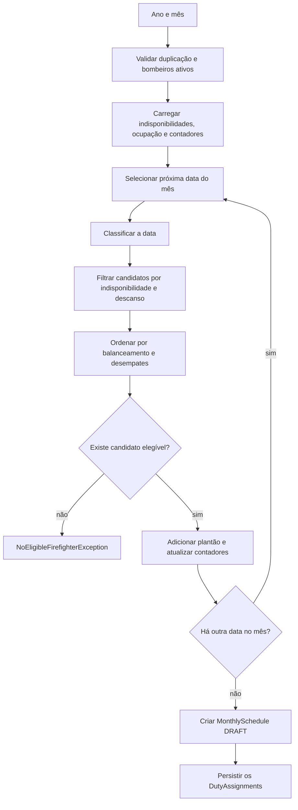

# 15 — Geração de escalas

## Objetivo deste capítulo

Este capítulo explica o algoritmo real de geração mensal.

> **Pergunta central:** como o Escala 24 escolhe bombeiros elegíveis e distribui
> os plantões de um mês?

## Preparação

`generate` recebe ano/mês, cria `YearMonth`, rejeita escala duplicada, busca
bombeiros ativos e falha com `NoEligibleFirefighterException` se não houver
nenhum. Carrega indisponibilidades aprovadas que intersectam o mês e plantões
existentes de um dia antes a um dia depois da fronteira.

O classificador retorna `WEEKEND_OR_HOLIDAY` para sábado, domingo ou feriado;
caso contrário retorna `WEEKDAY`. Contadores mensais começam em zero e o
histórico anual de plantões especiais é consultado para cada bombeiro.

## Elegibilidade e balanceamento

Para cada data, o candidato é excluído se tiver indisponibilidade aprovada ou
plantão na data anterior, na própria data ou na seguinte. Isso é elegibilidade;
não é ainda o critério de distribuição.

Entre os elegíveis, o comparador usa:

- fim de semana/feriado: menor contagem anual de especiais, depois menor
  contagem mensal;
- dia útil: menor contagem mensal, depois maior contagem anual de especiais;
- empate: plantão anterior mais antigo, depois menor ID.

Após escolher, atualiza ocupação e contadores. Se nenhum candidato existir,
lança `NoEligibleFirefighterException`. Ao final cria escala `DRAFT` e salva
todos os plantões com `saveAllAndFlush`, dentro de método `@Transactional`.

## O que os testes confirmam

`MonthlyScheduleGenerationServiceIntegrationTest` cobre ausência de cobertura,
duplicidade, bombeiros ativos, indisponibilidades pendentes/rejeitadas,
descanso na fronteira do mês, histórico especial e geração equilibrada. Os
testes verificam cenários concretos, não toda combinação possível do algoritmo.

## Onde estudar no código

- [`MonthlyScheduleGenerationService.java`](../../src/main/java/br/com/escala24/service/MonthlyScheduleGenerationService.java)
- [`DayTypeClassifier.java`](../../src/main/java/br/com/escala24/service/DayTypeClassifier.java)
- [`MonthlyScheduleGenerationServiceIntegrationTest.java`](../../src/test/java/br/com/escala24/service/MonthlyScheduleGenerationServiceIntegrationTest.java)
- [`DutyAssignmentRepository.java`](../../src/main/java/br/com/escala24/repository/DutyAssignmentRepository.java)

## Limites

`@Transactional` agrupa a operação do service, mas não é promessa de qualquer
comportamento de produção fora desse método. Balanceamento reduz desigualdade
conforme o comparador implementado; não é otimização global garantida.

## Perguntas de revisão

1. Por que buscar um dia antes e depois do mês?
2. Qual a diferença entre elegibilidade e balanceamento?
3. Como feriados são classificados?
4. Quais critérios de desempate existem?
5. O que provoca `NoEligibleFirefighterException`?
6. Em que estado a escala é criada?
7. Que histórico influencia plantões especiais?

## Resumo

O algoritmo valida o mês, filtra candidatos por disponibilidade e descanso,
ordena por critérios de equilíbrio e cria uma escala mensal `DRAFT` com um
plantão por data.

> **Frase de fixação:** primeiro o bombeiro precisa ser elegível; depois o
> comparador decide quem está mais equilibrado.
