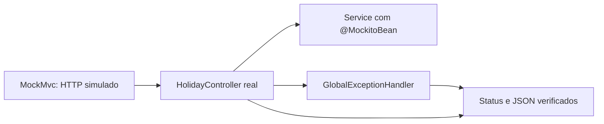

# 15 — Testes de controller

## Objetivo deste capítulo

Este capítulo mostra como o Escala 24 verifica a camada HTTP do backend sem
iniciar navegador ou frontend.

> **Pergunta central:** o controller traduz corretamente requisições HTTP em
> chamadas de serviço e respostas com status, JSON e erros esperados?

## `@WebMvcTest` e `MockMvc`

Quatro classes usam `@WebMvcTest` com um controller específico:
`FirefighterControllerTest`, `HolidayControllerTest`,
`MonthlyScheduleControllerTest` e `UnavailabilityControllerTest`.
`@WebMvcTest` cria o recorte da camada web e disponibiliza a infraestrutura
necessária para usar `MockMvc`. No projeto,
`@AutoConfigureMockMvc(addFilters = false)` é usado para executar esses testes
sem os filtros de segurança. O `GlobalExceptionHandler` é importado
explicitamente.

`MockMvc` envia requisições HTTP simuladas diretamente à camada web. Assim, o
teste verifica rotas, binding, validação, serialização e resposta sem navegador,
frontend, Nginx ou banco real.

## Dependências simuladas

Os services necessários ao controller são registrados com `@MockitoBean`.
O controller real recebe respostas controladas e o teste verifica tanto o
resultado HTTP quanto, quando relevante, a chamada ao service. Isso mantém o
foco no contrato web; não prova a implementação real do service ou repository.

## O que é verificado

Os testes usam `mockMvc.perform(...)`, corpo JSON e matchers de status, JSON,
conteúdo e headers. Os códigos HTTP efetivamente verificados nesses testes incluem:

| Status | Uso testado |
| --- | --- |
| 200 | consultas, atualizações, publicação e exportações |
| 201 | criação de bombeiro, feriado, escala e indisponibilidade |
| 204 | exclusão de feriado |
| 400 | JSON/Bean Validation ou argumento inválido |
| 404 | recurso não encontrado |
| 409 | conflito, como data de feriado ou registro duplicado |
| 422 | regra de negócio, como escala incompleta ou período inválido |

Por exemplo, `FirefighterControllerTest` envia cadastro inválido e verifica
`400`, `status` no JSON e os campos em `fieldErrors`. `MonthlyScheduleControllerTest`
verifica também headers e bytes de PDF/XLSX.

## Validação e tratamento de erros

Os testes de slice exercitam validação de request quando o controller recebe
JSON inválido. O `GlobalExceptionHandler`, importado por `@Import`, converte
exceções em `ApiErrorResponse`. Os cenários verificam campos, mensagem, status,
tipo do erro e caminho da requisição.

Uma exceção de domínio não é apenas um detalhe interno: no contrato HTTP ela
pode virar `404`, `409` ou `422`, conforme o handler real. O teste confirma essa
tradução para o cenário preparado.

## Segurança: dois grupos diferentes

Os quatro testes `@WebMvcTest` desabilitam filtros com
`addFilters = false`; portanto, não verificam autenticação, autorização ou
CSRF.

Já `AuthenticationIntegrationTest`, `FirefighterSecurityIntegrationTest`,
`HolidaySecurityIntegrationTest`, `MonthlyScheduleSecurityIntegrationTest`,
`PasswordChangeIntegrationTest` e `UnavailabilityApiIntegrationTest` usam
`@IntegrationTest` e `@AutoConfigureMockMvc`. Esses testes entram por HTTP com
contexto de segurança real, mas serão tratados apenas como contraste aqui; a
análise detalhada de segurança permanece nos capítulos próprios.

## Estudo de caso: `HolidayControllerTest`

Esse teste de slice prepara o service com Mockito, envia uma requisição JSON ao
controller de feriados e verifica a resposta. Nos cenários reais, cobre criação
com `201`, lista/atualização com `200`, exclusão com `204`, validação com `400`,
conflito com `409` e ausência com `404`.

O teste prova o contrato do controller para aquelas respostas preparadas. Não
prova consulta ao PostgreSQL, regra completa do service, segurança com filtros
ou funcionamento do frontend.

## Limites e cuidados

`@WebMvcTest` é um recorte da aplicação. Mocks tornam o cenário controlável,
mas podem ocultar falhas de integração. Também é incorreto chamar esses testes
de E2E: eles não atravessam navegador, Nginx e banco.

| Mecanismo | Evidência principal |
| --- | --- |
| `@WebMvcTest` | controller, binding, validação e contrato HTTP |
| `@IntegrationTest` + MockMvc | HTTP com contexto, segurança e componentes reais |
| E2E | sistema completo como usuário, quando existir |

## Onde estudar no código

- [`FirefighterControllerTest.java`](../../src/test/java/br/com/escala24/controller/FirefighterControllerTest.java)
- [`HolidayControllerTest.java`](../../src/test/java/br/com/escala24/controller/HolidayControllerTest.java)
- [`MonthlyScheduleControllerTest.java`](../../src/test/java/br/com/escala24/controller/MonthlyScheduleControllerTest.java)
- [`UnavailabilityControllerTest.java`](../../src/test/java/br/com/escala24/controller/UnavailabilityControllerTest.java)
- [`GlobalExceptionHandler.java`](../../src/main/java/br/com/escala24/controller/GlobalExceptionHandler.java)
- [`14 — Testes de integração`](./14-testes-de-integracao.md)

## Perguntas de revisão

1. O que `@WebMvcTest` permite verificar?
2. Por que `MockMvc` não é um navegador?
3. Qual é a função de `@MockitoBean` nesses testes?
4. Por que `addFilters = false` impede concluir que a segurança foi testada?
5. Como `GlobalExceptionHandler` participa da resposta HTTP?
6. O que um teste de controller não prova sobre PostgreSQL?

## Resumo

Os testes de controller usam `@WebMvcTest`, `MockMvc`, services simulados e o
handler global para verificar rotas, JSON, validação, status e headers. São
testes focados no contrato HTTP, distintos dos testes integrados de segurança e
dos testes end-to-end.

> **Frase de fixação:** testar o controller é verificar a tradução entre HTTP e
> aplicação, não testar o sistema inteiro.
