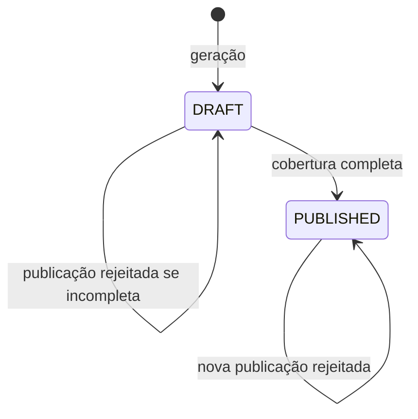
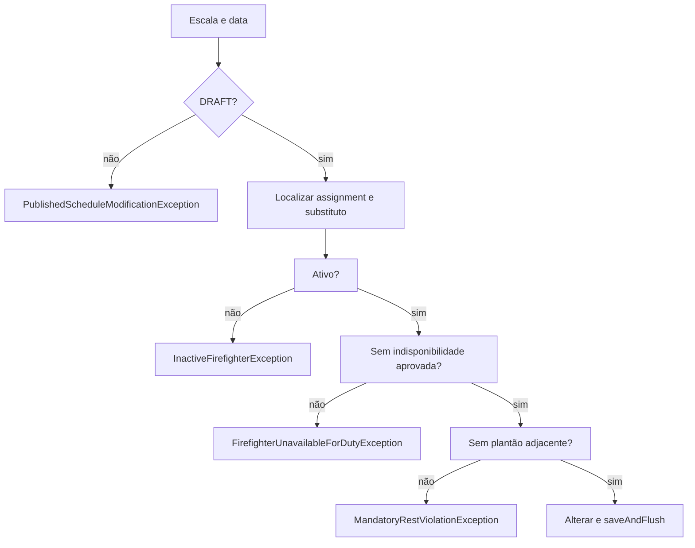

# 16 — Publicação e remanejamento

## Objetivo deste capítulo

Este capítulo explica quando uma escala pode ser publicada e como um plantão é
remanejado.

> **Pergunta central:** como o Escala 24 protege a transição de rascunho para
> publicada e escolhe um substituto válido?

## Estados e publicação

Uma escala nasce `DRAFT`. `MonthlyScheduleManagementService.publish` localiza a
escala, rejeita publicação repetida e calcula todas as datas esperadas do mês.
Compara o conjunto de datas dos plantões; se não houver cobertura completa,
lança `IncompleteMonthlyScheduleException`. Só então muda para `PUBLISHED` e
usa `saveAndFlush`.

Não há caminho implementado de `PUBLISHED` para `DRAFT`. Publicar muda as
operações permitidas: `DutyReassignmentService` rejeita alterações em escala
publicada com `PublishedScheduleModificationException`.

## Remanejamento

O service localiza escala por ano/mês e o plantão pela data, inclusive
rejeitando data fora do mês. Busca o substituto, exige bombeiro ativo, rejeita
indisponibilidade `APPROVED` e consulta plantões na data anterior, na data e na
seguinte para garantir descanso obrigatório. Se tudo for válido, troca o
bombeiro e salva o assignment.

## Testes e limites

Os testes integrados cobrem publicação completa/incompleta, publicação
repetida, assignment inexistente, escala publicada, substituto inativo,
indisponível e descanso obrigatório. Eles fornecem evidência desses cenários,
não de toda combinação possível.

## Onde estudar no código

- [`MonthlyScheduleManagementService.java`](../../src/main/java/br/com/escala24/service/MonthlyScheduleManagementService.java)
- [`DutyReassignmentService.java`](../../src/main/java/br/com/escala24/service/DutyReassignmentService.java)
- [`MonthlyScheduleController.java`](../../src/main/java/br/com/escala24/controller/MonthlyScheduleController.java)
- [`MonthlyScheduleManagementServiceIntegrationTest.java`](../../src/test/java/br/com/escala24/service/MonthlyScheduleManagementServiceIntegrationTest.java)
- [`DutyReassignmentServiceIntegrationTest.java`](../../src/test/java/br/com/escala24/service/DutyReassignmentServiceIntegrationTest.java)

## Perguntas de revisão

1. Por que a escala nasce DRAFT?
2. Como cobertura completa é calculada?
3. O que impede publicar duas vezes?
4. Existe retorno de PUBLISHED para DRAFT?
5. Quais verificações o substituto precisa passar?
6. Por que datas adjacentes são consultadas?
7. O que protege uma escala publicada?

## Resumo

Publicação exige cobertura de todas as datas e muda a escala para `PUBLISHED`.
Remanejamento só ocorre em `DRAFT` e exige substituto ativo, disponível e com
descanso respeitado.

> **Frase de fixação:** a publicação protege a escala contra remanejamentos; antes de publicar, qualquer substituição precisa preservar as regras de elegibilidade e descanso.
