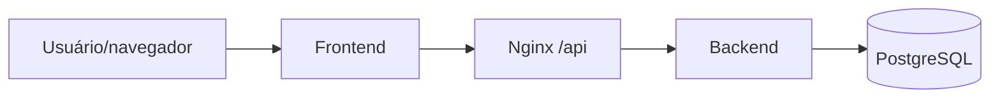

# 16 — Testes end-to-end

## Objetivo deste capítulo

Este capítulo verifica se o Escala 24 possui testes automatizados que atravessem
o sistema completo como um usuário real.

> **Pergunta central:** existe uma suíte que percorra usuário, frontend, servidor
> web, backend e banco em uma única jornada automatizada?

## O que significa end-to-end

Um teste end-to-end (E2E, ou ponta a ponta) começa em uma interface próxima à
experiência do usuário e atravessa as partes relevantes do produto:

```text
usuário → frontend → Nginx → backend → PostgreSQL
```

Ele é diferente de um teste unitário, de `@WebMvcTest`, de `MockMvc` e de um
`@SpringBootTest`. Um teste integrado pode atravessar vários componentes do
backend, mas não necessariamente inicia navegador, frontend ou Nginx.

## Situação real do Escala 24

Não foi identificada uma suíte E2E automatizada no repositório. A busca não
encontrou Selenium, Playwright, Cypress, Puppeteer ou outra ferramenta de
automação de navegador. Também não há arquivos de teste E2E dedicados.

Isso não significa ausência de testes importantes. O projeto possui testes
unitários, slices web e integrações com PostgreSQL; alguns testes de integração
entram pela API com MockMvc. Eles fornecem evidências diferentes, mas não devem
ser chamados de E2E.

## O que existe e o que falta

Os testes de controller verificam HTTP em memória. Os testes integrados verificam
Spring, segurança, JPA, Flyway, services e PostgreSQL. A lacuna é a jornada que
começa na interface entregue ao usuário e atravessa a distribuição completa.

Conceitualmente, um E2E futuro precisaria abrir o frontend, executar ações de
usuário, atravessar o encaminhamento `/api/` do Nginx, usar o backend e verificar
o resultado persistido. Essa descrição é um conceito, não uma funcionalidade
presente no Escala 24.



O diagrama mostra o limite conceitual do E2E; os testes atuais não automatizam
essa cadeia inteira.

## Validação manual não é E2E automatizado

Imagens, documentação do desktop ou uma execução manual podem demonstrar o
produto, mas não são equivalentes a um teste automatizado repetível. O cliente
desktop inicia a aplicação e o Compose em uma instalação, porém isso não cria,
por si só, uma suíte E2E no código.

## Limites

Não é correto afirmar que os testes integrados cobrem frontend, Nginx, desktop,
experiência visual ou todo o fluxo de produção. Também não é correto concluir
que a ausência de E2E invalida os testes existentes: cada nível responde a uma
pergunta diferente.

| Tipo | O que atravessa |
| --- | --- |
| Unitário | uma unidade isolada |
| `@WebMvcTest` | recorte web do backend |
| Integração | componentes reais do backend e PostgreSQL de teste |
| E2E | produto completo pela interface do usuário, quando implementado |

## Onde estudar no código

- [`frontend/app.js`](../../frontend/app.js) — chamadas HTTP do frontend;
- [`frontend/nginx.conf`](../../frontend/nginx.conf) — encaminhamento da API;
- [`desktop/main.js`](../../desktop/main.js) — orquestração do cliente desktop;
- [`12 — Testes: visão geral`](./12-testes-visao-geral.md) — estratégia geral;
- [`15 — Testes de controller`](./15-testes-de-controller.md) — limite do MockMvc.

## Perguntas de revisão

1. O que caracteriza um teste E2E?
2. Por que `MockMvc` não equivale a um navegador?
3. Quais ferramentas E2E foram encontradas no repositório?
4. Que partes são cobertas pelos testes atuais?
5. Qual lacuna permanece sem uma suíte E2E?
6. Por que uma validação manual não é automaticamente um teste E2E?

## Resumo

O repositório não possui uma suíte E2E automatizada nem ferramenta de browser.
Há cobertura relevante de unidades, web e integração do backend, mas a jornada
frontend–Nginx–backend–PostgreSQL não é automatizada como um único teste.

> **Frase de fixação:** integração verifica partes reais trabalhando juntas; E2E
> verifica o produto completo pela perspectiva do usuário.
