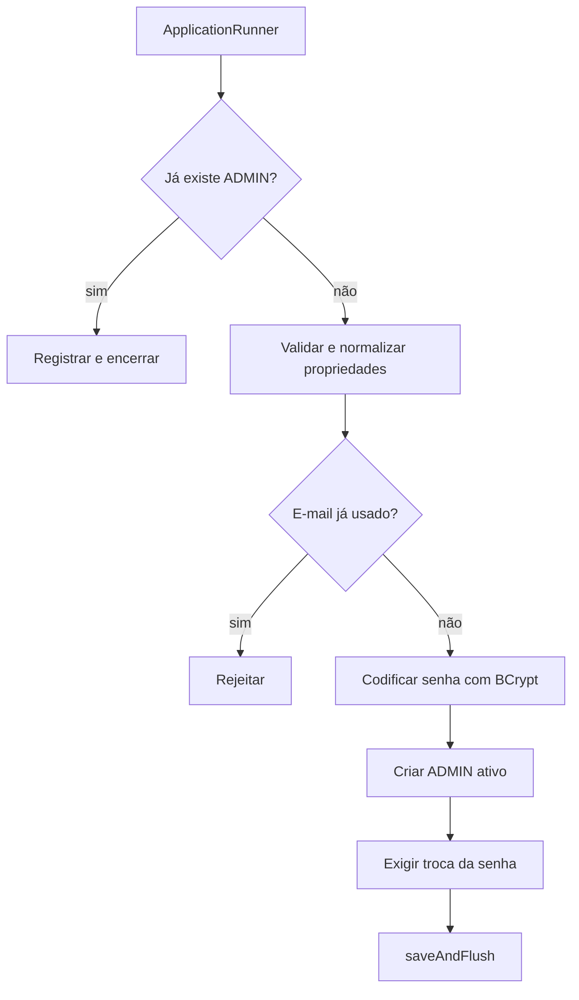

# 17 — Administrador inicial

## Objetivo deste capítulo

Este capítulo explica como o Escala 24 cria a primeira conta administrativa
quando ainda não existe um administrador.

> **Pergunta central:** como criar com segurança o primeiro `ADMIN` quando
> ainda não existe uma conta capaz de administrar o sistema?

## O problema e o bootstrap

Se operações administrativas exigem `ADMIN`, uma instalação nova precisa de uma
exceção controlada. **Bootstrap** é o procedimento inicial de preparação da
aplicação; aqui, ele não é migration nem seed genérico do banco.

`InitialAdminBootstrap` é um `ApplicationRunner` condicional. Ele só é
registrado quando `escala24.bootstrap.admin.enabled` é `true`.

## Configuração externa

`application.properties` liga estas variáveis a `InitialAdminProperties`:

| Variável | Finalidade | Default |
| --- | --- | --- |
| `ESCALA24_INITIAL_ADMIN_ENABLED` | habilita o bootstrap | `false` |
| `ESCALA24_INITIAL_ADMIN_NAME` | nome inicial | vazio |
| `ESCALA24_INITIAL_ADMIN_EMAIL` | e-mail inicial | vazio |
| `ESCALA24_INITIAL_ADMIN_PASSWORD` | senha temporária | vazio |

Compose e `.env.example` fornecem as entradas ao container. A senha é um
secret e não deve ser exposta em Git, logs ou documentação. O capítulo 11
detalha a resolução dessas configurações.

`InitialAdminProperties` usa `@ConfigurationProperties(prefix =
"escala24.bootstrap.admin")`; o Spring transforma as propriedades em um
record Java tipado, injetado no bootstrap.

## Fluxo real

Quando executa, o componente consulta se já existe `Role.ADMIN`; se existir,
registra e encerra. Caso contrário, exige nome, e-mail e senha não vazios,
remove espaços nas bordas, normaliza o e-mail com `Locale.ROOT` e valida
comprimentos, formato e senha entre 8 e 72 caracteres. Depois verifica e-mail
duplicado, codifica a senha, cria usuário `ADMIN` ativo com
`mustChangePassword=true` e chama `saveAndFlush`.

## Idempotência e senha temporária

A consulta por papel evita que execuções posteriores criem administradores
indefinidamente. Isso é idempotência no objetivo do bootstrap, não significa
que qualquer execução nunca possa alterar nada.

`PasswordConfig` fornece `BCryptPasswordEncoder`; a senha não é persistida em
texto puro. A conta inicial deve trocar a senha pelo fluxo documentado no
capítulo 07.

O código não desativa automaticamente a propriedade. Desativá-la depois da
criação é recomendação operacional: retornar a configuração a `false` e trocar
a senha temporária.

## Testes e limites

`InitialAdminBootstrapTest` testa decisões com mocks: propriedades inválidas e
e-mail usado geram exceção e não chamam `saveAndFlush`. Já
`InitialAdminBootstrapIntegrationTest` usa Spring, propriedades, encoder,
repository e PostgreSQL, verificando conta, senha codificada, estado e ausência
de duplicação. São evidências complementares dos capítulos 13 e 14.

Bootstrap não é cadastro público, não substitui gestão posterior e não elimina
a necessidade de proteger secrets e credenciais.

## Onde estudar no código

- [`InitialAdminBootstrap.java`](../../src/main/java/br/com/escala24/config/InitialAdminBootstrap.java)
- [`InitialAdminProperties.java`](../../src/main/java/br/com/escala24/config/InitialAdminProperties.java)
- [`PasswordConfig.java`](../../src/main/java/br/com/escala24/config/PasswordConfig.java)
- [`InitialAdminBootstrapTest.java`](../../src/test/java/br/com/escala24/config/InitialAdminBootstrapTest.java)
- [`InitialAdminBootstrapIntegrationTest.java`](../../src/test/java/br/com/escala24/config/InitialAdminBootstrapIntegrationTest.java)
- [`application.properties`](../../src/main/resources/application.properties)

## Perguntas de revisão

1. Por que o bootstrap é necessário numa instalação nova?
2. Qual propriedade controla sua habilitação?
3. Como o e-mail é normalizado e validado?
4. Como a duplicação é evitada?
5. Por que a senha inicial exige troca?
6. O que o teste unitário não prova sobre a persistência?

## Resumo

O bootstrap condicional valida a configuração, cria o primeiro administrador
ativo com senha BCrypt e exige sua troca. A desativação posterior é operacional,
não automática.

> **Frase de fixação:** o bootstrap abre a porta inicial de administração com
> condições, senha protegida e criação controlada.
