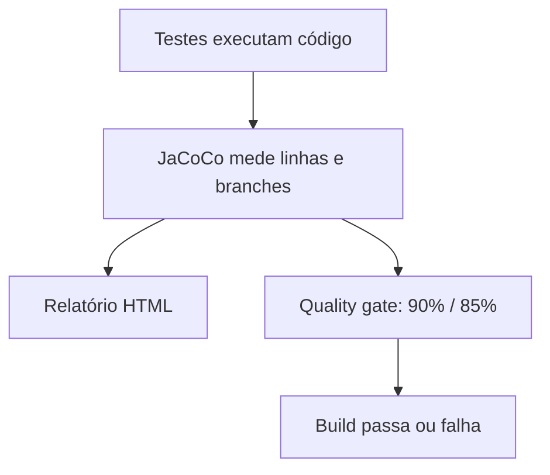

# 20 — Cobertura com JaCoCo

## Objetivo deste capítulo

Este capítulo explica o que o JaCoCo mede no build do Escala 24 e por que seus
limites não equivalem à qualidade total dos testes.

> **Pergunta central:** o que a cobertura mede e por que atingir o limite não
> significa que todos os comportamentos estão corretos?

## Conceito e configuração

Cobertura mede partes do código executadas durante os testes. Instruções são
operações de bytecode; linhas são linhas associadas a instruções; branches são
caminhos de decisão. O `pom.xml` usa `jacoco-maven-plugin` 0.8.15:

1. `prepare-agent` prepara a coleta;
2. `generate-report` gera relatório na fase `verify`;
3. `check-coverage` aplica regras na mesma fase.

O bundle exige mínimo de 90% de linhas e 85% de branches. Não há exclusões
configuradas nessas regras.

```text
mvn verify → testes → coleta → relatório → check → build passa/falha
```

## Relatório e interpretação

O relatório HTML é gerado em `target/site/jacoco/`. Na visualização JaCoCo,
No relatório HTML, as cores ajudam a interpretar a cobertura. De forma geral,
verde indica código coberto pelos testes, vermelho indica código não coberto e
amarelo indica cobertura parcial. Em decisões com mais de um caminho possível,
por exemplo, o amarelo pode indicar que apenas parte dos branches foi
executada.

Essas cores mostram execução, não correção: uma linha verde foi exercitada
durante os testes, mas isso não garante que seu comportamento tenha sido
verificado adequadamente.

O CI executa `bash ./mvnw --batch-mode --no-transfer-progress verify` e publica
`target/site/jacoco/` como artefato quando possível. Os 90%/85% são limites
configurados, não cobertura atual permanente. Como Docker impediu a execução
integrada nesta tarefa, não há percentual atual válido a registrar.

## Cobertura não é qualidade

Uma linha executada pode não ter asserção adequada; um branch coberto não prova
que todos os valores relevantes foram usados. Mesmo 100% não garante ausência
de bugs, regras completas, segurança perfeita, integração, E2E ou performance.



## Analogia e onde estudar

Cobertura é um mapa das áreas visitadas numa inspeção: visitar não prova que a
área foi inspecionada corretamente.

- [`pom.xml`](../../pom.xml)
- [`backend-ci.yml`](../../.github/workflows/backend-ci.yml)
- [`18 — Testes`](./18-testes.md)
- [`13 — Testes unitários`](./13-testes-unitarios.md)

## Perguntas de revisão

1. O que cobertura mede?
2. Qual a diferença entre linhas e branches?
3. Quais limites estão configurados?
4. Em que fase o relatório e o check ocorrem?
5. Onde o relatório é gerado?
6. Por que 100% não garante qualidade?
7. Por que não foi registrada cobertura atual nesta tarefa?

## Resumo

JaCoCo coleta execução, gera relatório em `target/site/jacoco/` e aplica no
`verify` os limites de 90% para linhas e 85% para branches. É um controle útil,
mas não substitui testes significativos e níveis complementares.

> **Frase de fixação:** cobertura mostra por onde o teste passou; não garante
> que ele compreendeu tudo o que encontrou.
