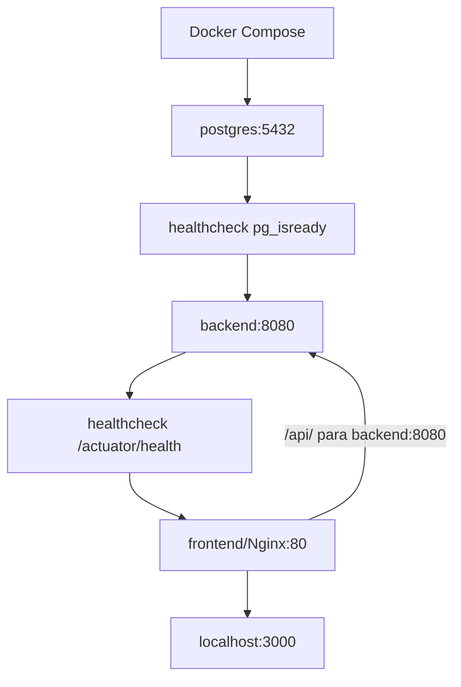

# 21 — Docker

## Objetivo deste capítulo

Este capítulo explica como Docker empacota e coordena o Escala 24.

> **Pergunta central:** como Docker empacota e coordena as partes do Escala 24
> para uma execução reproduzível?

## Imagem, container e Compose

Uma **imagem** é um pacote imutável que reúne a aplicação e os elementos necessários para criar containers. Um **container** é uma instância executável criada a partir dessa imagem. O `Dockerfile` descreve como construir uma imagem; Docker Compose descreve vários serviços que trabalham juntos.

No Escala 24, o Compose coordena `postgres`, `backend` e `frontend`. A imagem
não é o container em execução, e apagar uma instância não significa apagar um
volume de dados.

## Imagens do projeto

O `Dockerfile` do backend é multi-stage: a etapa `build` usa
`eclipse-temurin:21-jdk-jammy`, baixa dependências com Maven Wrapper e gera o
JAR; a etapa final usa `eclipse-temurin:21-jre-jammy`, copia o JAR e expõe
8080. Ela cria o usuário de sistema `escala24` e executa com `USER escala24`,
sem root. Isso reduz o impacto de determinados problemas, mas não torna o
container absolutamente seguro.

O `frontend/Dockerfile` usa `nginx:alpine`, copia HTML, CSS, JavaScript e a
configuração do Nginx, e expõe 80. O `.dockerignore` exclui, entre outros,
`.git`, `.github`, `target`, `frontend`, `.env` e logs do contexto do backend;
ele controla o contexto do Docker, enquanto `.gitignore` controla arquivos não
rastreados pelo Git.

## Serviços do Compose

| Serviço | Imagem/build | Comunicação e responsabilidade |
| --- | --- | --- |
| `postgres` | `postgres:17` | banco; publica `${POSTGRES_PORT}:5432` e usa volume |
| `backend` | build do diretório raiz | API Spring em 8080, exposta apenas à rede |
| `frontend` | build de `./frontend` | Nginx em 80, publicado como `3000:80` |

O backend recebe `SPRING_DATASOURCE_*` e configurações do administrador. O
frontend depende do health check do backend, e o backend depende do health
check do PostgreSQL. O volume `escala24_postgres_data` preserva dados do banco
entre recriações de containers.

## Portas e comunicação

Dentro da rede Compose, o backend é `backend:8080` e o banco é
`postgres:5432`; os nomes dos serviços funcionam como DNS interno. O Nginx
encaminha `/api/` para `http://backend:8080`. Isso é diferente de
`localhost:8080` no computador do usuário.

`3000:80` significa porta 3000 do host para porta 80 do frontend. A publicação
de PostgreSQL é controlada por `POSTGRES_PORT`; o backend usa a porta interna
5432, não a porta publicada do host.

## Inicialização e health checks

`depends_on` com `condition: service_healthy` espera o health check do serviço,
não apenas o processo ter sido criado. PostgreSQL usa `pg_isready`; backend usa
`curl` no actuator `/health`. Essa coordenação reduz corridas de inicialização,
mas não resolve qualquer indisponibilidade posterior.

## Deployment desktop e limites

O Compose de `desktop/deployment` usa imagens versionadas do GHCR, mantém os
serviços internos e publica `3000:80`. `desktop/main.js` prepara o diretório,
cria `.env`, copia o Compose e inicia o Docker; isso é orquestração do cliente
desktop, não uma documentação completa do Electron.

Os arquivos descrevem principalmente execução local/distribuição. Docker
funcionar localmente não significa que observabilidade, secrets, rede, backup
ou política de produção estejam completos.

## Estudo de caso

Ao executar Compose, variáveis alimentam PostgreSQL e backend; o banco passa no
health check; o backend inicia, aplica Flyway e passa no actuator; então o
frontend é iniciado e encaminha `/api/` ao backend.

## Analogia, cuidados e onde estudar

Imagem é um modelo preparado; container é uma instância em execução. A
analogia não cobre volumes, redes ou o ciclo de vida real.

Cuidados: não usar `localhost` entre containers; não colocar secrets na imagem;
não confundir `depends_on` com prontidão universal; não apagar volume por
engano; não tratar Compose local como infraestrutura completa de produção.

- [`Dockerfile`](../../Dockerfile)
- [`docker-compose.yml`](../../docker-compose.yml)
- [`frontend/Dockerfile`](../../frontend/Dockerfile)
- [`frontend/nginx.conf`](../../frontend/nginx.conf)
- [`desktop/deployment/docker-compose.yml`](../../desktop/deployment/docker-compose.yml)
- [`11 — Frontend`](./11-frontend.md)

## Perguntas de revisão

1. Qual a diferença entre imagem e container?
2. O que a etapa final do Dockerfile do backend acrescenta?
3. Por que `localhost` não é o nome do backend dentro do Compose?
4. O que o volume do PostgreSQL preserva?
5. Qual a diferença entre processo iniciado e serviço saudável?
6. O que o Nginx encaminha?
7. Por que Compose local não prova prontidão de produção?

## Resumo

Docker constrói imagens do backend e frontend; Compose coordena PostgreSQL,
backend e Nginx com rede interna, volumes e health checks. A execução sem root
é uma medida de redução de risco, não uma garantia absoluta.

> **Frase de fixação:** a imagem empacota, o container executa e o Compose
> coordena.
