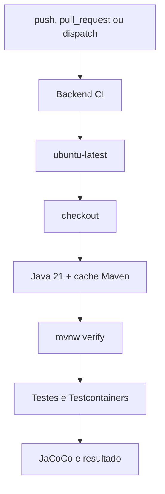

# 22 — Integração contínua

## Objetivo deste capítulo

Este capítulo explica o que os workflows do GitHub fazem automaticamente.

> **Pergunta central:** o que acontece no GitHub quando o código é enviado ou
> proposto para integração?

## Conceito

Integração contínua (CI) é a verificação automática e repetível de mudanças.
No GitHub Actions, um **workflow** descreve uma automação que pode ser iniciada
por determinados eventos. Dentro dele, um **job** reúne um conjunto de etapas.
Cada **step** representa uma ação ou comando executado durante o job, e o
**runner** é o ambiente em que esse trabalho acontece.

## Backend CI

`backend-ci.yml` dispara em `push` para `main`, `pull_request` para `main` e
`workflow_dispatch`. O job `test`, chamado “Java 21 and integration tests”,
roda em `ubuntu-latest`, tem limite de 15 minutos e cancela execução anterior
concorrente do mesmo grupo.

Seus steps fazem checkout, configuram Temurin Java 21 com cache Maven e
executam `bash ./mvnw --batch-mode --no-transfer-progress verify`. Esse comando executa o ciclo Maven até a fase `verify`, fazendo com que as
verificações configuradas no projeto sejam executadas, incluindo testes e o
quality gate do JaCoCo. Os testes de integração utilizam Testcontainers quando
seus cenários são executados.



O workflow não declara um serviço PostgreSQL separado: os testes integrados
usam Testcontainers. O runner Ubuntu fornece o ambiente Docker necessário para
essa estratégia.

## Outros workflows

`frontend-ci.yml` valida JavaScript, constrói a imagem frontend e testa a
configuração Nginx. `secret-scan.yml` procura segredos adicionados
acidentalmente ao repositório. `container-images.yml` publica imagens
backend/frontend no GHCR em tags `v*` ou por execução manual.
`desktop-installer.yml` valida e constrói o instalador Windows. Esses workflows
têm eventos e permissões próprios; não são um único pipeline universal.

O Backend CI publica `target/site/jacoco/` como artefato por 14 dias, mesmo
quando o job falha (`if: always()`). Artefato de CI é resultado preservado para
consulta; não é sinônimo do JAR Maven.

## Pull requests e falhas

O workflow pode ser executado em um pull request, mas o YAML não prova que o
GitHub exige esse check para permitir merge. Essa exigência depende de ruleset
ou proteção externa da branch.

Compilação, teste, Docker/Testcontainers ou check de cobertura podem falhar em
etapas diferentes. O status vermelho informa que o job não concluiu, mas a
causa precisa ser localizada no step e nos logs.

## Estudo de caso e limites

Um PR dispara Backend CI, que prepara Java, executa `verify`, inicia os testes
necessários e produz relatório/resultado. Isso verifica o estado do código no
runner; não garante todos os cenários, produção ou E2E.

```text
workflow = checklist automatizado
```

A analogia ajuda a entender sequência e repetição, mas um workflow também
possui permissões, eventos, concorrência e artefatos específicos.

## Onde estudar no código

- [`backend-ci.yml`](../../.github/workflows/backend-ci.yml)
- [`frontend-ci.yml`](../../.github/workflows/frontend-ci.yml)
- [`secret-scan.yml`](../../.github/workflows/secret-scan.yml)
- [`container-images.yml`](../../.github/workflows/container-images.yml)
- [`desktop-installer.yml`](../../.github/workflows/desktop-installer.yml)
- [`20 — Cobertura com JaCoCo`](./20-cobertura-com-jacoco.md)
- [`19 — Testcontainers`](./19-testcontainers.md)

## Perguntas de revisão

1. Qual a diferença entre workflow, job e step?
2. Quais eventos iniciam o Backend CI?
3. Qual runner e versão Java são usados?
4. Por que `mvn verify` é mais amplo que compilar?
5. Como o CI fornece PostgreSQL aos testes?
6. O que é o artefato JaCoCo?
7. Por que workflow executado não prova branch protection?

## Resumo

O GitHub executa workflows distintos para backend, frontend, verificação de
segredos, imagens e instalador. O Backend CI usa Ubuntu, Java 21, Maven Wrapper
e `verify`, que integra testes, Testcontainers e JaCoCo, publicando o relatório
como artefato.

> **Frase de fixação:** CI transforma uma mudança em uma verificação repetível,
> mas o resultado ainda precisa ser interpretado.
