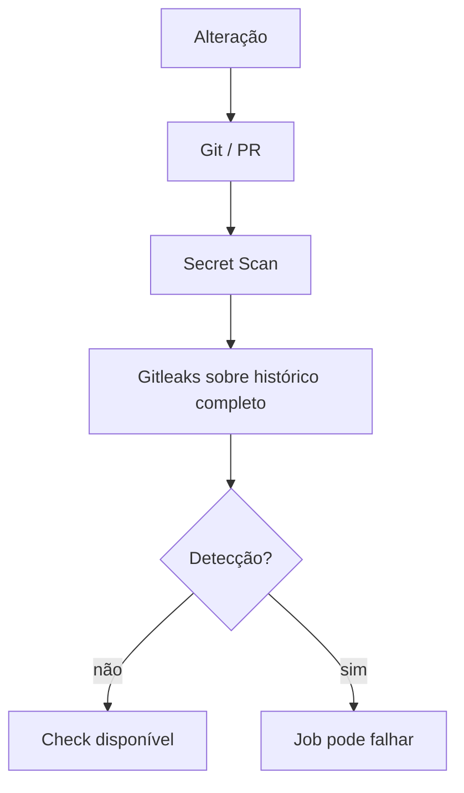

# 23 — Segurança do repositório

## Objetivo deste capítulo

Este capítulo trata da proteção do código, dos segredos e do processo de
integração no repositório, diferente da segurança da aplicação do capítulo 07.

> **Pergunta central:** como o Escala 24 reduz o risco de expor credenciais ou
> integrar mudanças inseguras?

## Secrets e arquivos de ambiente

Um secret é um dado que não deve ser publicado, como senha ou token. `.env`
guarda valores locais; `.env.example` documenta nomes e exemplos sem depender
de credenciais reais; `.gitignore` orienta o Git a não considerar determinados
arquivos não rastreados para versionamento.

O `.gitignore` contém `.env`, além de `target`, `node_modules` do desktop,
artefatos e logs. Os exemplos listam variáveis como `POSTGRES_PASSWORD` e
`ESCALA24_INITIAL_ADMIN_PASSWORD`, mas valores reais devem ficar fora do Git.
Isso conecta diretamente aos capítulos 11 e 17.

O `.gitignore` reduz o risco de inclusão acidental de arquivos locais, mas não
remove um segredo já commitado, não limpa o histórico e não revoga uma
credencial. Se houver exposição, é necessário invalidar ou rotacionar a
credencial e tratar o histórico com o procedimento apropriado.

## Gitleaks

`secret-scan.yml` executa em push para `main`, pull request para `main` ou
manual, em `ubuntu-latest`. O checkout usa `fetch-depth: 0`, portanto o workflow
fornece o histórico completo ao scan. A action é `gitleaks/gitleaks-action@v3`,
com versão `8.30.1`; comentários e upload próprio de artefato estão
desabilitados.

O objetivo é detectar padrões de secrets no material fornecido ao scan. Uma
detecção pode fazer o job falhar. Gitleaks reduz risco, mas não garante que
nenhum segredo exista e não substitui rotação ou revisão.



## Relato de vulnerabilidades

`SECURITY.md` orienta não publicar senhas, tokens ou exploração em issue
pública. O relato deve usar Security Advisories → Report a vulnerability; se
essa opção não estiver disponível, deve-se pedir canal privado sem detalhes
sensíveis. O documento informa suporte de segurança para versões 1.0.x e não
para anteriores a 1.0.

Uma vulnerabilidade é diferente de um bug comum: a política orienta um canal
privado para reduzir exposição durante a análise.

## Licença

`LICENSE` declara MIT License. Em termos simples, uma licença informa como o
software pode ser usado, copiado, modificado e redistribuído, sujeitando-se às
condições escritas no próprio texto. Esta documentação não substitui análise
jurídica.

## Checks, PRs e proteção

Os YAMLs definem workflows, eventos e permissões. O repositório não contém, nos
arquivos analisados, um ruleset que prove proteção obrigatória da `main`.
Portanto, não se deve afirmar que um check é obrigatoriamente exigido para
merge: isso depende de configuração externa do GitHub.

```text
YAML → workflow e check
ruleset externo → condição para integrar
PR → proposta e revisão
```

## Limites e cuidados

`.env` local não é gerenciador de secrets de produção; Compose não define toda
a segurança operacional; Gitleaks não substitui rotação; branch protection não
substitui revisão técnica. A analogia de Gitleaks como inspeção ajuda a entender
o objetivo, mas não significa inspeção perfeita.

## Onde estudar no código

- [`.gitignore`](../../.gitignore)
- [`.env.example`](../../.env.example)
- [`secret-scan.yml`](../../.github/workflows/secret-scan.yml)
- [`SECURITY.md`](../../SECURITY.md)
- [`LICENSE`](../../LICENSE)
- [`17 — Administrador inicial`](./17-administrador-inicial.md)
- [`22 — Integração contínua`](./22-integracao-continua.md)

## Perguntas de revisão

1. Qual a diferença entre `.env` e `.env.example`?
2. Por que `.gitignore` não resolve segredo já commitado?
3. O que o checkout completo permite ao Secret Scan?
4. O que Gitleaks verifica e o que não garante?
5. Como uma vulnerabilidade deve ser reportada?
6. Qual licença o projeto declara?
7. Por que workflow não equivale a ruleset?

## Resumo

O repositório ignora `.env`, oferece exemplos de variáveis, executa Gitleaks
sobre histórico completo e documenta canal privado para vulnerabilidades. A
licença é MIT. Ainda assim, secrets exigem rotação e a proteção efetiva da
branch depende também da configuração externa do GitHub.

> **Frase de fixação:** prevenção reduz exposição; não substitui revogar um
> segredo nem revisar uma mudança.
