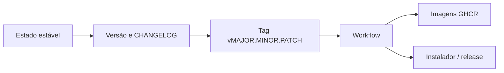

# 25 — Versionamento e release

## Objetivo deste capítulo

Este capítulo relaciona versões, tags, changelog e artefatos distribuíveis.

> **Pergunta central:** como o Escala 24 identifica versões e transforma um
> estado do repositório em uma release distribuível?

## Versão, tag e release

Versão identifica um estado do software. Tag é uma referência nomeada para um
commit existente; release é a publicação/distribuição associada a uma versão.
Tag não é branch nem commit novo.

O repositório possui `v1.0.0`, `v1.1.0`, `v1.1.1` e `v1.2.0`. O `pom.xml` e
`desktop/package.json` estão em `1.2.0`. Uma tag permite relacionar versão,
commit, código e workflows, mas o artefato precisa ser produzido por um
processo adicional.

## SemVer e CHANGELOG

O `CHANGELOG.md` declara Keep a Changelog e Versionamento Semântico. SemVer usa `MAJOR.MINOR.PATCH`:

- **MAJOR**: mudanças incompatíveis com a versão anterior;
- **MINOR**: novas funcionalidades compatíveis com versões anteriores;
- **PATCH**: correções compatíveis que não alteram o contrato de forma
  incompatível.
As tags `v1.x.x` são compatíveis
com essa forma; isso não prova que toda decisão histórica seguiu SemVer
rigorosamente.

O changelog organiza alterações por versão, enquanto `git log` registra o
histórico bruto de commits, incluindo documentação e merges. São fontes
complementares.

## Evolução observável

O changelog registra `1.0.0` em 2026-08-17, `1.1.0`, `1.1.1` e `1.2.0` em
2026-08-25. A documentação pode confirmar tags e commits de preparação, mas não
reconstruir cada atividade humana da release. O estado atual é `1.2.0`, não o
processo histórico inteiro.

## A primeira versão estável

A tag `v1.0.0` representa a primeira versão estável registrada no histórico do
projeto. A partir dela, o repositório continuou evoluindo pelas versões
`v1.1.0`, `v1.1.1` e `v1.2.0`.

O histórico, as tags e o `CHANGELOG.md` permitem relacionar essas versões ao
código correspondente. Eles não permitem reconstruir com certeza todas as
decisões humanas e etapas manuais realizadas durante cada release; por isso,
este guia documenta apenas o processo que pode ser confirmado no repositório.

## Workflows e artefatos

Em tags `v*`, `container-images.yml` deriva a versão da tag, constrói e publica
backend e frontend no GHCR com tags versionada e `latest`. Por execução manual,
recebe uma versão de entrada. `desktop-installer.yml` em tags constrói o
instalador Windows e cria uma release GitHub; em PR, apenas valida o caminho
configurado. A tag identifica o estado; imagem, instalador e release são
resultados produzidos a partir dele.

## Estudo de caso e cuidados

Uma release pode ser entendida como estado versionado → tag → workflow →
artefato/distribuição. Não se deve confundir tag com criação automática de
versão, nem documentar versão antiga como estado atual. O workflow não prova
que todos os artefatos são publicados em toda situação.

## Onde estudar no código

- [`CHANGELOG.md`](../../CHANGELOG.md)
- [`pom.xml`](../../pom.xml)
- [`desktop/package.json`](../../desktop/package.json)
- [`container-images.yml`](../../.github/workflows/container-images.yml)
- [`desktop-installer.yml`](../../.github/workflows/desktop-installer.yml)

## Perguntas de revisão

1. Qual a diferença entre tag, branch e commit?
2. O que significam MAJOR, MINOR e PATCH?
3. Para que serve o CHANGELOG?
4. Como uma tag participa dos workflows?
5. Por que tag não é o mesmo que artefato?
6. O que é possível e impossível reconstruir sobre a release 1.0.0?
7. Por que `latest` não substitui uma tag versionada?

## Resumo

O Escala 24 usa tags `v1.x.x`, changelog baseado em SemVer e workflows que
produzem imagens e instalador. A tag identifica o commit; a release e os
artefatos são consequências de workflows e distribuição.

> **Frase de fixação:** versão nomeia o estado, tag aponta para ele e release o
> distribui.
